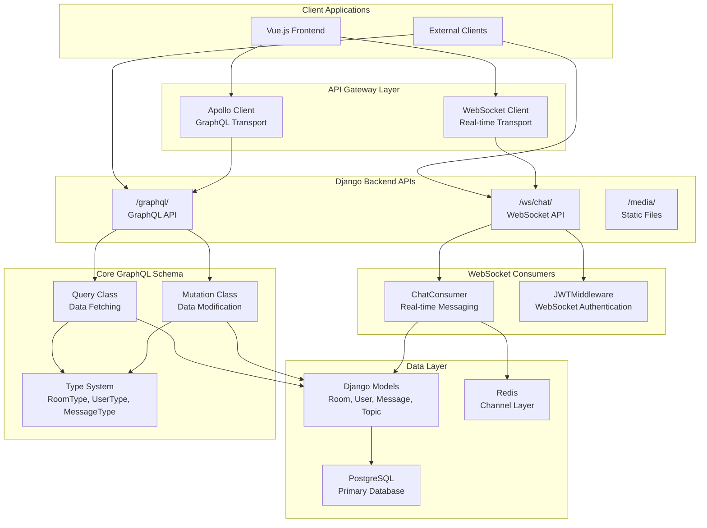
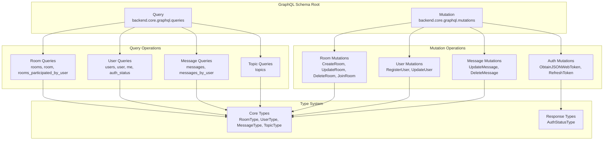
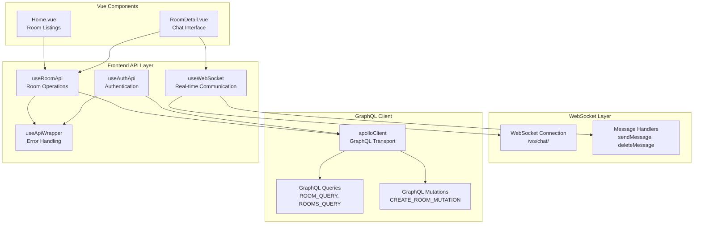
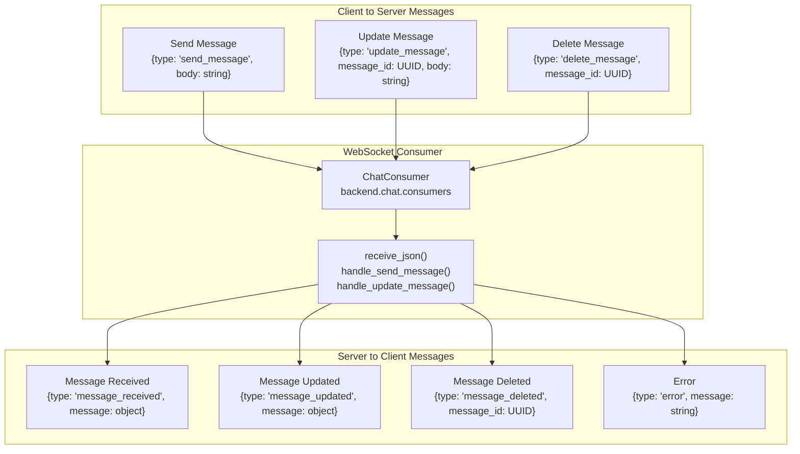
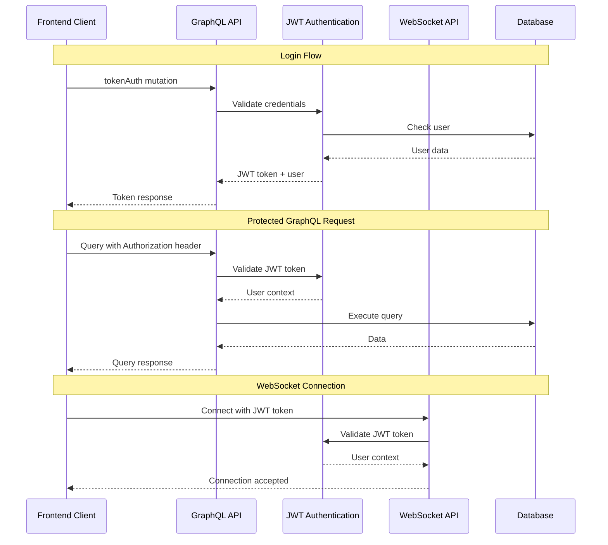

# API Documentation

> **Relevant source files**
> * [backend/core/admin.py](../backend/core/admin.py)
> * [backend/core/graphql/mutations.py](../backend/core/graphql/mutations.py)
> * [backend/core/graphql/queries.py](../backend/core/graphql/queries.py)
> * [frontend/src/api/graphql/room.mutations.ts](../frontend/src/api/graphql/room.mutations.ts)
> * [frontend/src/api/graphql/room.queries.ts](../frontend/src/api/graphql/room.queries.ts)
> * [frontend/src/api/room.api.ts](../frontend/src/api/room.api.ts)
> * [frontend/src/views/Home.vue](../frontend/src/views/HomePage.vue)
> * [frontend/src/views/RoomDetail.vue](../frontend/src/views/RoomDetail.vue)
> * [scripts/setup.sh](../scripts/setup.sh)

This document provides comprehensive reference for all API interfaces available in the EduSphere system. It covers the GraphQL API for data operations, WebSocket API for real-time messaging, and authentication mechanisms. For detailed implementation guides, see [Frontend Development Guide](./Frontend-Development-Guide.md) and [Backend Development Guide](./Backend-Development-Guide.md). For real-time messaging specifics, see [Real-time Messaging](./Real-time-Messaging.md).

## API Architecture Overview

EduSphere exposes three primary API interfaces that work together to provide a complete chat platform experience.



**Sources:**

| File | Lines |
|------|-------|
| [`apollo.client.ts`](../frontend/src/api/apollo.client.ts) | — |
| [`queries.py`](../backend/core/graphql/queries.py#L1-L168) | L1–L168 |
| [`mutations.py`](../backend/core/graphql/mutations.py#L1-L244) | L1–L244 |

## GraphQL API Structure

The GraphQL API is implemented through Django Graphene and provides both query and mutation operations. The schema is organized around core entities: rooms, users, messages, and topics.

### Schema Organization



**Sources:**

| File | Lines |
|------|-------|
| [`queries.py`](../backend/core/graphql/queries.py#L8-L168) | L8–L168 |
| [`mutations.py`](../backend/core/graphql/mutations.py#L225-L244) | L225–L244 |

### Key Query Operations

| Query | Purpose | Authentication | Parameters |
| --- | --- | --- | --- |
| `rooms` | Fetch filtered room list | Optional | `host_slug`, `search`, `topic` |
| `room` | Fetch single room details | Optional | `host_slug`, `room_slug` |
| `messages` | Fetch room messages | Optional | `host_slug`, `room_slug` |
| `topics` | Fetch available topics | None | `search`, `min_rooms` |
| `user` | Fetch user profile | Optional | `user_slug` |
| `me` | Fetch current user | Required | None |
| `auth_status` | Check authentication status | None | None |

### Key Mutation Operations

| Mutation | Purpose | Authentication | Parameters |
| --- | --- | --- | --- |
| `createRoom` | Create new room | Required | `name`, `topic_name`, `description` |
| `updateRoom` | Update room details | Required (host only) | `host_slug`, `room_slug`, fields |
| `deleteRoom` | Delete room | Required (host only) | `host_slug`, `room_slug` |
| `joinRoom` | Join as participant | Required | `host_slug`, `room_slug` |
| `updateMessage` | Edit message content | Required (author only) | `message_id`, `body` |
| `deleteMessage` | Delete message | Required (author only) | `message_id` |
| `registerUser` | Create user account | None | `username`, `name`, `email`, `password1`, `password2` |
| `updateUser` | Update user profile | Required | `username`, `name`, `bio`, `avatar` |

**Sources:**

| File | Lines |
|------|-------|
| [`queries.py`](../backend/core/graphql/queries.py#L9-L51) | L9–L51 |
| [`mutations.py`](../backend/core/graphql/mutations.py#L76-L233) | L76–L233 |

## Frontend API Integration

The Vue.js frontend implements a structured API layer that wraps GraphQL operations and WebSocket communication.

### API Client Architecture



**Sources:**

| File | Lines |
|------|-------|
| [`room.api.ts`](../frontend/src/api/room.api.ts#L20-L187) | L20–L187 |
| [`room.queries.ts`](../frontend/src/api/graphql/room.queries.ts#L1-L122) | L1–L122 |
| [`room.mutations.ts`](../frontend/src/api/graphql/room.mutations.ts#L1-L93) | L1–L93 |

### Room API Functions

The `useRoomApi` composable provides methods for room management:

| Function | GraphQL Operation | Purpose |
| --- | --- | --- |
| `fetchRoom()` | `ROOM_QUERY` | Get room details and participants |
| `fetchRoomMessages()` | `ROOM_MESSAGES_QUERY` | Get room message history |
| `createRoom()` | `CREATE_ROOM_MUTATION` | Create new room |
| `updateRoom()` | `UPDATE_ROOM_MUTATION` | Update room properties |
| `deleteRoom()` | `DELETE_ROOM_MUTATION` | Delete room |
| `joinRoom()` | `JOIN_ROOM_MUTATION` | Join room as participant |
| `fetchTopics()` | `TOPIC_QUERY` | Get available topics |

**Sources:**

| File | Lines |
|------|-------|
| [`room.api.ts`](../frontend/src/api/room.api.ts#L24-L174) | L24–L174 |

## WebSocket API Protocol

Real-time messaging uses WebSocket connections with JSON message protocol. Messages are handled by Django Channels consumers.

### WebSocket Message Types



### WebSocket Connection Flow

1. **Connection**: Client connects to `/ws/chat/{host_slug}/{room_slug}/`
2. **Authentication**: JWT token validated via WebSocket middleware
3. **Room Validation**: User must be room participant
4. **Message Exchange**: JSON messages for real-time operations
5. **Broadcasting**: Messages broadcast to all room participants

**Sources:**

| File | Lines |
|------|-------|
| [`RoomDetail.vue`](../frontend/src/views/RoomDetail.vue#L29-L36) | L29–L36 |
| [`websocket.ts`](../frontend/src/api/websocket.ts) | — |

## Authentication System

Authentication uses JWT tokens for both HTTP and WebSocket connections.

### Authentication Flow



### Authentication Mutations

| Mutation | Purpose | Response |
| --- | --- | --- |
| `tokenAuth` | Login and get JWT token | `{token, user, success}` |
| `verifyToken` | Validate existing token | `{payload}` |
| `refreshToken` | Refresh expired token | `{token, refreshToken}` |
| `deleteToken` | Logout (clear token) | `{deleted}` |

**Sources:**

| File | Lines |
|------|-------|
| [`mutations.py`](../backend/core/graphql/mutations.py#L15-L22) | L15–L22 |
| [`mutations.py`](../backend/core/graphql/mutations.py#L235-L241) | L235–L241 |

## Error Handling

The API implements consistent error handling across GraphQL and WebSocket interfaces.

### GraphQL Error Format

```json
{
  "errors": [
    {
      "message": "Room not found",
      "extensions": {
        "code": "NOT_FOUND"
      }
    }
  ]
}
```

### Common Error Codes

| Code | Description | When Used |
| --- | --- | --- |
| `NOT_FOUND` | Resource doesn't exist | Room, user, or message not found |
| `PERMISSION_DENIED` | Access forbidden | User lacks permission for operation |
| `VALIDATION_ERROR` | Invalid input data | Form validation failures |
| `AUTHENTICATION_ERROR` | Invalid credentials | Login failures |

### Frontend Error Wrapper

The `useApiWrapper` composable provides consistent error handling:

```javascript
// Wraps API calls with error handling
const response = await apiWrapper.callApi(
  async () => apolloClient.query({
    query: ROOM_QUERY,
    variables: { hostSlug, roomSlug }
  })
);
```

**Sources:**

| File | Lines |
|------|-------|
| [`queries.py`](../backend/core/graphql/queries.py#L88-L88) | L88 |
| [`mutations.py`](../backend/core/graphql/mutations.py#L121-L121) | L121 |
| [`room.api.ts`](../frontend/src/api/room.api.ts#L26-L32) | L26–L32 |

## API Usage Examples

### Fetching Rooms with Filters

```javascript
// GraphQL query with search and topic filters
const { data } = await apolloClient.query({
  query: ROOMS_QUERY,
  variables: {
    search: "javascript",
    topic: ["Programming", "Web Development"]
  }
});
```

### Creating a Room

```javascript
// Create room mutation
const { data } = await apolloClient.mutate({
  mutation: CREATE_ROOM_MUTATION,
  variables: {
    name: "JavaScript Discussion",
    topicName: "Programming",
    description: "Talk about JavaScript frameworks"
  }
});
```

### Real-time Message Sending

```javascript
// WebSocket message
const message = {
  type: 'send_message',
  body: 'Hello everyone!'
};
websocket.send(JSON.stringify(message));
```

**Sources:**

| File | Lines |
|------|-------|
| [`Home.vue`](../frontend/src/views/HomePage.vue#L400-L404) | L400–L404 |
| [`room.api.ts`](../frontend/src/api/room.api.ts#L58-L78) | L58–L78 |
| [`RoomDetail.vue`](../frontend/src/views/RoomDetail.vue#L156-L165) | L156–L165 |
