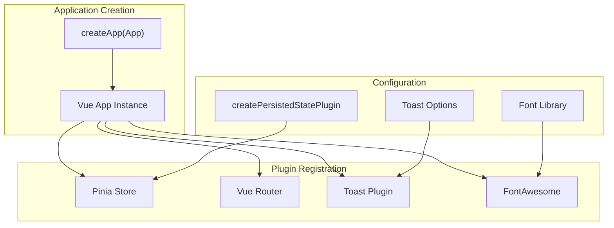
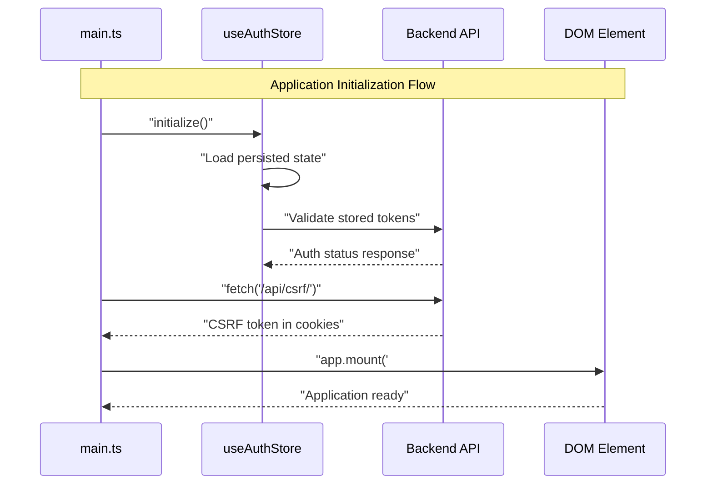
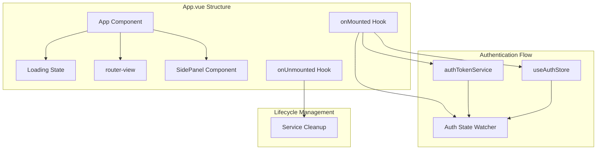

# Application Setup

> **Relevant source files**
> * [frontend/package-lock.json](../frontend/pnpm-lock.yaml)
> * [frontend/package.json](../frontend/package.json)
> * [frontend/src/App.vue](../frontend/src/App.vue)
> * [frontend/src/api/graphql/auth.queries.ts](../frontend/src/api/graphql/auth.queries.ts)
> * [frontend/src/main.ts](../frontend/src/main.ts)
> * [frontend/src/plugins/toast.ts](../frontend/src/plugins/toast.ts)

This document covers the Vue.js frontend application initialization process, including plugin configuration, state management setup, authentication bootstrapping, and security initialization. This covers the core startup sequence that occurs before the application becomes interactive.

For information about individual Vue components and their structure, see [Component Library](./Component-Library.md). For details about Pinia store implementations and state patterns, see [State Management](./State-Management.md).

## Application Entry Point

The Vue.js application initializes through the main entry point at [frontend/src/main.ts L1-L46](../frontend/src/main.ts#L1-L46)

 This file orchestrates the creation of the Vue application instance, configures all necessary plugins, and handles the asynchronous initialization sequence before mounting the application to the DOM.

The entry point follows a structured initialization pattern:

| Phase | Purpose | Components |
| --- | --- | --- |
| Import | Load dependencies and core modules | Vue, Pinia, Router, Plugins |
| Plugin Setup | Configure application-wide functionality | State persistence, icons, notifications |
| Async Init | Handle authentication and security | Auth store, CSRF tokens |
| Mount | Attach application to DOM | App component mounting |

**Sources:**

| File | Lines |
|------|-------|
| [`main.ts`](../frontend/src/main.ts#L1-L46) | L1–L46 |

## Vue Application Creation and Plugin Configuration

### Application Instance and Core Plugins



The application instance is created using Vue's `createApp` function with the root `App` component. The plugin registration follows this sequence:

1. **Pinia State Management**: Configured with persistence plugin for automatic state hydration
2. **Vue Router**: Handles client-side routing and navigation
3. **Toast Notifications**: Custom plugin with mobile-optimized settings
4. **FontAwesome Icons**: Global icon component registration

**Sources:**

| File | Lines |
|------|-------|
| [`main.ts`](../frontend/src/main.ts#L20-L31) | L20–L31 |
| [`toast.ts`](../frontend/src/plugins/toast.ts#L1-L47) | L1–L47 |

### State Persistence Configuration

The Pinia store is enhanced with the `createPersistedStatePlugin` to maintain state across browser sessions:

```javascript
// Configuration from main.ts:20-23
const pinia = createPinia();
pinia.use(
  createPersistedStatePlugin({})
);
```

This enables automatic serialization and restoration of store state, particularly important for maintaining authentication state and user preferences.

**Sources:**

| File | Lines |
|------|-------|
| [`main.ts`](../frontend/src/main.ts#L20-L23) | L20–L23 |

## Authentication and Security Initialization

### Asynchronous Initialization Sequence



The initialization process includes two critical asynchronous operations:

1. **Authentication Store Initialization**: Validates existing tokens and restores user session
2. **CSRF Token Retrieval**: Fetches CSRF protection token for secure API requests

**Sources:**

| File | Lines |
|------|-------|
| [`main.ts`](../frontend/src/main.ts#L33-L45) | L33–L45 |

### Security Setup

The application implements CSRF protection by proactively fetching a CSRF token before mounting:

```python
// CSRF token fetch from main.ts:37-41
await fetch('/api/csrf/', {
  method: 'GET',
  credentials: 'include',
});
```

This ensures that subsequent API requests include the necessary CSRF token for Django's security middleware.

**Sources:**

| File | Lines |
|------|-------|
| [`main.ts`](../frontend/src/main.ts#L37-L41) | L37–L41 |

## Dependency Management

### Core Dependencies

The application relies on a modern Vue.js ecosystem with these primary dependencies:

| Category | Package | Version | Purpose |
| --- | --- | --- | --- |
| Framework | `vue` | ^3.5.13 | Core Vue.js framework |
| State | `pinia` | ^3.0.2 | State management |
| Routing | `vue-router` | ^4.5.0 | Client-side routing |
| GraphQL | `@apollo/client` | ^3.13.1 | GraphQL client |
| UI | `@fortawesome/vue-fontawesome` | ^3.0.8 | Icon components |
| Notifications | `vue-toastification` | ^2.0.0-rc.5 | Toast notifications |

**Sources:**

| File | Lines |
|------|-------|
| [`package.json`](../frontend/package.json#L13-L29) | L13–L29 |

### Development Dependencies

Build tooling and development experience:

| Package | Purpose |
| --- | --- |
| `vite` | Build tool and development server |
| `@vitejs/plugin-vue` | Vue.js support for Vite |
| `eslint` | Code linting and formatting |
| `prettier` | Code formatting |

**Sources:**

| File | Lines |
|------|-------|
| [`package.json`](../frontend/package.json#L31-L39) | L31–L39 |

## Application Component Integration

### Root Component Structure



The root `App` component manages the overall application layout and coordinates authentication state with token refresh services. It implements a loading state pattern to ensure proper initialization before rendering child components.

**Sources:**

| File | Lines |
|------|-------|
| [`App.vue`](../frontend/src/App.vue#L13-L54) | L13–L54 |

### Component Lifecycle Integration

The `App` component coordinates several initialization concerns:

1. **Authentication State Management**: Initializes auth store and sets up watchers
2. **Token Refresh Service**: Manages automatic token refresh functionality
3. **Loading State**: Prevents rendering until initialization completes
4. **Cleanup Handling**: Properly unmounts services and watchers

**Sources:**

| File | Lines |
|------|-------|
| [`App.vue`](../frontend/src/App.vue#L24-L48) | L24–L48 |

## Build and Development Configuration

### Package Scripts

The application provides these npm scripts for development and deployment:

```
// From package.json:6-11
"scripts": {
  "dev": "vite",
  "build": "vite build", 
  "preview": "vite preview",
  "lint": "eslint . --fix",
  "format": "prettier --write src/"
}
```

* `dev`: Starts Vite development server with hot module replacement
* `build`: Creates production build with optimizations
* `preview`: Serves built application locally for testing
* `lint`: Runs ESLint with automatic fixing
* `format`: Formats source code with Prettier

**Sources:**

| File | Lines |
|------|-------|
| [`package.json`](../frontend/package.json#L6-L11) | L6–L11 |
