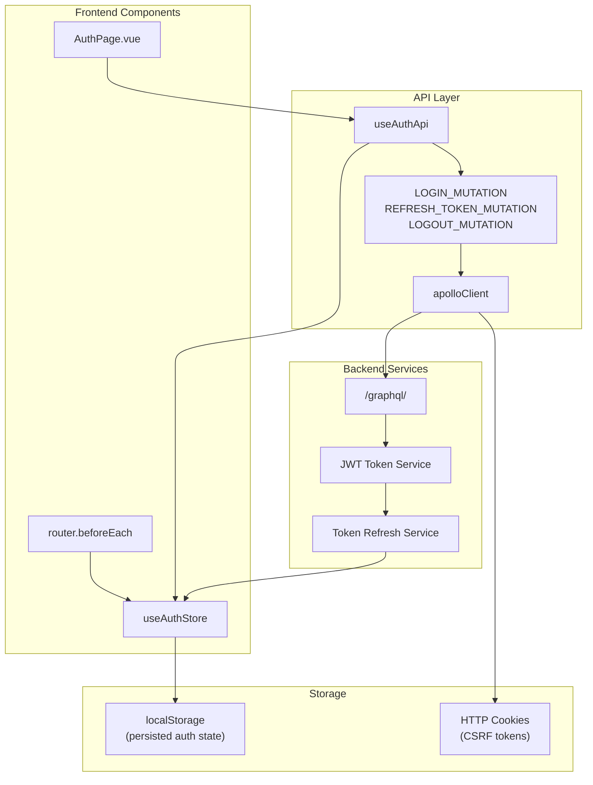
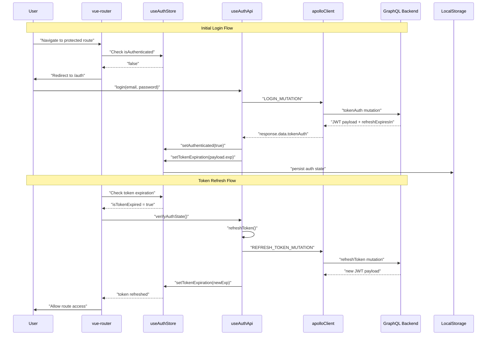
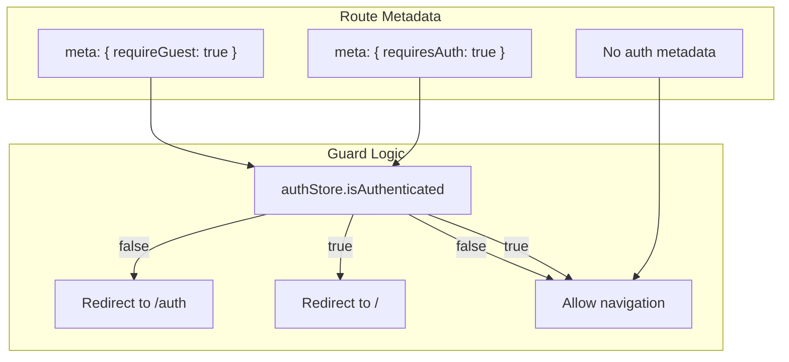
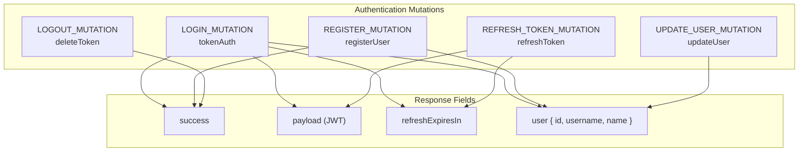

# Authentication System

> **Relevant source files**
> * [frontend/src/api/apollo.client.ts](../frontend/src/api/apollo.client.ts)
> * [frontend/src/api/auth.api.ts](../frontend/src/api/auth.api.ts)
> * [frontend/src/api/graphql/auth.mutations.ts](../frontend/src/api/graphql/auth.mutations.ts)
> * [frontend/src/router/index.ts](../frontend/src/router/index.ts)
> * [frontend/src/stores/auth.store.ts](../frontend/src/stores/auth.store.ts)

## Purpose and Scope

This document covers the JWT-based authentication system in EduSphere, including user login/logout, registration, session management, and route protection. The system uses JSON Web Tokens for stateless authentication with automatic token refresh capabilities. For information about user profile management and avatar handling, see [User Management](./User-Management.md). For details about the GraphQL schema and API endpoints, see [GraphQL Mutations](./GraphQL-Mutations.md).

## Authentication Architecture

The authentication system follows a multi-layered architecture with clear separation between state management, API communication, and route protection.

### Core Authentication Flow

**Sources:**

| File | Lines |
|------|-------|
| [`index.ts`](../frontend/src/router/index.ts#L1-L64) | L1–L64 |
| [`auth.api.ts`](../frontend/src/api/auth.api.ts#L1-L264) | L1–L264 |
| [`auth.store.ts`](../frontend/src/stores/auth.store.ts#L1-L153) | L1–L153 |
| [`auth.mutations.ts`](../frontend/src/api/graphql/auth.mutations.ts#L1-L83) | L1–L83 |

### Token Management and Refresh Mechanism

The system implements automatic token refresh with expiration tracking and grace periods to ensure seamless user experience.

**Sources:**

| File | Lines |
|------|-------|
| [`auth.api.ts`](../frontend/src/api/auth.api.ts#L92-L140) | L92–L140 |
| [`auth.store.ts`](../frontend/src/stores/auth.store.ts#L19-L74) | L19–L74 |
| [`index.ts`](../frontend/src/router/index.ts#L45-L62) | L45–L62 |

## Authentication State Management

### Auth Store Structure

The `useAuthStore` manages authentication state with persistence and automatic validation:

| State Property | Type | Purpose |
| --- | --- | --- |
| `isAuthenticated` | Boolean | Core authentication flag |
| `user` | Object | Current user information |
| `tokenExpiration` | Number | JWT expiration timestamp (seconds) |
| `tokenIssueTime` | Number | Token issue timestamp for lifespan calculation |
| `refreshTokenExpiration` | Number | Refresh token expiration timestamp |
| `tokenRevoked` | Boolean | Manual token revocation flag |

### Key Computed Properties

The store provides several computed properties for token lifecycle management:

* `isTokenExpired`: Checks if token has expired with 30-second grace period
* `isRefreshTokenExpired`: Validates refresh token expiration
* `hasValidAuthState`: Comprehensive validation of authentication state
* `tokenLifePercentage`: Calculates percentage of token lifetime elapsed

**Sources:**

| File | Lines |
|------|-------|
| [`auth.store.ts`](../frontend/src/stores/auth.store.ts#L6-L74) | L6–L74 |
| [`auth.store.ts`](../frontend/src/stores/auth.store.ts#L136-L152) | L136–L152 |

## Route Protection System

### Navigation Guards Implementation

The router implements authentication guards using Vue Router's `beforeEach` hook:

### Protected Routes Configuration

The system defines route-level protection through metadata:

* **Protected Routes**: `/create-room` requires `requiresAuth: true`
* **Guest-Only Routes**: `/auth`, `/login`, `/register` require `requireGuest: true`
* **Public Routes**: `/`, `/user/:userSlug`, `/user/:hostSlug/:roomSlug` have no restrictions

**Sources:**

| File | Lines |
|------|-------|
| [`index.ts`](../frontend/src/router/index.ts#L4-L38) | L4–L38 |
| [`index.ts`](../frontend/src/router/index.ts#L45-L62) | L45–L62 |

## API Integration Layer

### Authentication API Methods

The `useAuthApi` composable provides core authentication operations:

| Method | Parameters | Purpose |
| --- | --- | --- |
| `login` | `email, password` | Authenticate user and establish session |
| `registerUser` | `username, name, email, password1, password2` | Create new user account |
| `refreshToken` | None | Refresh JWT token before expiration |
| `logout` | None | Terminate session and clear tokens |
| `updateUser` | `data` | Update user profile information |
| `verifyAuthState` | None | Validate current authentication state |

### Token Validation Logic

The system implements comprehensive token validation in the `validateTokenPayload` function:

* Validates token payload existence and structure
* Checks expiration with minimum 30-second buffer
* Ensures reasonable token lifespan (minimum 30 seconds)
* Prevents acceptance of malformed or too-short-lived tokens

**Sources:**

| File | Lines |
|------|-------|
| [`auth.api.ts`](../frontend/src/api/auth.api.ts#L23-L47) | L23–L47 |
| [`auth.api.ts`](../frontend/src/api/auth.api.ts#L49-L90) | L49–L90 |

## GraphQL Authentication Mutations

### Core Authentication Operations

The system defines GraphQL mutations for all authentication operations:

### Mutation Structure

Each authentication mutation follows consistent patterns:

* **Input validation**: Required fields and type checking
* **Response structure**: Standardized success/error handling
* **User data**: Consistent user object fields (`id`, `username`, `name`)
* **Token handling**: JWT payload and refresh token expiration

**Sources:**

| File | Lines |
|------|-------|
| [`auth.mutations.ts`](../frontend/src/api/graphql/auth.mutations.ts#L3-L83) | L3–L83 |

## Apollo Client Authentication Integration

### Authentication Links Configuration

The Apollo Client implements authentication through a chain of links:

1. **Error Link**: Handles authentication errors and automatic token refresh
2. **Auth Link**: Injects CSRF tokens from cookies
3. **Upload Link**: Manages file uploads with authentication

### Automatic Token Refresh

The error link implements automatic token refresh when authentication errors occur:

* Detects `UNAUTHENTICATED` GraphQL errors
* Identifies expired token signatures
* Attempts token refresh before retrying failed operations
* Clears authentication state if refresh fails

**Sources:**

| File | Lines |
|------|-------|
| [`apollo.client.ts`](../frontend/src/api/apollo.client.ts#L14-L21) | L14–L21 |
| [`apollo.client.ts`](../frontend/src/api/apollo.client.ts#L34-L76) | L34–L76 |
| [`apollo.client.ts`](../frontend/src/api/apollo.client.ts#L78-L81) | L78–L81 |

## Session Persistence

### Local Storage Strategy

The authentication store uses Pinia persistence to maintain session state across browser sessions:

* **Storage Backend**: `localStorage` for persistent sessions
* **Persisted Fields**: Authentication state, user data, token expiration times
* **Initialization**: Automatic validation and cleanup of stale sessions

### State Validation on Startup

The store's `initialize` method validates persisted state:

* Checks token expiration status
* Validates refresh token expiration
* Clears invalid authentication state automatically

**Sources:**

| File | Lines |
|------|-------|
| [`auth.store.ts`](../frontend/src/stores/auth.store.ts#L124-L133) | L124–L133 |
| [`auth.store.ts`](../frontend/src/stores/auth.store.ts#L136-L152) | L136–L152 |
