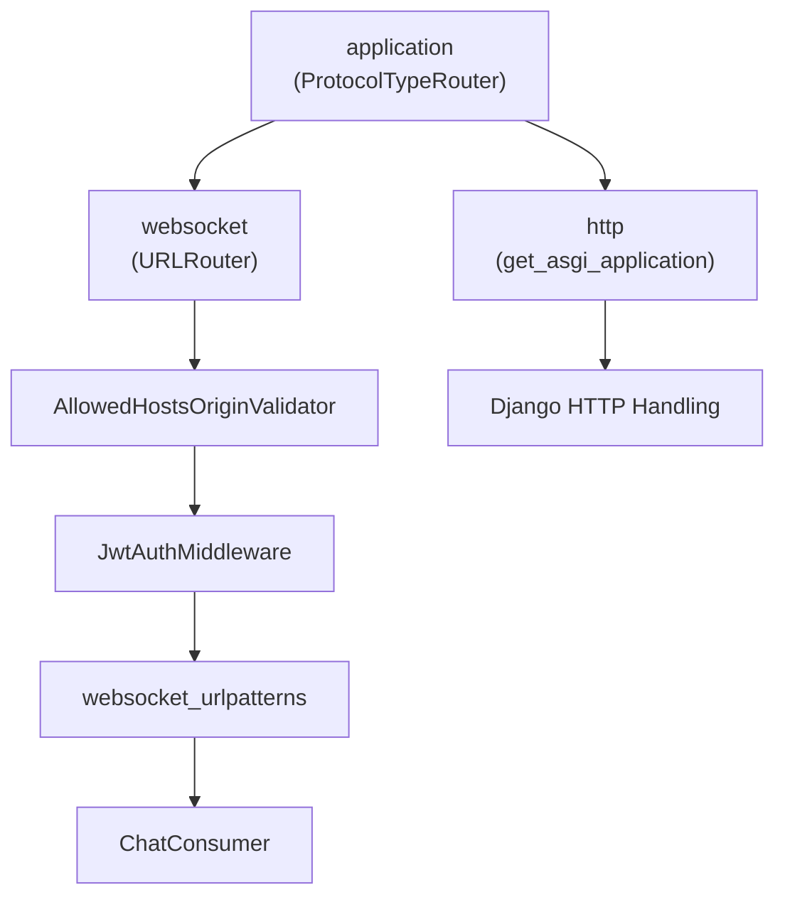
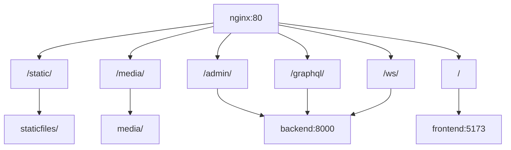
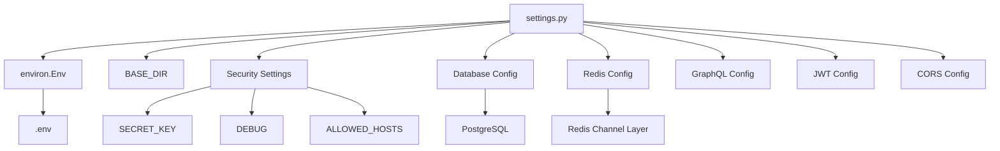
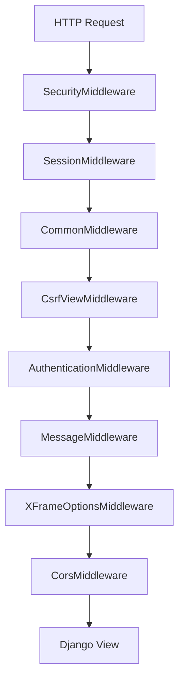
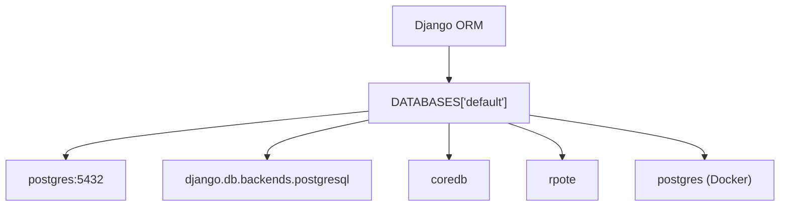
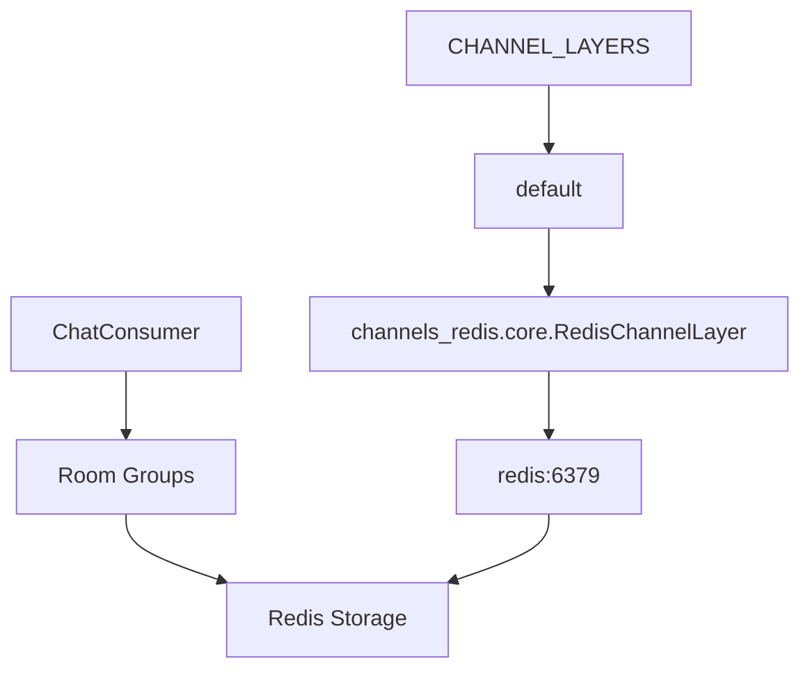
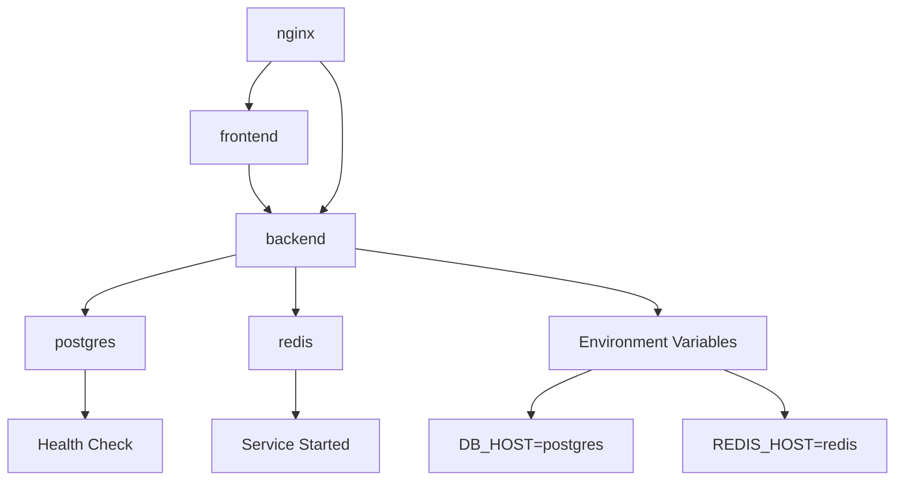
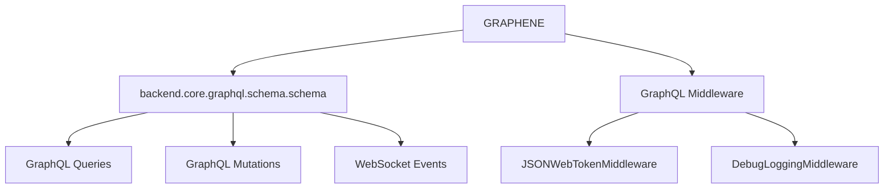

# Backend Architecture

> **Relevant source files**
> * [.gitignore](../.gitignore)
> * [backend/config/asgi.py](../backend/config/asgi.py)
> * [backend/config/settings.py](../backend/config/settings.py)
> * [backend/config/urls.py](../backend/config/urls.py)
> * [backend/core/graphql/utils.py](../backend/core/graphql/utils.py)
> * [docker-compose.yml](../docker-compose.yml)
> * [docker/nginx/nginx.conf](../docker/nginx/nginx.conf)
> * [frontend/vite.config.ts](../frontend/vite.config.ts)
> * [scripts/run.sh](../scripts/run.sh)
> * [scripts/test.sh](../scripts/test.sh)

This page documents the Django backend architecture of EduSphere, covering ASGI application setup, Django configuration, URL routing, and service integration. The backend serves as the core API layer supporting both GraphQL operations and real-time WebSocket communication.

For information about the complete system architecture, see [System Architecture](./System-Architecture.md). For real-time communication implementation details, see [Real-time Communication](./Real-time-Communication.md). For database schema and models, see [Database Design](./Database-Design.md).

## ASGI Application Structure

EduSphere uses Django with ASGI (Asynchronous Server Gateway Interface) to support both traditional HTTP requests and WebSocket connections for real-time chat functionality.

### ASGI Configuration

The ASGI application is configured in `backend/config/asgi.py` and uses a protocol-based router to handle different connection types:



The ASGI application routes HTTP requests to Django's standard ASGI application and WebSocket connections through custom middleware and routing.

**Sources:**

| File | Lines |
|------|-------|
| [`asgi.py`](../backend/config/asgi.py#L1-L15) | L1–L15 |

### Django Application Configuration

The backend consists of multiple Django applications configured in `settings.py`:

| Application | Purpose | Location |
| --- | --- | --- |
| `backend.core` | Core models, GraphQL schema, chat consumers | `backend/core/` |
| `backend.api` | REST API endpoints (if needed) | `backend/api/` |
| `channels` | WebSocket support | Third-party |
| `graphene_django` | GraphQL integration | Third-party |
| `corsheaders` | Cross-origin resource sharing | Third-party |

**Sources:**

| File | Lines |
|------|-------|
| [`settings.py`](../backend/config/settings.py#L50-L63) | L50–L63 |

## URL Routing Architecture

The URL routing system directs requests to appropriate handlers based on the request path and type.

### Main URL Configuration

```

```

The GraphQL endpoint includes multiple layers of security middleware including JWT authentication, CSRF protection, and file upload support.

**Sources:**

| File | Lines |
|------|-------|
| [`urls.py`](../backend/config/urls.py#L9-L17) | L9–L17 |

### Nginx Reverse Proxy Routing

Nginx serves as the entry point and routes requests based on path patterns:



Nginx handles static file serving directly while proxying dynamic requests to the appropriate backend services.

**Sources:**

| File | Lines |
|------|-------|
| [`nginx.conf`](../docker/nginx/nginx.conf#L1-L75) | L1–L75 |

## Django Configuration System

The Django configuration system manages application settings, middleware, authentication, and external service integration.

### Core Configuration Structure



The configuration system uses environment variables for sensitive data and provides defaults for development.

**Sources:**

| File | Lines |
|------|-------|
| [`settings.py`](../backend/config/settings.py#L16-L31) | L16–L31 |

### Authentication and Security Configuration

EduSphere implements a comprehensive authentication system using JWT tokens with additional security measures:

| Component | Configuration | Purpose |
| --- | --- | --- |
| `AUTH_USER_MODEL` | `core.User` | Custom user model |
| `AUTHENTICATION_BACKENDS` | JWT + ModelBackend | Token and session auth |
| `GRAPHQL_JWT` | JWT settings | Token expiration and security |
| `CSRF_TRUSTED_ORIGINS` | Localhost origins | CSRF protection |
| `CORS_ALLOWED_ORIGINS` | Frontend origins | Cross-origin requests |

The JWT configuration includes token expiration, refresh tokens, blacklisting, and CSRF rotation for enhanced security.

**Sources:**

| File | Lines |
|------|-------|
| [`settings.py`](../backend/config/settings.py#L153-L187) | L153–L187 |

### Middleware Stack

The Django middleware stack processes requests in order:



Each middleware layer adds specific functionality including security headers, session management, authentication, and CORS handling.

**Sources:**

| File | Lines |
|------|-------|
| [`settings.py`](../backend/config/settings.py#L65-L74) | L65–L74 |

## Service Integration Architecture

The backend integrates with multiple external services for data persistence, caching, and real-time communication.

### Database Configuration



The database configuration uses environment variables for connection parameters, enabling different configurations for development and production.

**Sources:**

| File | Lines |
|------|-------|
| [`settings.py`](../backend/config/settings.py#L192-L201) | L192–L201 |
| [`docker-compose.yml`](../docker-compose.yml#L3-L17) | L3–L17 |

### Redis Channel Layer Configuration

Redis serves as the channel layer for Django Channels, enabling real-time WebSocket communication:



The Redis configuration enables message broadcasting across multiple WebSocket connections and supports horizontal scaling.

**Sources:**

| File | Lines |
|------|-------|
| [`settings.py`](../backend/config/settings.py#L203-L210) | L203–L210 |
| [`docker-compose.yml`](../docker-compose.yml#L19-L23) | L19–L23 |

### Docker Service Integration

The backend runs in a containerized environment with service dependencies:



The Docker Compose configuration manages service dependencies and ensures proper startup order with health checks.

**Sources:**

| File | Lines |
|------|-------|
| [`docker-compose.yml`](../docker-compose.yml#L25-L46) | L25–L46 |

## GraphQL and API Configuration

The backend provides a GraphQL API as the primary interface for frontend communication.

### GraphQL Configuration



The GraphQL configuration includes JWT middleware for authentication and optional debug logging for development.

**Sources:**

| File | Lines |
|------|-------|
| [`settings.py`](../backend/config/settings.py#L145-L151) | L145–L151 |

### Logging Configuration

The application includes structured logging for monitoring and debugging:

| Logger | Handler | Purpose |
| --- | --- | --- |
| `backend.core.graphql.middleware` | `graphql_file` | GraphQL request logging |
| Root logger | `root_file` | General application logging |

The logging system captures GraphQL operations and general application events with configurable verbosity levels.

**Sources:**

| File | Lines |
|------|-------|
| [`settings.py`](../backend/config/settings.py#L107-L139) | L107–L139 |

## Development and Production Configuration

The backend configuration supports both development and production environments with appropriate security settings.

### Development Configuration

* Debug mode enabled with GraphiQL interface
* Relaxed CORS and CSRF settings for localhost
* File-based logging for debugging
* Hot reload support with Uvicorn

### Production Considerations

The codebase includes commented production security settings for HTTPS deployment:

* SSL redirect and HSTS headers
* Secure cookie settings
* Strict CORS and CSRF policies
* Production-grade static file serving

**Sources:**

| File | Lines |
|------|-------|
| [`settings.py`](../backend/config/settings.py#L76-L85) | L76–L85 |
| [`settings.py`](../backend/config/settings.py#L157-L174) | L157–L174 |
