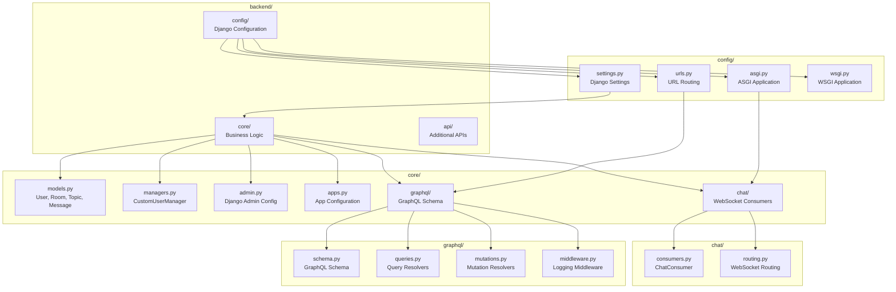
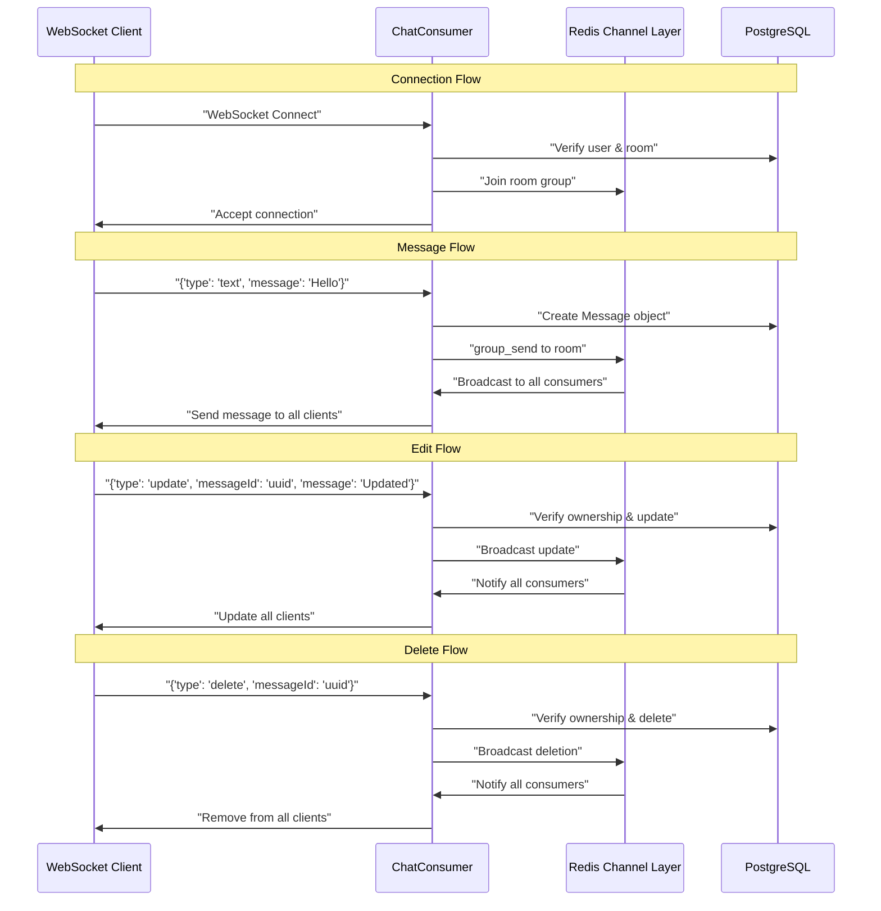
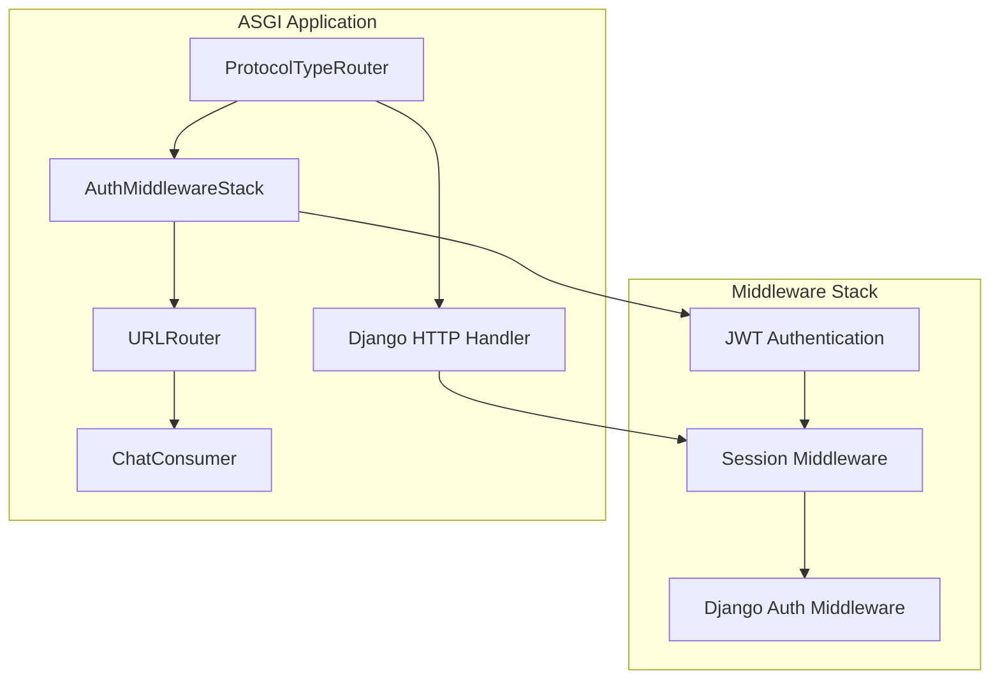

# Backend Development Guide

> **Relevant source files**
> * [backend/config/settings.py](../backend/config/settings.py)
> * [backend/config/urls.py](../backend/config/urls.py)
> * [backend/core/chat/consumers.py](../backend/core/chat/consumers.py)
> * [backend/core/models.py](../backend/core/models.py)
> * [docker-compose.yml](../docker-compose.yml)
> * [docker/nginx/nginx.conf](../docker/nginx/nginx.conf)
> * [frontend/vite.config.ts](../frontend/vite.config.ts)

This document covers the Django backend implementation of EduSphere, including project structure, data models, authentication, real-time WebSocket communication, and GraphQL API integration. It focuses on the technical implementation details and code organization within the `backend/` directory.

For frontend implementation details, see [Frontend Development Guide](./Frontend-Development-Guide.md). For API usage and GraphQL schema documentation, see [API Documentation](./API-Documentation.md). For deployment and infrastructure setup, see [Deployment and Infrastructure](./Deployment-and-Infrastructure.md).

## Django Project Structure

EduSphere uses Django 5.2.1 with ASGI support for handling both HTTP and WebSocket connections. The backend is organized into two main applications: `core` for business logic and `api` for additional API endpoints.



**Sources:**

| File | Lines |
|------|-------|
| [`settings.py`](../backend/config/settings.py#L1-L264) | L1–L264 |
| [`urls.py`](../backend/config/urls.py#L1-L25) | L1–L25 |
| [`models.py`](../backend/core/models.py#L1-L150) | L1–L150 |
| [`consumers.py`](../backend/core/chat/consumers.py#L1-L217) | L1–L217 |

## Core Data Models

The application uses four primary Django models that form the foundation of the chat platform. All models implement validation through Django's `full_clean()` method and use UUID primary keys for enhanced security.

```css
#mermaid-qb72hpwl5x{font-family:ui-sans-serif,-apple-system,system-ui,Segoe UI,Helvetica;font-size:16px;fill:#333;}@keyframes edge-animation-frame{from{stroke-dashoffset:0;}}@keyframes dash{to{stroke-dashoffset:0;}}#mermaid-qb72hpwl5x .edge-animation-slow{stroke-dasharray:9,5!important;stroke-dashoffset:900;animation:dash 50s linear infinite;stroke-linecap:round;}#mermaid-qb72hpwl5x .edge-animation-fast{stroke-dasharray:9,5!important;stroke-dashoffset:900;animation:dash 20s linear infinite;stroke-linecap:round;}#mermaid-qb72hpwl5x .error-icon{fill:#dddddd;}#mermaid-qb72hpwl5x .error-text{fill:#222222;stroke:#222222;}#mermaid-qb72hpwl5x .edge-thickness-normal{stroke-width:1px;}#mermaid-qb72hpwl5x .edge-thickness-thick{stroke-width:3.5px;}#mermaid-qb72hpwl5x .edge-pattern-solid{stroke-dasharray:0;}#mermaid-qb72hpwl5x .edge-thickness-invisible{stroke-width:0;fill:none;}#mermaid-qb72hpwl5x .edge-pattern-dashed{stroke-dasharray:3;}#mermaid-qb72hpwl5x .edge-pattern-dotted{stroke-dasharray:2;}#mermaid-qb72hpwl5x .marker{fill:#999;stroke:#999;}#mermaid-qb72hpwl5x .marker.cross{stroke:#999;}#mermaid-qb72hpwl5x svg{font-family:ui-sans-serif,-apple-system,system-ui,Segoe UI,Helvetica;font-size:16px;}#mermaid-qb72hpwl5x p{margin:0;}#mermaid-qb72hpwl5x .entityBox{fill:#ffffff;stroke:#dddddd;}#mermaid-qb72hpwl5x .relationshipLabelBox{fill:#dddddd;opacity:0.7;background-color:#dddddd;}#mermaid-qb72hpwl5x .relationshipLabelBox rect{opacity:0.5;}#mermaid-qb72hpwl5x .labelBkg{background-color:rgba(221, 221, 221, 0.5);}#mermaid-qb72hpwl5x .edgeLabel .label{fill:#dddddd;font-size:14px;}#mermaid-qb72hpwl5x .label{font-family:ui-sans-serif,-apple-system,system-ui,Segoe UI,Helvetica;color:#333;}#mermaid-qb72hpwl5x .edge-pattern-dashed{stroke-dasharray:8,8;}#mermaid-qb72hpwl5x .node rect,#mermaid-qb72hpwl5x .node circle,#mermaid-qb72hpwl5x .node ellipse,#mermaid-qb72hpwl5x .node polygon{fill:#ffffff;stroke:#dddddd;stroke-width:1px;}#mermaid-qb72hpwl5x .relationshipLine{stroke:#999;stroke-width:1;fill:none;}#mermaid-qb72hpwl5x .marker{fill:none!important;stroke:#999!important;stroke-width:1;}#mermaid-qb72hpwl5x :root{--mermaid-font-family:"trebuchet ms",verdana,arial,sans-serif;}hostsparticipatescategorizessendscontainsUserUUIDFieldidPKEmailFieldemailUKSlugFieldusernameUKCharFieldnameTextFieldbioImageFieldavatarBooleanFieldis_staffBooleanFieldis_activeDateTimeFielddate_joinedTopicAutoFieldidPKCharFieldnameUKRoomUUIDFieldidPKCharFieldnameSlugFieldslugForeignKeyhostFKForeignKeytopicFKTextFielddescriptionManyToManyFieldparticipantsDateTimeFieldupdatedDateTimeFieldcreatedMessageUUIDFieldidPKForeignKeyuserFKForeignKeyroomFKTextFieldbodyBooleanFieldeditedDateTimeFieldupdatedDateTimeFieldcreated
```

### User Model

The `User` model extends Django's `AbstractBaseUser` and uses email as the primary authentication field. It includes custom validation and automatic username slugification.

Key features:

* Custom manager via `CustomUserManager` for user creation
* Avatar upload with file extension validation
* Bio field with 500-character limit
* Automatic username slugification in `save()` method

### Room Model

The `Room` model represents chat rooms with automatic slug generation and uniqueness constraints. It maintains participant relationships and enforces business rules through database constraints.

Key features:

* Unique constraint per host for room names
* Automatic slug generation with collision handling
* Many-to-many relationship with participants
* Database indexes for performance optimization

### Message Model

The `Message` model handles chat messages with edit tracking and serialization methods for WebSocket communication.

Key features:

* `serialize()` method for WebSocket responses
* `update()` method for message editing with automatic `edited` flag
* 500-character body limit with validation
* Database indexes for efficient querying

**Sources:**

| File | Lines |
|------|-------|
| [`models.py`](../backend/core/models.py#L12-L150) | L12–L150 |
| [`managers.py`](../backend/core/managers.py#L1-L40) | L1–L40 |

## Authentication and Authorization

EduSphere implements JWT-based authentication using `django-graphql-jwt` with both GraphQL and WebSocket support. The authentication system includes token rotation, blacklisting, and CSRF protection.

### JWT Configuration

The JWT system is configured with short-lived access tokens (10 minutes) and longer refresh tokens (7 days):

```python
# JWT settings from settings.py
GRAPHQL_JWT = {
    "JWT_VERIFY_EXPIRATION": True,
    "JWT_EXPIRATION_DELTA": timedelta(minutes=10),
    "JWT_REFRESH_EXPIRATION_DELTA": timedelta(days=7),
    "JWT_BLACKLIST_ENABLED": True,
    "JWT_BLACKLIST_AFTER_ROTATION": True,
    "JWT_CSRF_ROTATION": True,
}
```

### Authentication Backends

The system uses multiple authentication backends to support both traditional session-based authentication and JWT tokens:

* `JSONWebTokenBackend` for GraphQL JWT authentication
* `ModelBackend` for Django admin and traditional authentication

### WebSocket Authentication

WebSocket connections authenticate using JWT tokens through middleware. The `ChatConsumer` verifies user authentication and room participation before accepting connections.

**Sources:**

| File | Lines |
|------|-------|
| [`settings.py`](../backend/config/settings.py#L153-L163) | L153–L163 |
| [`settings.py`](../backend/config/settings.py#L184-L187) | L184–L187 |
| [`consumers.py`](../backend/core/chat/consumers.py#L23-L62) | L23–L62 |

## WebSocket Implementation

The real-time chat functionality is implemented using Django Channels with Redis as the channel layer. The `ChatConsumer` class handles WebSocket connections and message operations.



### ChatConsumer Class

The `ChatConsumer` handles three types of operations:

* `text`: Creating new messages
* `update`: Editing existing messages
* `delete`: Removing messages

Each operation includes ownership verification and validation before database updates. Error handling sends JSON error responses to clients.

### Channel Layer Configuration

Redis serves as the channel layer backend for distributing messages across multiple WebSocket connections:

```
CHANNEL_LAYERS = {
    "default": {
        "BACKEND": "channels_redis.core.RedisChannelLayer",
        "CONFIG": {
            "hosts": [(env("REDIS_HOST", default="localhost"), 6379)],
        },
    },
}
```

**Sources:**

| File | Lines |
|------|-------|
| [`consumers.py`](../backend/core/chat/consumers.py#L1-L217) | L1–L217 |
| [`settings.py`](../backend/config/settings.py#L203-L210) | L203–L210 |

## GraphQL Integration

The backend uses Graphene-Django to provide a GraphQL API with JWT authentication middleware. The GraphQL endpoint supports file uploads and includes comprehensive error handling.

### Schema Configuration

GraphQL is configured with JWT middleware and optional debug logging:

```css
GRAPHENE = {
    "SCHEMA": "backend.core.graphql.schema.schema",
    "MIDDLEWARE": [
        "graphql_jwt.middleware.JSONWebTokenMiddleware",
        # "backend.core.graphql.middleware.DebugLoggingMiddleware",
    ],
}
```

### Endpoint Security

The GraphQL endpoint includes multiple security layers:

* CSRF protection via `csrf_protect` decorator
* JWT cookie handling via `jwt_cookie` decorator
* CSRF token initialization via `ensure_csrf_cookie`
* File upload support via `FileUploadGraphQLView`

The endpoint configuration demonstrates Django's decorator composition for security:

```
path("graphql/", jwt_cookie(
    csrf_protect(ensure_csrf_cookie(
        FileUploadGraphQLView.as_view(graphiql=settings.DEBUG)
    ))
)),
```

**Sources:**

| File | Lines |
|------|-------|
| [`settings.py`](../backend/config/settings.py#L145-L151) | L145–L151 |
| [`urls.py`](../backend/config/urls.py#L11-L15) | L11–L15 |

## Configuration Management

EduSphere uses environment-based configuration with `django-environ` for managing sensitive settings and deployment-specific values.

### Environment Variables

Key configuration variables include:

* `SECRET_KEY`: Django secret key for cryptographic signing
* `DEBUG`: Development mode toggle
* `DB_*`: PostgreSQL database connection parameters
* `REDIS_HOST`: Redis server location for channels

### Security Settings

The configuration includes production-ready security settings that are currently commented for development:

* HTTPS redirection and HSTS headers
* Secure cookie settings
* CSRF trusted origins
* CORS allowed origins

### Logging Configuration

Structured logging captures GraphQL operations and general application events to separate log files for debugging and monitoring.

**Sources:**

| File | Lines |
|------|-------|
| [`settings.py`](../backend/config/settings.py#L16-L35) | L16–L35 |
| [`settings.py`](../backend/config/settings.py#L107-L139) | L107–L139 |
| [`settings.py`](../backend/config/settings.py#L171-L182) | L171–L182 |

## ASGI Application Structure

The ASGI application handles both HTTP and WebSocket protocols through Django Channels. The configuration integrates authentication middleware for WebSocket connections and routing for chat functionality.



The ASGI configuration enables real-time WebSocket communication while maintaining Django's authentication system for both HTTP and WebSocket protocols.

**Sources:**

| File | Lines |
|------|-------|
| [`settings.py`](../backend/config/settings.py#L141-L141) | L141 |
| [`docker-compose.yml`](../docker-compose.yml#L25-L47) | L25–L47 |
