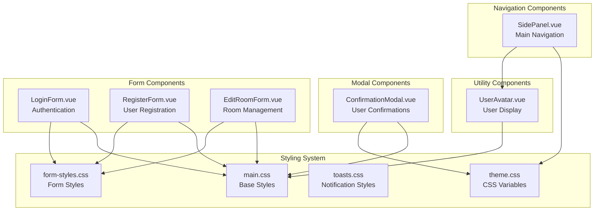
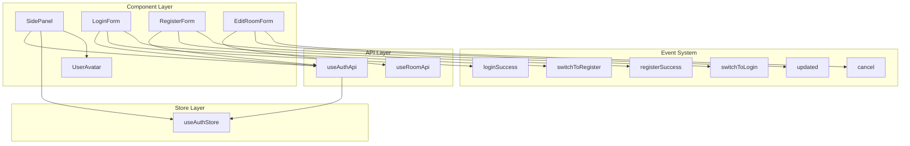

# Component Library

> **Relevant source files**
> * [backend/core/graphql/types.py](../backend/core/graphql/types.py)
> * [frontend/src/assets/styles/main.css](../frontend/src/assets/styles/main.css)
> * [frontend/src/assets/styles/theme.css](../frontend/src/assets/styles/theme.css)
> * [frontend/src/assets/styles/toasts.css](../frontend/src/assets/styles/toasts.css)
> * [frontend/src/components/ConfirmationModal.vue](../frontend/src/components/ConfirmationModal.vue)
> * [frontend/src/components/EditRoomForm.vue](../frontend/src/components/EditRoomForm.vue)
> * [frontend/src/components/LoginForm.vue](../frontend/src/components/LoginForm.vue)
> * [frontend/src/components/RegisterForm.vue](../frontend/src/components/RegisterForm.vue)
> * [frontend/src/components/SidePanel.vue](../frontend/src/components/SidePanel.vue)
> * [frontend/src/components/UserAvatar.vue](../frontend/src/components/UserAvatar.vue)

This document covers the reusable UI components, forms, modals, and styling system in the EduSphere frontend application. The component library provides a consistent set of Vue 3 components that implement the application's design system and handle common UI patterns such as authentication forms, navigation, user interactions, and modal dialogs.

For information about Vue application setup and configuration, see [Application Setup](./Application-Setup.md). For state management patterns used within components, see [State Management](./State-Management.md).

## Component Architecture Overview

The component library follows a modular architecture where components are organized by functionality and reusability. Each component is self-contained with scoped styles and well-defined props interfaces.



**Sources:**

| File | Lines |
|------|-------|
| [`SidePanel.vue`](../frontend/src/components/SidePanel.vue#L1-L359) | L1–L359 |
| [`LoginForm.vue`](../frontend/src/components/LoginForm.vue#L1-L72) | L1–L72 |
| [`RegisterForm.vue`](../frontend/src/components/RegisterForm.vue#L1-L131) | L1–L131 |
| [`EditRoomForm.vue`](../frontend/src/components/EditRoomForm.vue#L1-L333) | L1–L333 |
| [`ConfirmationModal.vue`](../frontend/src/components/ConfirmationModal.vue#L1-L236) | L1–L236 |
| [`UserAvatar.vue`](../frontend/src/components/UserAvatar.vue#L1-L129) | L1–L129 |

## Core UI Components

### Navigation Components

#### SidePanel Component

The `SidePanel` component provides the main navigation interface with collapsible functionality, user authentication state display, and theme switching capabilities.

**Key Features:**

* Collapsible side panel with toggle button at [frontend/src/components/SidePanel.vue L4-L10](../frontend/src/components/SidePanel.vue#L4-L10)
* Authentication-aware navigation links at [frontend/src/components/SidePanel.vue L30-L40](../frontend/src/components/SidePanel.vue#L30-L40)
* User profile display with avatar integration at [frontend/src/components/SidePanel.vue L50-L60](../frontend/src/components/SidePanel.vue#L50-L60)
* Theme toggle functionality at [frontend/src/components/SidePanel.vue L44-L47](../frontend/src/components/SidePanel.vue#L44-L47)
* Responsive design with backdrop overlay at [frontend/src/components/SidePanel.vue L12-L17](../frontend/src/components/SidePanel.vue#L12-L17)

**Props Interface:**
The component is self-contained and uses composables for authentication state from `useAuthStore` and `useAuthApi`.

**Sources:**

| File | Lines |
|------|-------|
| [`SidePanel.vue`](../frontend/src/components/SidePanel.vue#L80-L145) | L80–L145 |

### Form Components

#### Authentication Forms

The authentication forms implement a consistent design pattern with validation, loading states, and error handling.

**LoginForm Component:**

* Email/password authentication at [frontend/src/components/LoginForm.vue L6-L28](../frontend/src/components/LoginForm.vue#L6-L28)
* Form submission handling at [frontend/src/components/LoginForm.vue L56-L66](../frontend/src/components/LoginForm.vue#L56-L66)
* Loading state management at [frontend/src/components/LoginForm.vue L30-L33](../frontend/src/components/LoginForm.vue#L30-L33)

**RegisterForm Component:**

* Multi-field registration with validation at [frontend/src/components/RegisterForm.vue L6-L64](../frontend/src/components/RegisterForm.vue#L6-L64)
* Password confirmation validation at [frontend/src/components/RegisterForm.vue L107-L110](../frontend/src/components/RegisterForm.vue#L107-L110)
* Form switching events at [frontend/src/components/RegisterForm.vue L74-L76](../frontend/src/components/RegisterForm.vue#L74-L76)

**Sources:**

| File | Lines |
|------|-------|
| [`LoginForm.vue`](../frontend/src/components/LoginForm.vue#L44-L67) | L44–L67 |
| [`RegisterForm.vue`](../frontend/src/components/RegisterForm.vue#L82-L125) | L82–L125 |

#### EditRoomForm Component

Provides room editing functionality with autocomplete topic selection and form validation.

**Key Features:**

* Autocomplete topic input with suggestions at [frontend/src/components/EditRoomForm.vue L8-L36](../frontend/src/components/EditRoomForm.vue#L8-L36)
* Keyboard navigation support at [frontend/src/components/EditRoomForm.vue L17-L21](../frontend/src/components/EditRoomForm.vue#L17-L21)
* Dynamic topic filtering at [frontend/src/components/EditRoomForm.vue L101-L107](../frontend/src/components/EditRoomForm.vue#L101-L107)
* Form state management at [frontend/src/components/EditRoomForm.vue L147-L165](../frontend/src/components/EditRoomForm.vue#L147-L165)

**Sources:**

| File | Lines |
|------|-------|
| [`EditRoomForm.vue`](../frontend/src/components/EditRoomForm.vue#L62-L165) | L62–L165 |

### Modal Components

#### ConfirmationModal Component

Implements a reusable confirmation dialog pattern with customizable content and actions.

**Configuration Options:**

* Customizable title and message at [frontend/src/components/ConfirmationModal.vue L34-L41](../frontend/src/components/ConfirmationModal.vue#L34-L41)
* Configurable button text at [frontend/src/components/ConfirmationModal.vue L42-L49](../frontend/src/components/ConfirmationModal.vue#L42-L49)
* Outside click handling at [frontend/src/components/ConfirmationModal.vue L50-L53](../frontend/src/components/ConfirmationModal.vue#L50-L53)
* Keyboard event handling (ESC key) at [frontend/src/components/ConfirmationModal.vue L74-L78](../frontend/src/components/ConfirmationModal.vue#L74-L78)

**Sources:**

| File | Lines |
|------|-------|
| [`ConfirmationModal.vue`](../frontend/src/components/ConfirmationModal.vue#L26-L88) | L26–L88 |

### Utility Components

#### UserAvatar Component

Provides consistent user avatar display with fallback handling and size variants.

**Features:**

* Image fallback with initials at [frontend/src/components/UserAvatar.vue L24-L38](../frontend/src/components/UserAvatar.vue#L24-L38)
* Multiple size variants at [frontend/src/components/UserAvatar.vue L9-L13](../frontend/src/components/UserAvatar.vue#L9-L13)
* Status indicator support at [frontend/src/components/UserAvatar.vue L14-L17](../frontend/src/components/UserAvatar.vue#L14-L17)
* Computed avatar source handling at [frontend/src/components/UserAvatar.vue L24-L27](../frontend/src/components/UserAvatar.vue#L24-L27)

**Sources:**

| File | Lines |
|------|-------|
| [`UserAvatar.vue`](../frontend/src/components/UserAvatar.vue#L1-L45) | L1–L45 |

## Styling System

### Theme Variables

The styling system uses CSS custom properties for consistent theming and dark mode support.

**Light Theme Variables:**

```
--primary-color: #4f46e5
--text-color: #1f2937
--bg-color: #f9fafb
--white: #ffffff
```

**Dark Theme Variables:**

```
--primary-color: #818cf8
--text-color: #f3f4f6
--bg-color: #1f2937
--white: #111827
```

**Sources:**

| File | Lines |
|------|-------|
| [`theme.css`](../frontend/src/assets/styles/theme.css#L1-L25) | L1–L25 |

### Utility Classes

Base utility classes provide consistent spacing, typography, and layout patterns.

| Category | Classes | Purpose |
| --- | --- | --- |
| Typography | `.text-primary`, `.text-error`, `.text-muted` | Color variants |
| Layout | `.flex`, `.flex-col`, `.items-center` | Flexbox utilities |
| Spacing | `.gap-1`, `.gap-2`, `.mt-2`, `.mb-4` | Margin and gap utilities |
| Sizing | `.w-full`, `.h-full` | Width and height utilities |

**Sources:**

| File | Lines |
|------|-------|
| [`main.css`](../frontend/src/assets/styles/main.css#L20-L96) | L20–L96 |

### Component Style Patterns

**Button System:**

* Base `.btn` class with variants at [frontend/src/assets/styles/main.css L98-L154](../frontend/src/assets/styles/main.css#L98-L154)
* Size modifiers: `.btn-sm`, `.btn-lg`, `.btn-icon`
* Style variants: `.btn-primary`, `.btn-outline`, `.btn-danger`

**Card System:**

* Base `.card` structure at [frontend/src/assets/styles/main.css L156-L176](../frontend/src/assets/styles/main.css#L156-L176)
* Sectioned layout: `.card-header`, `.card-body`, `.card-footer`

**Form System:**

* Consistent form styling at [frontend/src/assets/styles/main.css L178-L208](../frontend/src/assets/styles/main.css#L178-L208)
* Input focus states and validation styling

**Sources:**

| File | Lines |
|------|-------|
| [`main.css`](../frontend/src/assets/styles/main.css#L98-L241) | L98–L241 |

## Component Interaction Patterns

The following diagram shows how components interact with stores, APIs, and each other in the component hierarchy.



**Event Emission Patterns:**

* Authentication forms emit success/switch events for parent component handling
* EditRoomForm emits `updated` and `cancel` events for modal management
* ConfirmationModal emits `confirm`, `cancel`, and `close` events

**Sources:**

| File | Lines |
|------|-------|
| [`SidePanel.vue`](../frontend/src/components/SidePanel.vue#L82-L86) | L82–L86 |
| [`LoginForm.vue`](../frontend/src/components/LoginForm.vue#L48-L50) | L48–L50 |
| [`RegisterForm.vue`](../frontend/src/components/RegisterForm.vue#L86-L88) | L86–L88 |
| [`EditRoomForm.vue`](../frontend/src/components/EditRoomForm.vue#L73-L75) | L73–L75 |
| [`ConfirmationModal.vue`](../frontend/src/components/ConfirmationModal.vue#L56-L57) | L56–L57 |

### Responsive Design Implementation

Components implement mobile-first responsive design using CSS media queries and adaptive layouts.

**Mobile Optimizations:**

* SidePanel responsive width adjustments at [frontend/src/components/SidePanel.vue L354-L358](../frontend/src/components/SidePanel.vue#L354-L358)
* EditRoomForm mobile button layouts at [frontend/src/components/EditRoomForm.vue L318-L332](../frontend/src/components/EditRoomForm.vue#L318-L332)
* ConfirmationModal mobile adaptations at [frontend/src/components/ConfirmationModal.vue L216-L235](../frontend/src/components/ConfirmationModal.vue#L216-L235)
* Toast notification mobile styling at [frontend/src/assets/styles/toasts.css L1-L55](../frontend/src/assets/styles/toasts.css#L1-L55)

**Sources:**

| File | Lines |
|------|-------|
| [`SidePanel.vue`](../frontend/src/components/SidePanel.vue#L206-L210) | L206–L210 |
| [`EditRoomForm.vue`](../frontend/src/components/EditRoomForm.vue#L318-L332) | L318–L332 |
| [`ConfirmationModal.vue`](../frontend/src/components/ConfirmationModal.vue#L216-L235) | L216–L235 |
| [`toasts.css`](../frontend/src/assets/styles/toasts.css#L1-L23) | L1–L23 |
