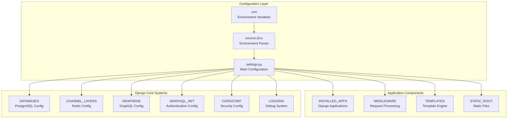
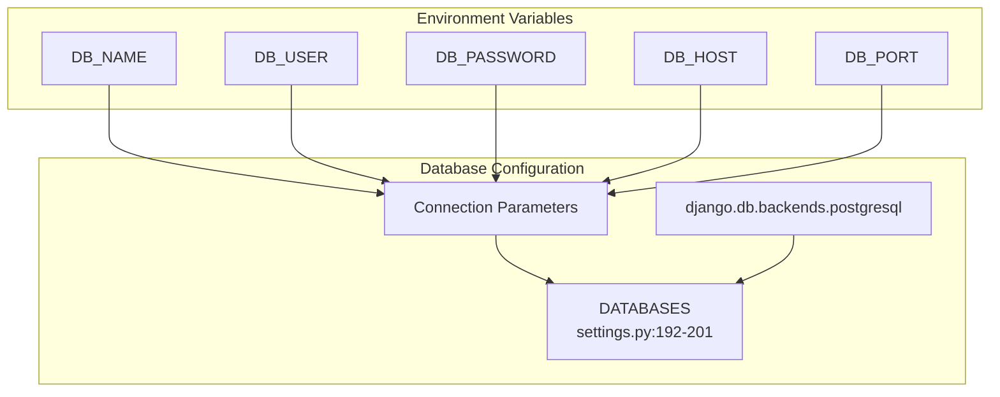
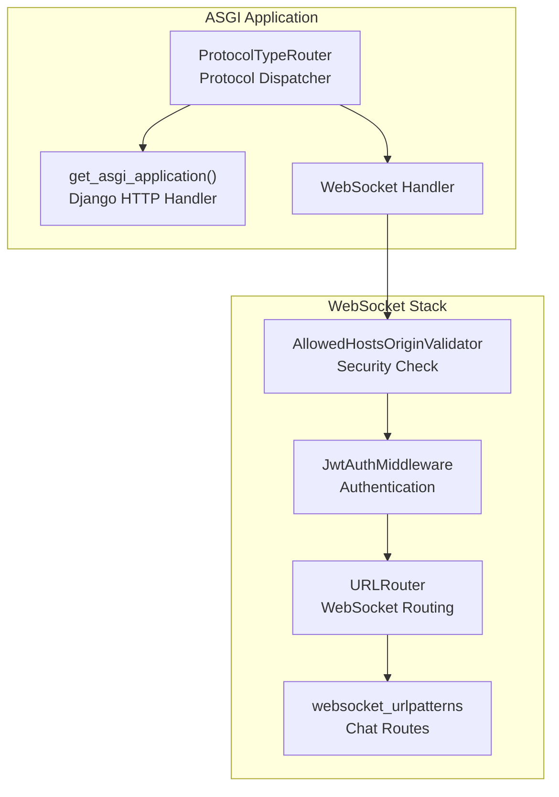
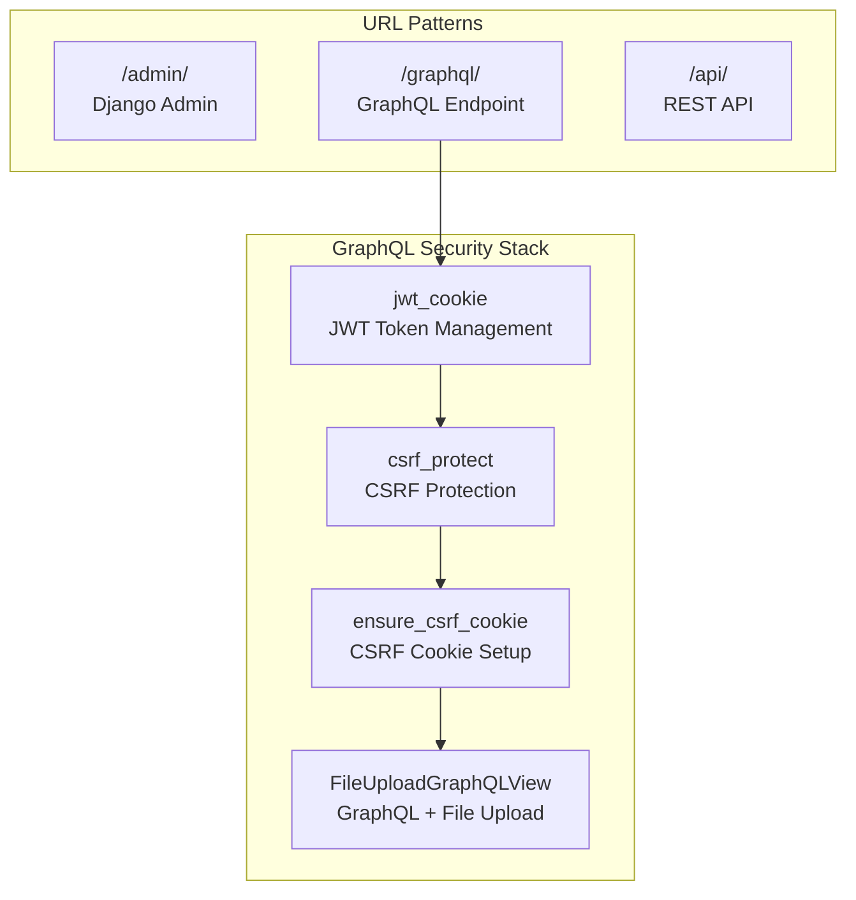
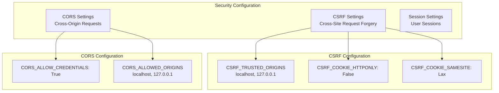
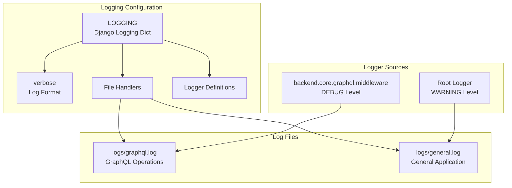

# Configuration

> **Relevant source files**
> * [.gitignore](../.gitignore)
> * [backend/config/asgi.py](../backend/config/asgi.py)
> * [backend/config/settings.py](../backend/config/settings.py)
> * [backend/config/urls.py](../backend/config/urls.py)
> * [backend/core/graphql/utils.py](../backend/core/graphql/utils.py)
> * [docker-compose.yml](../docker-compose.yml)
> * [docker/nginx/nginx.conf](../docker/nginx/nginx.conf)
> * [frontend/vite.config.ts](../frontend/vite.config.ts)
> * [scripts/run.sh](../scripts/run.sh)
> * [scripts/test.sh](../scripts/test.sh)

This document covers the Django backend configuration system, including settings management, ASGI setup, URL routing, and environment variables. It details how the backend is configured for both development and production environments.

For frontend build configuration, see [Application Setup](./Application-Setup.md). For Docker containerization setup, see [Docker Configuration](./Docker-Configuration.md).

## Django Settings Architecture

The EduSphere backend uses Django's settings system with environment-based configuration through the `django-environ` package. The main configuration is centralized in `settings.py` with environment variables controlling deployment-specific values.



**Sources:**

| File | Lines |
|------|-------|
| [`settings.py`](../backend/config/settings.py#L1-L264) | L1–L264 |

## Core Configuration Components

### Environment Variable Management

The system uses `django-environ` to manage environment-specific settings with secure defaults:

| Variable | Purpose | Default | Required |
| --- | --- | --- | --- |
| `SECRET_KEY` | Django cryptographic signing | None | Yes |
| `DEBUG` | Development mode flag | `False` | No |
| `DB_NAME` | PostgreSQL database name | None | Yes |
| `DB_USER` | Database username | None | Yes |
| `DB_PASSWORD` | Database password | None | Yes |
| `DB_HOST` | Database host | `localhost` | No |
| `DB_PORT` | Database port | `5432` | No |
| `REDIS_HOST` | Redis server host | `localhost` | No |

The environment configuration is initialized in [backend/config/settings.py L16-L31](../backend/config/settings.py#L16-L31)

:

```
env = environ.Env(DEBUG=(bool, False))
environ.Env.read_env(ENV_PATH)
SECRET_KEY = env("SECRET_KEY")
DEBUG = env("DEBUG")
```

**Sources:**

| File | Lines |
|------|-------|
| [`settings.py`](../backend/config/settings.py#L16-L35) | L16–L35 |
| [`.gitignore`](../.gitignore#L5-L7) | L5–L7 |

### Database Configuration

EduSphere uses PostgreSQL as the primary database with configuration in the `DATABASES` setting:



**Sources:**

| File | Lines |
|------|-------|
| [`settings.py`](../backend/config/settings.py#L192-L201) | L192–L201 |

### Real-time Communication Setup

Django Channels with Redis backend provides WebSocket support:

| Setting | Value | Purpose |
| --- | --- | --- |
| `CHANNEL_LAYERS.default.BACKEND` | `channels_redis.core.RedisChannelLayer` | Redis channel layer |
| `CHANNEL_LAYERS.default.CONFIG.hosts` | `[(REDIS_HOST, 6379)]` | Redis connection |

**Sources:**

| File | Lines |
|------|-------|
| [`settings.py`](../backend/config/settings.py#L203-L210) | L203–L210 |

## ASGI Configuration

The ASGI application handles both HTTP and WebSocket protocols through Django Channels:



The ASGI configuration in [backend/config/asgi.py L7-L14](../backend/config/asgi.py#L7-L14)

 creates a `ProtocolTypeRouter` that:

* Routes HTTP requests to Django's standard ASGI application
* Routes WebSocket connections through security validation and JWT authentication
* Applies URL routing to WebSocket connections via `websocket_urlpatterns`

**Sources:**

| File | Lines |
|------|-------|
| [`asgi.py`](../backend/config/asgi.py#L1-L14) | L1–L14 |
| [`settings.py`](../backend/config/settings.py#L141-L141) | L141 |

## URL Routing Configuration

The main URL configuration provides API endpoints with security middleware:



The GraphQL endpoint at `/graphql/` is wrapped with multiple security decorators in [backend/config/urls.py L11-L15](../backend/config/urls.py#L11-L15)

:

* `jwt_cookie`: Manages JWT tokens in cookies
* `csrf_protect`: Enforces CSRF protection
* `ensure_csrf_cookie`: Ensures CSRF cookies are set
* `FileUploadGraphQLView`: Handles GraphQL queries with file uploads

**Sources:**

| File | Lines |
|------|-------|
| [`urls.py`](../backend/config/urls.py#L9-L17) | L9–L17 |

## Authentication and Security Configuration

### JWT Authentication Settings

The JWT configuration provides secure token-based authentication:

| Setting | Value | Purpose |
| --- | --- | --- |
| `JWT_VERIFY_EXPIRATION` | `True` | Validate token expiration |
| `JWT_EXPIRATION_DELTA` | `10 minutes` | Access token lifetime |
| `JWT_REFRESH_EXPIRATION_DELTA` | `7 days` | Refresh token lifetime |
| `JWT_BLACKLIST_ENABLED` | `True` | Enable token blacklisting |
| `JWT_CSRF_ROTATION` | `True` | Rotate CSRF tokens |

**Sources:**

| File | Lines |
|------|-------|
| [`settings.py`](../backend/config/settings.py#L153-L163) | L153–L163 |

### CORS and CSRF Configuration

Cross-origin and CSRF settings for frontend-backend communication:



**Sources:**

| File | Lines |
|------|-------|
| [`settings.py`](../backend/config/settings.py#L165-L182) | L165–L182 |

## Logging Configuration

The logging system provides structured logging for debugging and monitoring:



The logging configuration in [backend/config/settings.py L107-L139](../backend/config/settings.py#L107-L139)

 creates:

* Structured log formatting with timestamp and module information
* Separate log files for GraphQL operations and general application logs
* Debug-level logging for GraphQL middleware
* Warning-level logging for general application events

**Sources:**

| File | Lines |
|------|-------|
| [`settings.py`](../backend/config/settings.py#L107-L139) | L107–L139 |

## Development vs Production Settings

### Development Configuration

Development settings prioritize debugging and rapid iteration:

* `DEBUG = True` enables detailed error pages
* `GRAPHQL_JWT.JWT_COOKIE_SECURE = False` allows HTTP cookies
* CORS and CSRF settings allow `localhost` origins
* GraphiQL interface enabled for GraphQL debugging

### Production Considerations

Several settings are marked for production adjustment:

```css
# TODO: When moving to production with HTTPS
SECURE_SETTINGS = {
    "SECURE_SSL_REDIRECT": True,
    "SECURE_HSTS_SECONDS": 31536000,
    "SECURE_CONTENT_TYPE_NOSNIFF": True,
    # ...
}
```

Production changes needed:

* Enable HTTPS redirects and HSTS headers
* Set `JWT_COOKIE_SECURE = True` for HTTPS-only cookies
* Change `CSRF_COOKIE_SAMESITE` and `SESSION_COOKIE_SAMESITE` to `"Strict"`
* Disable GraphiQL interface
* Configure proper `ALLOWED_HOSTS` for production domains

**Sources:**

| File | Lines |
|------|-------|
| [`settings.py`](../backend/config/settings.py#L76-L86) | L76–L86 |
| [`settings.py`](../backend/config/settings.py#L157-L169) | L157–L169 |
