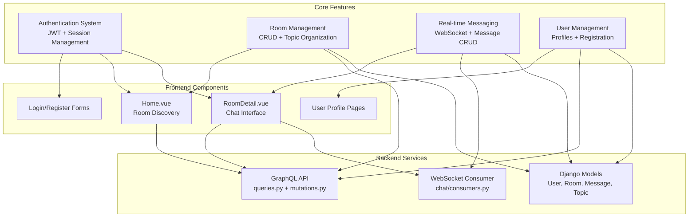
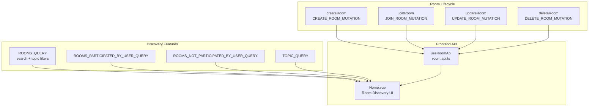
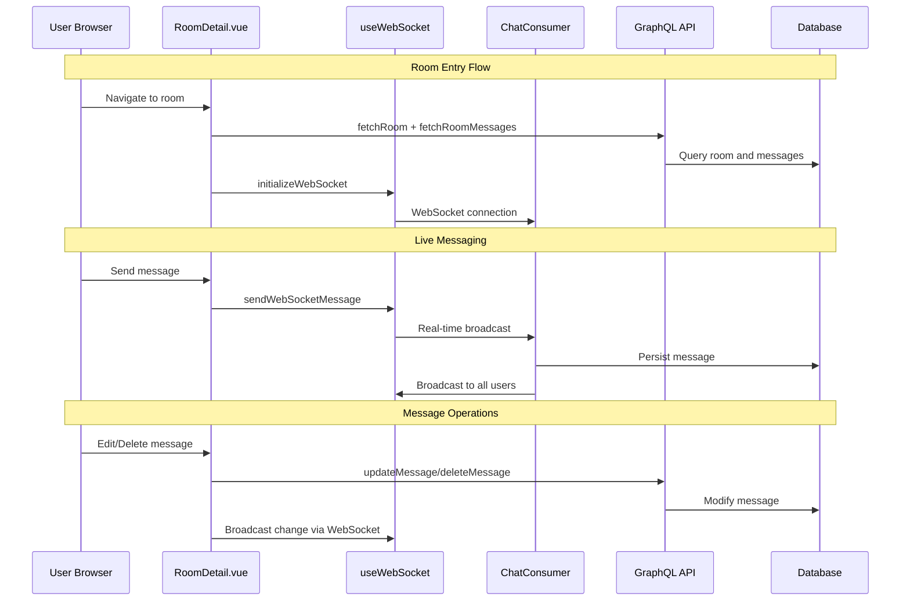
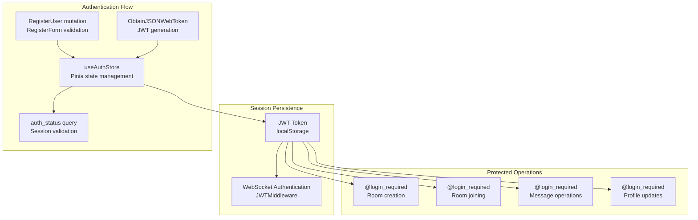
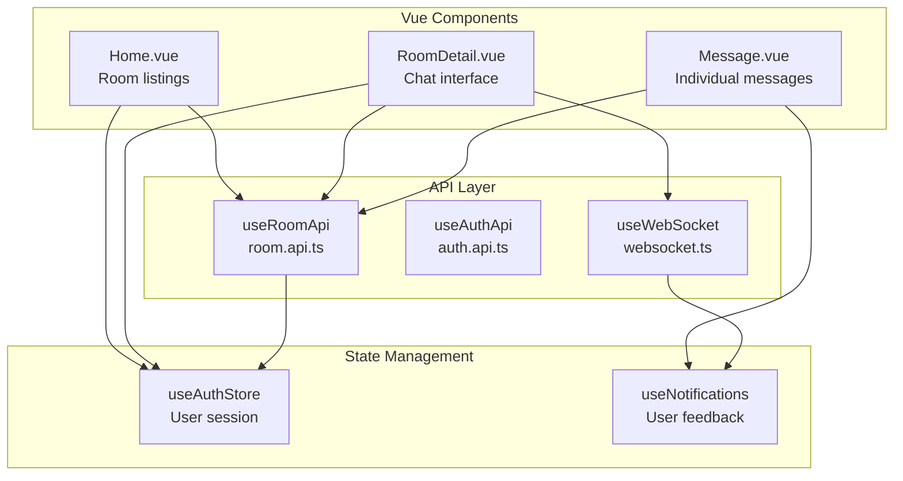

# Core Features

> **Relevant source files**
> * [backend/core/admin.py](../backend/core/admin.py)
> * [backend/core/graphql/mutations.py](../backend/core/graphql/mutations.py)
> * [backend/core/graphql/queries.py](../backend/core/graphql/queries.py)
> * [frontend/src/api/graphql/room.mutations.ts](../frontend/src/api/graphql/room.mutations.ts)
> * [frontend/src/api/graphql/room.queries.ts](../frontend/src/api/graphql/room.queries.ts)
> * [frontend/src/api/room.api.ts](../frontend/src/api/room.api.ts)
> * [frontend/src/views/Home.vue](../frontend/src/views/HomePage.vue)
> * [frontend/src/views/RoomDetail.vue](../frontend/src/views/RoomDetail.vue)
> * [scripts/setup.sh](../scripts/setup.sh)

This document provides an overview of EduSphere's primary functionality, covering the four main feature areas that enable real-time collaborative discussions. These features work together to create a complete chat platform where users can create topic-based rooms, participate in real-time conversations, and discover relevant discussions.

For detailed implementation specifics of authentication flows and JWT handling, see [Authentication System](./Authentication-System.md). For room creation and management operations, see [Room Management](./Room-Management.md#room-lifecycle-operations). For WebSocket implementation and real-time communication protocols, see [Real-time Messaging](./Real-time-Messaging.md). For user profiles and account management, see [User Management](./User-Management.md).

## Feature Overview

EduSphere consists of four interconnected core features that provide a complete real-time chat experience:

**Sources:**

| File | Lines |
|------|-------|
| [`Home.vue`](../frontend/src/views/HomePage.vue#L1-L526) | L1–L526 |
| [`RoomDetail.vue`](../frontend/src/views/RoomDetail.vue#L1-L832) | L1–L832 |
| [`queries.py`](../backend/core/graphql/queries.py#L1-L168) | L1–L168 |
| [`mutations.py`](../backend/core/graphql/mutations.py#L1-L244) | L1–L244 |

## Room Discovery and Management System

The platform centers around topic-based rooms that users can create, join, and participate in. The room system includes sophisticated discovery mechanisms with search and filtering capabilities.

**Sources:**

| File | Lines |
|------|-------|
| [`room.api.ts`](../frontend/src/api/room.api.ts#L20-L187) | L20–L187 |
| [`room.queries.ts`](../frontend/src/api/graphql/room.queries.ts#L28-L66) | L28–L66 |
| [`Home.vue`](../frontend/src/views/HomePage.vue#L391-L470) | L391–L470 |
| [`mutations.py`](../backend/core/graphql/mutations.py#L76-L183) | L76–L183 |

### Room Discovery Features

| Feature | Implementation | GraphQL Operation |
| --- | --- | --- |
| Room Search | Text search across name and description | `ROOMS_QUERY` with search parameter |
| Topic Filtering | Filter rooms by topic categories | `ROOMS_QUERY` with topic array |
| User's Rooms | Rooms the user has joined | `ROOMS_PARTICIPATED_BY_USER_QUERY` |
| Recommendations | Suggest rooms user hasn't joined | `ROOMS_NOT_PARTICIPATED_BY_USER_QUERY` |
| Topic Browse | List all available topics | `TOPIC_QUERY` |

**Sources:**

| File | Lines |
|------|-------|
| [`Home.vue`](../frontend/src/views/HomePage.vue#L391-L470) | L391–L470 |
| [`queries.py`](../backend/core/graphql/queries.py#L65-L120) | L65–L120 |

## Real-time Messaging Architecture

The messaging system uses WebSocket connections for live communication while maintaining message persistence through GraphQL mutations for non-real-time operations.

**Sources:**

| File | Lines |
|------|-------|
| [`RoomDetail.vue`](../frontend/src/views/RoomDetail.vue#L29-L36) | L29–L36 |
| [`room.api.ts`](../frontend/src/api/room.api.ts#L129-L159) | L129–L159 |
| [`mutations.py`](../backend/core/graphql/mutations.py#L184-L223) | L184–L223 |

### Message Operation Matrix

| Operation | Real-time Path | Persistence Path | Permission Check |
| --- | --- | --- | --- |
| Send Message | WebSocket → `ChatConsumer` | Automatic DB save | Participant only |
| Edit Message | WebSocket broadcast | `UPDATE_MESSAGE_MUTATION` | Message author only |
| Delete Message | WebSocket broadcast | `DELETE_MESSAGE_MUTATION` | Message author only |
| Load History | N/A | `ROOM_MESSAGES_QUERY` | Participant only |

**Sources:**

| File | Lines |
|------|-------|
| [`RoomDetail.vue`](../frontend/src/views/RoomDetail.vue#L68-L90) | L68–L90 |
| [`mutations.py`](../backend/core/graphql/mutations.py#L184-L223) | L184–L223 |

## User Authentication and Session Management

The authentication system uses JWT tokens for API access and maintains user sessions across both GraphQL and WebSocket connections.

**Sources:**

| File | Lines |
|------|-------|
| [`mutations.py`](../backend/core/graphql/mutations.py#L15-L42) | L15–L42 |
| [`auth.store.ts`](../frontend/src/stores/auth.store.ts) | — |
| [`backend/core/graphql/mutations.py`](../backend/core/graphql/mutations.py#L52-L73) | L52-L73 |

## Feature Integration Points

The core features integrate through several key mechanisms that ensure consistent state across the application:

### GraphQL Schema Integration

| Entity | Queries | Mutations | Relationships |
| --- | --- | --- | --- |
| `User` | `user`, `users`, `me` | `registerUser`, `updateUser` | Host of rooms, author of messages |
| `Room` | `room`, `rooms`, `roomsParticipatedByUser` | `createRoom`, `updateRoom`, `deleteRoom`, `joinRoom` | Has topic, host, participants |
| `Message` | `messages`, `messagesByUser` | `deleteMessage`, `updateMessage` | Belongs to room and user |
| `Topic` | `topics` | Auto-created in room mutations | Categories for rooms |

**Sources:**

| File | Lines |
|------|-------|
| [`queries.py`](../backend/core/graphql/queries.py#L8-L52) | L8–L52 |
| [`mutations.py`](../backend/core/graphql/mutations.py#L225-L244) | L225–L244 |

### Frontend State Coordination

**Sources:**

| File | Lines |
|------|-------|
| [`Home.vue`](../frontend/src/views/HomePage.vue#L240-L264) | L240–L264 |
| [`RoomDetail.vue`](../frontend/src/views/RoomDetail.vue#L1-L15) | L1–L15 |
| [`room.api.ts`](../frontend/src/api/room.api.ts#L20-L23) | L20–L23 |

## Data Access Patterns

The application uses consistent patterns for data access across all features:

### Query Patterns

* **Fetching with relationships**: `Room` queries include `host`, `participants`, and `topic`
* **User-scoped queries**: `roomsParticipatedByUser`, `messagesByUser` filter by user context
* **Search capabilities**: Text search on `name` and `description` fields with `Q` objects
* **Ordering**: Results ordered by relevance (`participants_count`, `created` timestamp)

### Mutation Patterns

* **Permission validation**: `@login_required` decorator and ownership checks
* **Form validation**: Django forms validate input before database operations
* **Auto-relationships**: Room creation automatically adds creator as participant
* **Cascading operations**: Room deletion removes associated messages

**Sources:**

| File | Lines |
|------|-------|
| [`queries.py`](../backend/core/graphql/queries.py#L65-L120) | L65–L120 |
| [`mutations.py`](../backend/core/graphql/mutations.py#L84-L101) | L84–L101 |
| [`mutations.py`](../backend/core/graphql/mutations.py#L148-L162) | L148–L162 |
