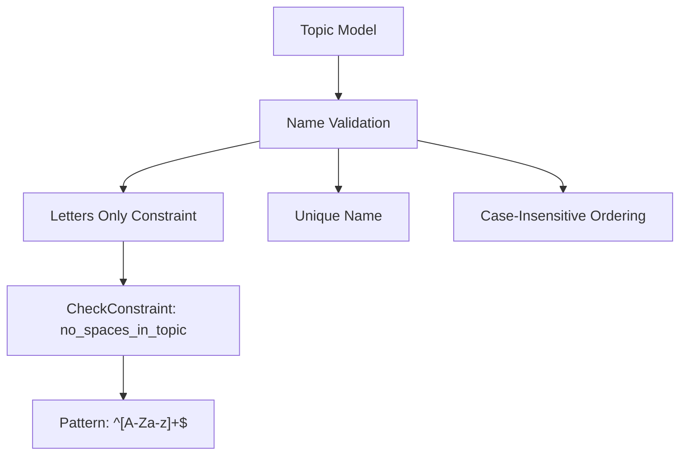
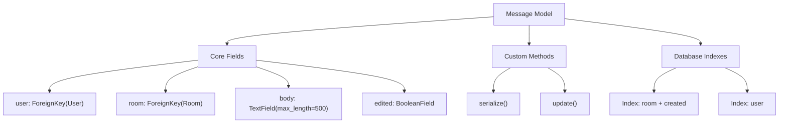
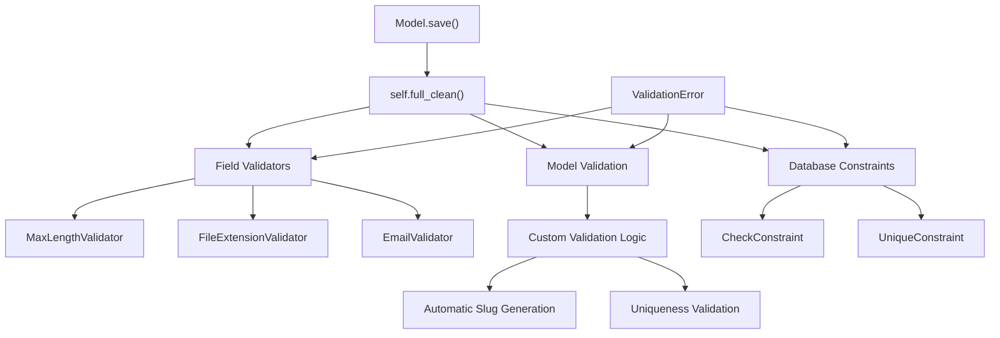
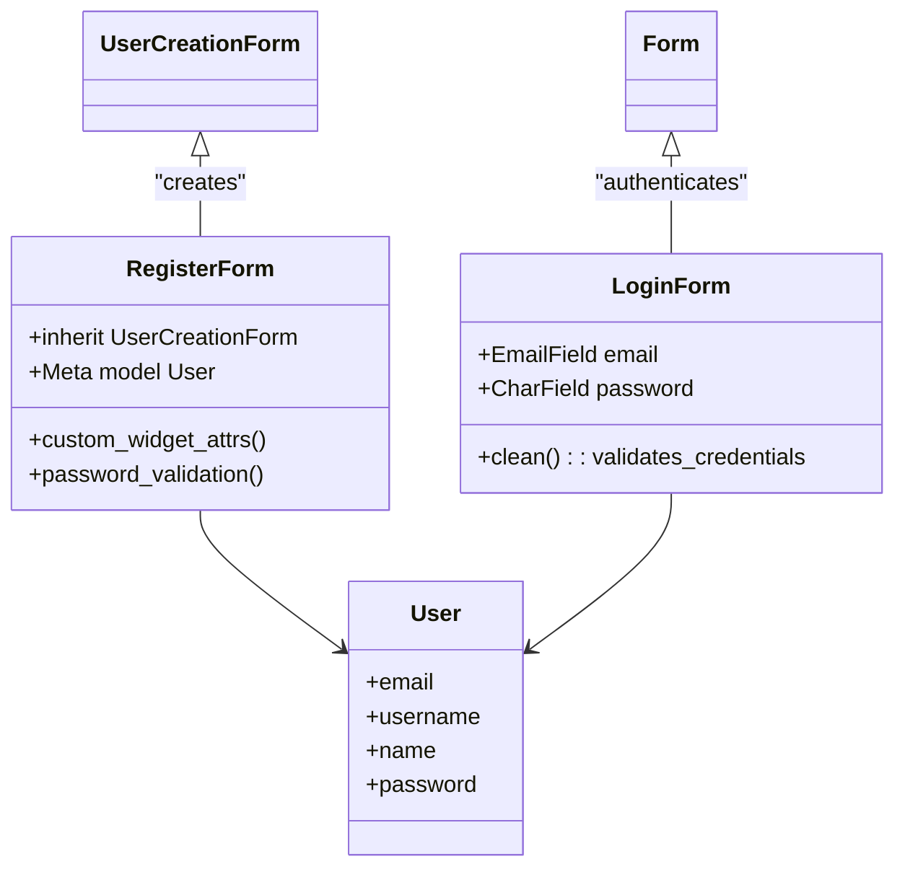
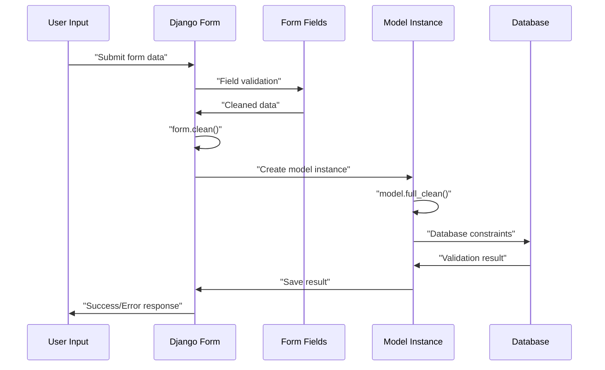
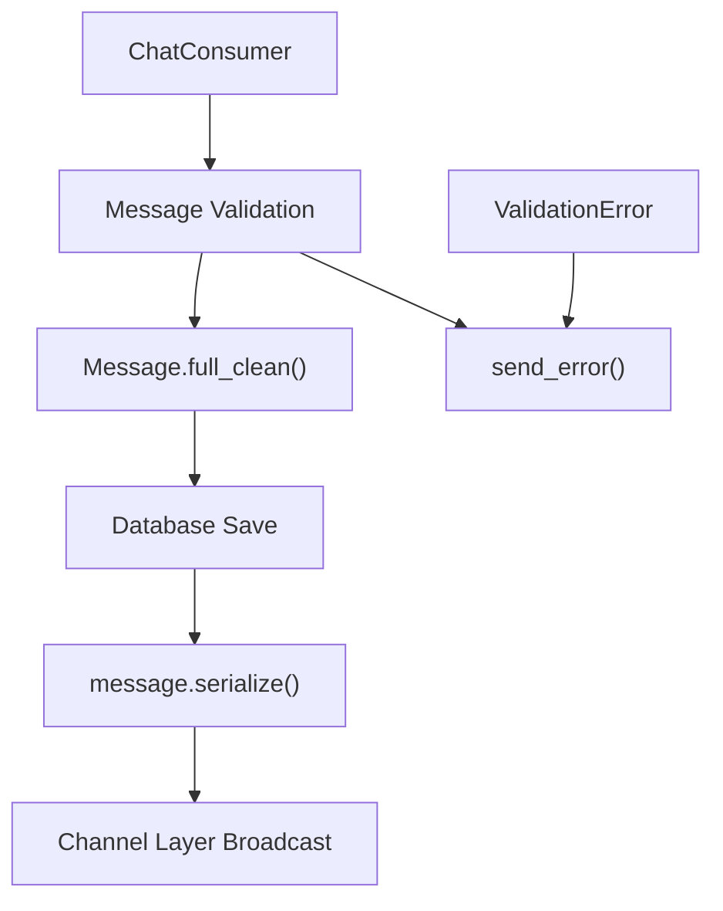

# Data Models and Forms

> **Relevant source files**
> * [backend/core/chat/consumers.py](../backend/core/chat/consumers.py)
> * [backend/core/forms.py](../backend/core/forms.py)
> * [backend/core/models.py](../backend/core/models.py)
> * [frontend/public/default.svg](../frontend/public/default.svg)

This document covers the Django data models and forms that define the core data structure and validation logic for the EduSphere backend. It includes the database schema, model relationships, field constraints, and form validation mechanisms.

For GraphQL API integration with these models, see [GraphQL Queries](./GraphQL-Queries.md) and [GraphQL Mutations](./GraphQL-Mutations.md). For real-time data handling, see [Real-time Communication](./Real-time-Communication.md).

## Core Data Models

The EduSphere backend defines four primary models that represent the core entities in the chat platform: users, topics, rooms, and messages.

### Model Architecture

```

```

**Sources:**

| File | Lines |
|------|-------|
| [`models.py`](../backend/core/models.py#L1-L150) | L1–L150 |

### User Model

The `User` model extends Django's `AbstractBaseUser` to provide custom authentication with email as the primary identifier.

| Field | Type | Purpose |
| --- | --- | --- |
| `id` | `UUIDField` | Primary key using UUID4 for security |
| `email` | `EmailField` | Unique identifier for authentication |
| `username` | `SlugField` | URL-safe display name, auto-slugified |
| `name` | `CharField` | Full display name |
| `bio` | `TextField` | User biography (max 500 characters) |
| `avatar` | `ImageField` | Profile picture with file validation |

The model implements custom validation in the `save()` method that automatically slugifies usernames and validates all fields using `full_clean()`.

**Sources:**

| File | Lines |
|------|-------|
| [`models.py`](../backend/core/models.py#L12-L38) | L12–L38 |

### Topic Model

The `Topic` model categorizes rooms with strict validation constraints.



The model enforces alphabetic-only topic names through a database `CheckConstraint` that prevents spaces and special characters.

**Sources:**

| File | Lines |
|------|-------|
| [`models.py`](../backend/core/models.py#L41-L58) | L41–L58 |

### Room Model

The `Room` model represents chat rooms with automatic slug generation and participant management.

| Field | Type | Relationship | Purpose |
| --- | --- | --- | --- |
| `host` | `ForeignKey` | User | Room owner with CASCADE delete |
| `topic` | `ForeignKey` | Topic | Room category with CASCADE delete |
| `participants` | `ManyToManyField` | User | Room members |
| `slug` | `SlugField` | - | URL-safe identifier |

The model includes sophisticated slug generation logic that ensures uniqueness per host by appending UUID fragments when conflicts occur.

**Sources:**

| File | Lines |
|------|-------|
| [`models.py`](../backend/core/models.py#L61-L103) | L61–L103 |

### Message Model

The `Message` model stores chat messages with editing capabilities and serialization methods.



The `serialize()` method provides a standardized format for WebSocket communication, while the `update()` method handles message editing with automatic timestamp management.

**Sources:**

| File | Lines |
|------|-------|
| [`models.py`](../backend/core/models.py#L105-L150) | L105–L150 |

## Database Relationships and Constraints

The models implement several types of database constraints for data integrity:

### Relationship Constraints

```css
#mermaid-f4r654ndxcq{font-family:ui-sans-serif,-apple-system,system-ui,Segoe UI,Helvetica;font-size:16px;fill:#333;}@keyframes edge-animation-frame{from{stroke-dashoffset:0;}}@keyframes dash{to{stroke-dashoffset:0;}}#mermaid-f4r654ndxcq .edge-animation-slow{stroke-dasharray:9,5!important;stroke-dashoffset:900;animation:dash 50s linear infinite;stroke-linecap:round;}#mermaid-f4r654ndxcq .edge-animation-fast{stroke-dasharray:9,5!important;stroke-dashoffset:900;animation:dash 20s linear infinite;stroke-linecap:round;}#mermaid-f4r654ndxcq .error-icon{fill:#dddddd;}#mermaid-f4r654ndxcq .error-text{fill:#222222;stroke:#222222;}#mermaid-f4r654ndxcq .edge-thickness-normal{stroke-width:1px;}#mermaid-f4r654ndxcq .edge-thickness-thick{stroke-width:3.5px;}#mermaid-f4r654ndxcq .edge-pattern-solid{stroke-dasharray:0;}#mermaid-f4r654ndxcq .edge-thickness-invisible{stroke-width:0;fill:none;}#mermaid-f4r654ndxcq .edge-pattern-dashed{stroke-dasharray:3;}#mermaid-f4r654ndxcq .edge-pattern-dotted{stroke-dasharray:2;}#mermaid-f4r654ndxcq .marker{fill:#999;stroke:#999;}#mermaid-f4r654ndxcq .marker.cross{stroke:#999;}#mermaid-f4r654ndxcq svg{font-family:ui-sans-serif,-apple-system,system-ui,Segoe UI,Helvetica;font-size:16px;}#mermaid-f4r654ndxcq p{margin:0;}#mermaid-f4r654ndxcq .entityBox{fill:#ffffff;stroke:#dddddd;}#mermaid-f4r654ndxcq .relationshipLabelBox{fill:#dddddd;opacity:0.7;background-color:#dddddd;}#mermaid-f4r654ndxcq .relationshipLabelBox rect{opacity:0.5;}#mermaid-f4r654ndxcq .labelBkg{background-color:rgba(221, 221, 221, 0.5);}#mermaid-f4r654ndxcq .edgeLabel .label{fill:#dddddd;font-size:14px;}#mermaid-f4r654ndxcq .label{font-family:ui-sans-serif,-apple-system,system-ui,Segoe UI,Helvetica;color:#333;}#mermaid-f4r654ndxcq .edge-pattern-dashed{stroke-dasharray:8,8;}#mermaid-f4r654ndxcq .node rect,#mermaid-f4r654ndxcq .node circle,#mermaid-f4r654ndxcq .node ellipse,#mermaid-f4r654ndxcq .node polygon{fill:#ffffff;stroke:#dddddd;stroke-width:1px;}#mermaid-f4r654ndxcq .relationshipLine{stroke:#999;stroke-width:1;fill:none;}#mermaid-f4r654ndxcq .marker{fill:none!important;stroke:#999!important;stroke-width:1;}#mermaid-f4r654ndxcq :root{--mermaid-font-family:"trebuchet ms",verdana,arial,sans-serif;}hostscreatesparticipateshascategorizescontainsUseruuididPKemailemailUKslugusernameUKTopicintidPKstringnameUKRoomuuididPKstringnameslugsluguuidhost_idFKinttopic_idFKMessageuuididPKuuiduser_idFKuuidroom_idFKtextbodybooleaneditedRoomParticipantsuuidroom_idFKuuiduser_idFK
```

### Database Indexes

The models define strategic indexes for query optimization:

| Model | Index Fields | Purpose |
| --- | --- | --- |
| Room | `['host', 'name']` | Fast lookup of user's rooms |
| Room | `['topic']` | Topic-based filtering |
| Room | `['updated']` | Recent rooms ordering |
| Message | `['room', 'created']` | Message chronology per room |
| Message | `['user']` | User's message history |

**Sources:**

| File | Lines |
|------|-------|
| [`models.py`](../backend/core/models.py#L84-L88) | L84–L88 |
| [`models.py`](../backend/core/models.py#L118-L121) | L118–L121 |

## Data Validation Framework

All models implement comprehensive validation through Django's constraint system and custom validation methods.

### Model-Level Validation



All models override the `save()` method to call `full_clean()`, ensuring validation occurs before database writes.

**Sources:**

| File | Lines |
|------|-------|
| [`models.py`](../backend/core/models.py#L35-L38) | L35–L38 |
| [`models.py`](../backend/core/models.py#L56-L58) | L56–L58 |
| [`models.py`](../backend/core/models.py#L96-L97) | L96–L97 |
| [`models.py`](../backend/core/models.py#L124-L126) | L124–L126 |

## Django Forms

The application uses Django ModelForms for user interface validation and data processing.

### Authentication Forms



The `LoginForm` implements custom authentication validation, while `RegisterForm` extends Django's built-in `UserCreationForm` with additional fields and custom widget attributes.

**Sources:**

| File | Lines |
|------|-------|
| [`forms.py`](../backend/core/forms.py#L9-L35) | L9–L35 |
| [`forms.py`](../backend/core/forms.py#L36-L63) | L36–L63 |

### Content Management Forms

| Form | Model | Purpose | Excluded Fields |
| --- | --- | --- | --- |
| `RoomForm` | Room | Room creation/editing | `host`, `participants`, `slug` |
| `UserForm` | User | Profile management | Password fields |

The `RoomForm` includes custom validation for room names using `RegexValidator` to ensure only alphanumeric characters and spaces are allowed.

**Sources:**

| File | Lines |
|------|-------|
| [`forms.py`](../backend/core/forms.py#L65-L81) | L65–L81 |
| [`forms.py`](../backend/core/forms.py#L82-L88) | L82–L88 |

### Form Validation Pipeline



The validation pipeline ensures data integrity at multiple levels: form field validation, custom form validation, model validation, and database constraint checking.

**Sources:**

| File | Lines |
|------|-------|
| [`forms.py`](../backend/core/forms.py#L25-L34) | L25–L34 |
| [`forms.py`](../backend/core/forms.py#L66-L75) | L66–L75 |

## Integration with Real-time Features

The models integrate seamlessly with the WebSocket consumer system for real-time functionality.

### Message Handling in WebSocket Context



The WebSocket consumer uses the same validation mechanisms as the Django forms, ensuring consistency between real-time and traditional form-based interactions.

**Sources:**

| File | Lines |
|------|-------|
| [`consumers.py`](../backend/core/chat/consumers.py#L104-L131) | L104–L131 |
| [`consumers.py`](../backend/core/chat/consumers.py#L167-L210) | L167–L210 |
