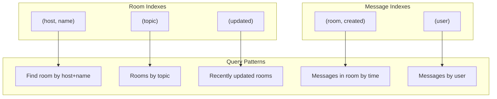
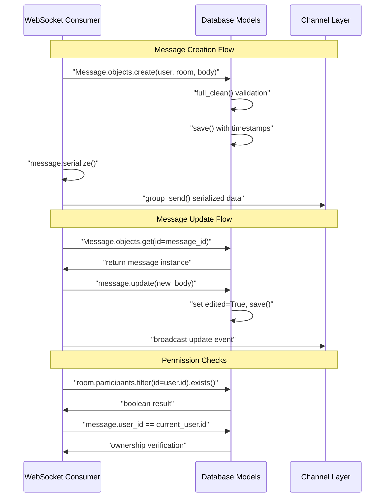

# Database Design

> **Relevant source files**
> * [backend/core/chat/consumers.py](../backend/core/chat/consumers.py)
> * [backend/core/migrations/0001_initial.py](../backend/core/migrations/0001_initial.py)
> * [backend/core/models.py](../backend/core/models.py)

This document describes the database schema, data models, and relationships for the EduSphere chat platform. It covers the core entities (`User`, `Room`, `Topic`, `Message`), their relationships, constraints, indexes, and migration strategy. For API interactions with these models, see [GraphQL Queries](./GraphQL-Queries.md) and [GraphQL Mutations](./GraphQL-Mutations.md). For real-time message handling, see [Real-time Communication](./Real-time-Communication.md).

## Data Model Overview

The EduSphere database consists of four core entities that form the foundation of the chat platform. The schema uses UUID primary keys for most entities to ensure global uniqueness and security, with PostgreSQL as the primary database backend.

The data model follows Django ORM conventions and includes custom validation, constraints, and indexes optimized for the real-time chat use case. All models include automatic timestamp tracking and implement custom save methods for data normalization.

**Sources:**

| File | Lines |
|------|-------|
| [`models.py`](../backend/core/models.py#L1-L150) | L1–L150 |

## Entity Relationship Diagram

```css
#mermaid-p7oht01w14{font-family:ui-sans-serif,-apple-system,system-ui,Segoe UI,Helvetica;font-size:16px;fill:#333;}@keyframes edge-animation-frame{from{stroke-dashoffset:0;}}@keyframes dash{to{stroke-dashoffset:0;}}#mermaid-p7oht01w14 .edge-animation-slow{stroke-dasharray:9,5!important;stroke-dashoffset:900;animation:dash 50s linear infinite;stroke-linecap:round;}#mermaid-p7oht01w14 .edge-animation-fast{stroke-dasharray:9,5!important;stroke-dashoffset:900;animation:dash 20s linear infinite;stroke-linecap:round;}#mermaid-p7oht01w14 .error-icon{fill:#dddddd;}#mermaid-p7oht01w14 .error-text{fill:#222222;stroke:#222222;}#mermaid-p7oht01w14 .edge-thickness-normal{stroke-width:1px;}#mermaid-p7oht01w14 .edge-thickness-thick{stroke-width:3.5px;}#mermaid-p7oht01w14 .edge-pattern-solid{stroke-dasharray:0;}#mermaid-p7oht01w14 .edge-thickness-invisible{stroke-width:0;fill:none;}#mermaid-p7oht01w14 .edge-pattern-dashed{stroke-dasharray:3;}#mermaid-p7oht01w14 .edge-pattern-dotted{stroke-dasharray:2;}#mermaid-p7oht01w14 .marker{fill:#999;stroke:#999;}#mermaid-p7oht01w14 .marker.cross{stroke:#999;}#mermaid-p7oht01w14 svg{font-family:ui-sans-serif,-apple-system,system-ui,Segoe UI,Helvetica;font-size:16px;}#mermaid-p7oht01w14 p{margin:0;}#mermaid-p7oht01w14 .entityBox{fill:#ffffff;stroke:#dddddd;}#mermaid-p7oht01w14 .relationshipLabelBox{fill:#dddddd;opacity:0.7;background-color:#dddddd;}#mermaid-p7oht01w14 .relationshipLabelBox rect{opacity:0.5;}#mermaid-p7oht01w14 .labelBkg{background-color:rgba(221, 221, 221, 0.5);}#mermaid-p7oht01w14 .edgeLabel .label{fill:#dddddd;font-size:14px;}#mermaid-p7oht01w14 .label{font-family:ui-sans-serif,-apple-system,system-ui,Segoe UI,Helvetica;color:#333;}#mermaid-p7oht01w14 .edge-pattern-dashed{stroke-dasharray:8,8;}#mermaid-p7oht01w14 .node rect,#mermaid-p7oht01w14 .node circle,#mermaid-p7oht01w14 .node ellipse,#mermaid-p7oht01w14 .node polygon{fill:#ffffff;stroke:#dddddd;stroke-width:1px;}#mermaid-p7oht01w14 .relationshipLine{stroke:#999;stroke-width:1;fill:none;}#mermaid-p7oht01w14 .marker{fill:none!important;stroke:#999!important;stroke-width:1;}#mermaid-p7oht01w14 :root{--mermaid-font-family:"trebuchet ms",verdana,arial,sans-serif;}hostsauthorscategorizescontainsparticipatesusesUserUUIDidPKstringemailUKstringusernameUKstringnametextbioimageavatarbooleanis_staffbooleanis_activedatetimedate_joinedTopicbigintidPKstringnameUKRoomUUIDidPKstringnamestringslugtextdescriptiondatetimeupdateddatetimecreatedUUIDhost_idFKbiginttopic_idFKMessageUUIDidPKtextbodybooleanediteddatetimeupdateddatetimecreatedUUIDuser_idFKUUIDroom_idFKRoomParticipantsUUIDroom_idFKUUIDuser_idFKCustomUserManager
```

This diagram shows the core relationships between entities. The `User` model extends Django's `AbstractBaseUser` and uses a custom manager. Each `Room` has one host but can have multiple participants through a many-to-many relationship. Messages belong to both a user and a room, creating the chat functionality.

**Sources:**

| File | Lines |
|------|-------|
| [`models.py`](../backend/core/models.py#L12-L142) | L12–L142 |
| [`0001_initial.py`](../backend/core/migrations/0001_initial.py#L21-L105) | L21–L105 |

## Database Schema Details

### User Model

The `User` model extends Django's authentication system with additional fields for the chat platform:

| Field | Type | Constraints | Purpose |
| --- | --- | --- | --- |
| `id` | `UUIDField` | Primary Key, Auto-generated | Unique identifier |
| `email` | `EmailField` | Unique, Required | Authentication username |
| `username` | `SlugField` | Unique, Max 200 chars | URL-safe display name |
| `name` | `CharField` | Max 200 chars | Human-readable name |
| `bio` | `TextField` | Max 500 chars, Optional | User description |
| `avatar` | `ImageField` | Optional, Validated extensions | Profile picture |
| `is_staff` | `BooleanField` | Default False | Admin access |
| `is_active` | `BooleanField` | Default True | Account status |
| `date_joined` | `DateTimeField` | Auto-generated | Registration timestamp |

The model uses email as the `USERNAME_FIELD` and implements automatic username slugification in the `save()` method.

**Sources:**

| File | Lines |
|------|-------|
| [`models.py`](../backend/core/models.py#L12-L38) | L12–L38 |

### Room Model

The `Room` model represents chat rooms with the following schema:

| Field | Type | Constraints | Purpose |
| --- | --- | --- | --- |
| `id` | `UUIDField` | Primary Key, Auto-generated | Unique identifier |
| `name` | `CharField` | Max 200 chars | Room display name |
| `slug` | `SlugField` | Max 200 chars, Auto-generated | URL-safe identifier |
| `host` | `ForeignKey(User)` | CASCADE delete | Room owner |
| `topic` | `ForeignKey(Topic)` | CASCADE delete | Room category |
| `description` | `TextField` | Max 500 chars, Optional | Room description |
| `participants` | `ManyToManyField(User)` | Optional | Room members |
| `updated` | `DateTimeField` | Auto-updated | Last modification |
| `created` | `DateTimeField` | Auto-generated | Creation timestamp |

**Sources:**

| File | Lines |
|------|-------|
| [`models.py`](../backend/core/models.py#L61-L103) | L61–L103 |

### Message Model

The `Message` model stores chat messages with edit tracking:

| Field | Type | Constraints | Purpose |
| --- | --- | --- | --- |
| `id` | `UUIDField` | Primary Key, Auto-generated | Unique identifier |
| `user` | `ForeignKey(User)` | CASCADE delete | Message author |
| `room` | `ForeignKey(Room)` | CASCADE delete | Containing room |
| `body` | `TextField` | Max 500 chars | Message content |
| `edited` | `BooleanField` | Default False | Edit status flag |
| `updated` | `DateTimeField` | Auto-updated | Last edit timestamp |
| `created` | `DateTimeField` | Auto-generated | Original timestamp |

The model includes a `serialize()` method for WebSocket transmission and an `update()` method for message editing functionality.

**Sources:**

| File | Lines |
|------|-------|
| [`models.py`](../backend/core/models.py#L105-L150) | L105–L150 |

## Database Constraints and Validation

```mermaid
flowchart TD

UserConstraints["User Constraints"]
UniqueEmail["email UNIQUE"]
UniqueUsername["username UNIQUE"]
ValidatedAvatar["avatar: svg,png,jpg,jpeg only"]
SlugifiedUsername["username auto-slugified"]
TopicConstraints["Topic Constraints"]
UniqueName["name UNIQUE"]
LettersOnly["name: letters only (regex: ^[A-Za-z]+$)"]
CaseInsensitiveOrder["ordering: Lower('name')"]
RoomConstraints["Room Constraints"]
UniqueHostRoom["UNIQUE(host, name)"]
SlugGeneration["slug auto-generated with collision handling"]
DescriptionLimit["description max 500 chars"]
MessageConstraints["Message Constraints"]
BodyLimit["body max 500 chars"]
EditTracking["edited flag for modifications"]
FullCleanValidation["full_clean() on save"]

    UserConstraints --> UniqueEmail
    UserConstraints --> UniqueUsername
    UserConstraints --> ValidatedAvatar
    UserConstraints --> SlugifiedUsername
    TopicConstraints --> UniqueName
    TopicConstraints --> LettersOnly
    TopicConstraints --> CaseInsensitiveOrder
    RoomConstraints --> UniqueHostRoom
    RoomConstraints --> SlugGeneration
    RoomConstraints --> DescriptionLimit
    MessageConstraints --> BodyLimit
    MessageConstraints --> EditTracking
    MessageConstraints --> FullCleanValidation
```



### Constraint Implementation

The database implements several types of constraints:

**Uniqueness Constraints:**

* `User.email` and `User.username` are globally unique
* `Topic.name` is unique across all topics
* `Room` has a composite unique constraint on `(host, name)` to prevent duplicate room names per user

**Check Constraints:**

* `Topic.name` must match regex `^[A-Za-z]+$` (letters only, no spaces)
* All text fields have `MaxLengthValidator` constraints

**Custom Validation:**

* All models call `full_clean()` in their `save()` methods to trigger field validation
* `User.avatar` validates file extensions (`svg`, `png`, `jpg`, `jpeg`)
* Automatic slug generation for `User.username` and `Room.slug` with collision handling

**Sources:**

| File | Lines |
|------|-------|
| [`models.py`](../backend/core/models.py#L17-L21) | L17–L21 |
| [`models.py`](../backend/core/models.py#L47-L58) | L47–L58 |
| [`models.py`](../backend/core/models.py#L77-L97) | L77–L97 |

## Database Indexes and Performance

The schema includes strategic indexes for common query patterns in the chat application:



### Index Strategy

**Room Indexes:**

* `(host, name)` - Supports room lookup by URL patterns and uniqueness constraint
* `(topic)` - Enables efficient topic-based room filtering
* `(updated)` - Supports ordering rooms by recent activity

**Message Indexes:**

* `(room, created)` - Optimizes chronological message retrieval within rooms
* `(user)` - Supports user-based message queries and foreign key operations

**Default Ordering:**

* `Room`: `['-updated', '-created']` - Most recently active rooms first
* `Message`: `['-created']` - Newest messages first
* `Topic`: `[Lower('name')]` - Case-insensitive alphabetical order

**Sources:**

| File | Lines |
|------|-------|
| [`models.py`](../backend/core/models.py#L84-L88) | L84–L88 |
| [`models.py`](../backend/core/models.py#L118-L122) | L118–L122 |
| [`0001_initial.py`](../backend/core/migrations/0001_initial.py#L90-L105) | L90–L105 |

## Real-time Integration

The database models integrate with the WebSocket layer for real-time functionality:



The `Message.serialize()` method provides a consistent data format for WebSocket transmission, while database constraints ensure data integrity even during high-frequency real-time operations.

**Sources:**

| File | Lines |
|------|-------|
| [`models.py`](../backend/core/models.py#L128-L141) | L128–L141 |
| [`consumers.py`](../backend/core/chat/consumers.py#L100-L210) | L100–L210 |

## Migration History

The database schema is managed through Django migrations:

**Initial Migration (`0001_initial.py`):**

* Creates all four core models with their relationships
* Establishes indexes and constraints
* Sets up custom user manager integration
* Configures UUID primary keys and field validations

The migration system ensures consistent schema deployment across environments and provides a clear evolution path for future database changes.

**Sources:**

| File | Lines |
|------|-------|
| [`0001_initial.py`](../backend/core/migrations/0001_initial.py#L1-L106) | L1–L106 |
