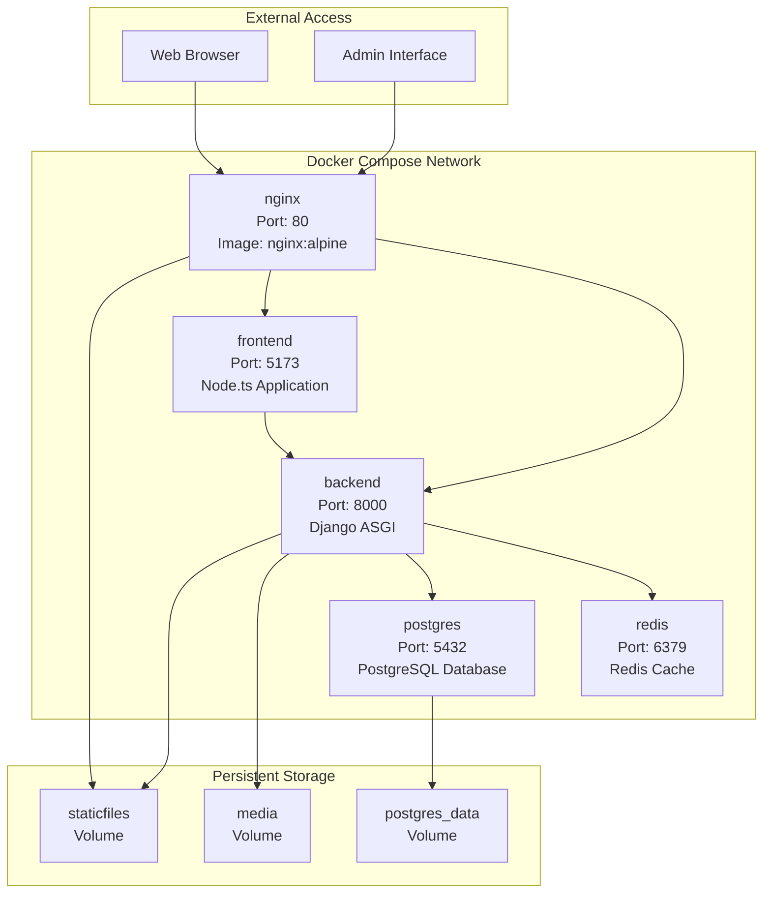
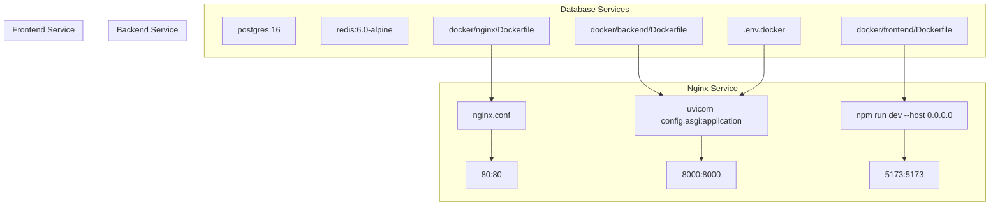
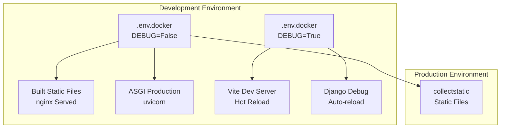
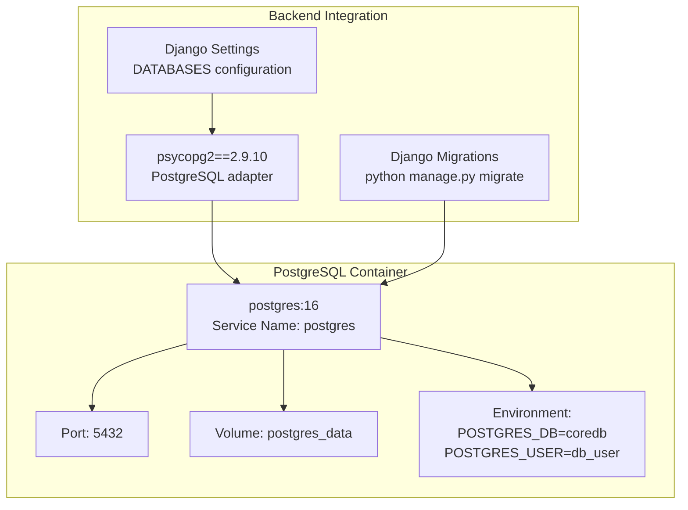
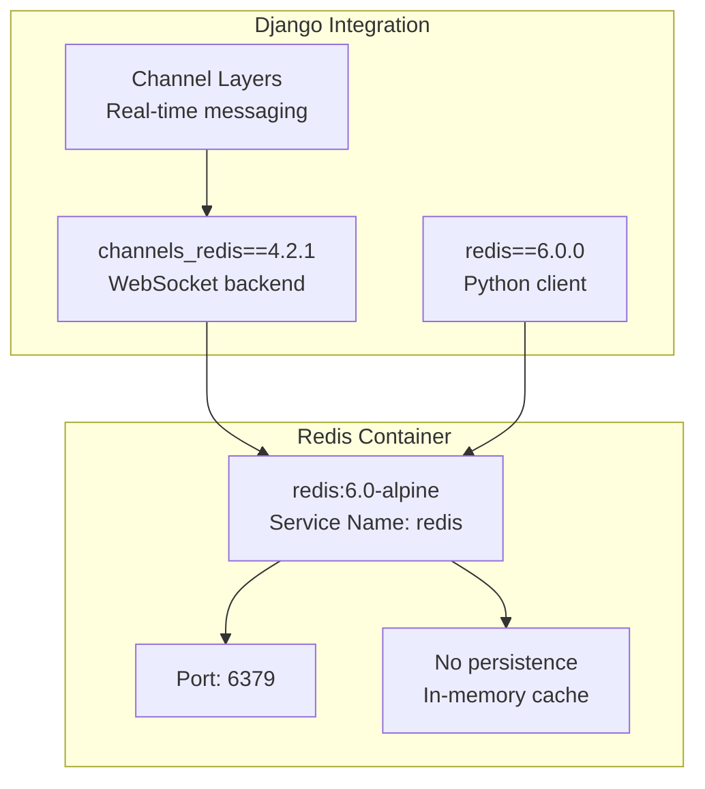
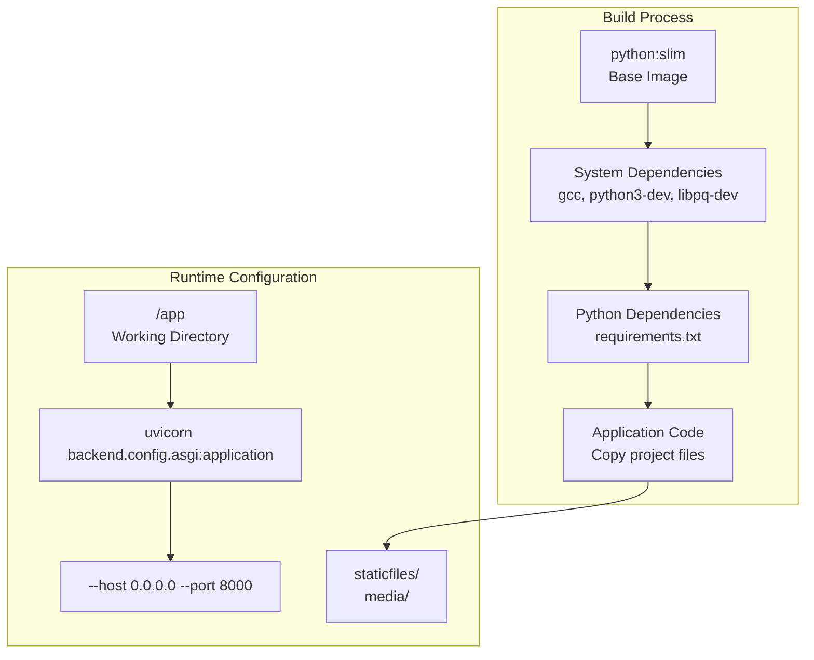
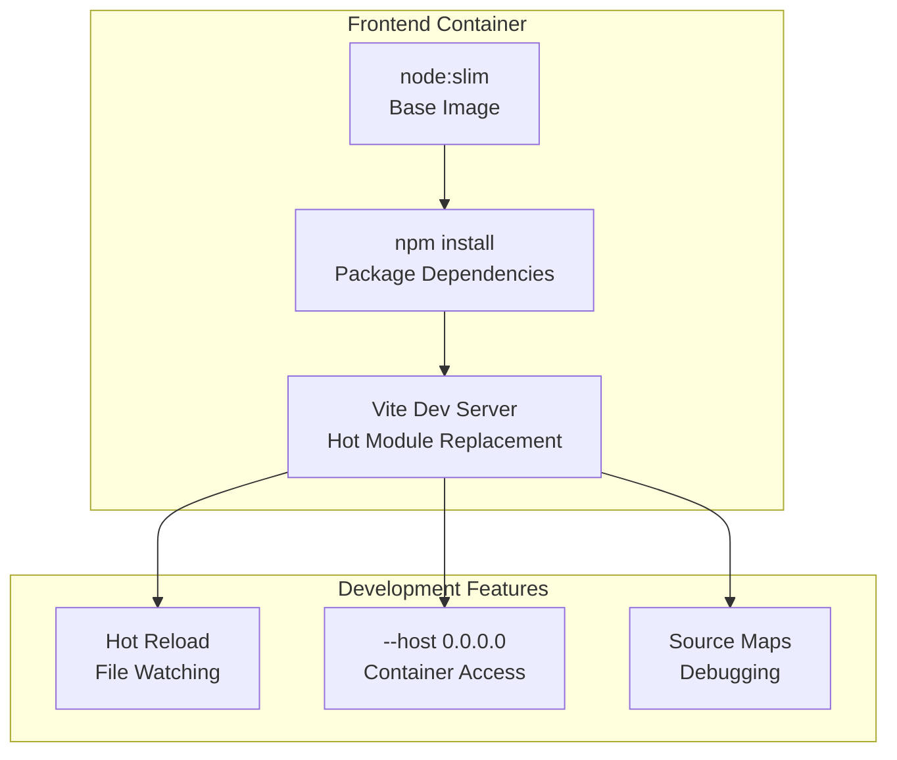
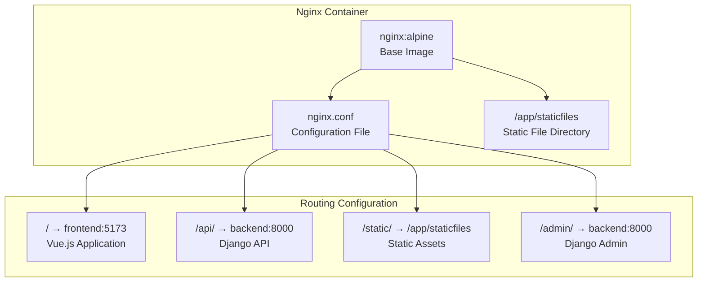

# Deployment and Infrastructure

> **Relevant source files**
> * [.dockerignore](../.dockerignore)
> * [README.md](../README.md)
> * [backend/README.md](../backend/README.md)
> * [docker/backend/Dockerfile](../docker/backend/Dockerfile)
> * [docker/frontend/Dockerfile](../docker/frontend/Dockerfile)
> * [docker/nginx/Dockerfile](../docker/nginx/Dockerfile)
> * [frontend/README.md](../frontend/README.md)
> * [requirements.txt](../requirements.txt)

This document covers the containerized deployment architecture and infrastructure configuration for the EduSphere platform. It details Docker container orchestration, service configuration, and production deployment setup. For specific Docker container implementation details, see [Docker Configuration](./Docker-Configuration.md). For individual service configurations including Nginx, PostgreSQL, and Redis setup, see [Infrastructure Setup](./Infrastructure-Setup.md).

## Deployment Architecture Overview

EduSphere uses a containerized microservices architecture orchestrated with Docker Compose, providing isolated, scalable service deployment.

### Service Container Architecture



**Container Network Communication**

* All services communicate through Docker's internal network using service names as hostnames
* External access is routed through `nginx` reverse proxy on port 80
* Database and cache services are isolated from direct external access

Sources: [README.md L114-L163](../README.md#L114-L163)

 [docker-compose.yml](../docker-compose.yml)

### Docker Compose Service Definitions



**Service Dependencies**

* `backend` depends on `postgres` and `redis` services being healthy
* `frontend` can start independently but requires `backend` for API communication
* `nginx` serves as the entry point and depends on both `frontend` and `backend`

Sources: [docker/frontend/Dockerfile L12-L14](../docker/frontend/Dockerfile#L12-L14)

 [docker/backend/Dockerfile L25-L26](../docker/backend/Dockerfile#L25-L26)

 [docker/nginx/Dockerfile L3](../docker/nginx/Dockerfile#L3-L3)

## Environment Configuration

### Docker Environment Setup

The platform uses environment-specific configuration through `.env.docker` file for containerized deployment:

| Variable | Purpose | Default Value |
| --- | --- | --- |
| `SECRET_KEY` | Django cryptographic signing | (required) |
| `DEBUG` | Django debug mode | `True` |
| `DB_HOST` | PostgreSQL container hostname | `postgres` |
| `DB_NAME` | Database name | `coredb` |
| `DB_USER` | Database username | `db_user` |
| `DB_PASSWORD` | Database password | (required) |
| `REDIS_HOST` | Redis container hostname | `redis` |
| `REDIS_PORT` | Redis port | `6379` |

**Container Network Hostnames**

* Database hostname uses Docker service name: `DB_HOST=postgres`
* Redis hostname uses Docker service name: `REDIS_HOST=redis`
* This enables automatic service discovery within the Docker network

Sources: [README.md L127-L140](../README.md#L127-L140)

### Production vs Development Configuration



**Development Configuration**

* Frontend runs Vite development server with hot module replacement
* Backend uses Django's development server with auto-reload
* Debug mode enabled for detailed error reporting

**Production Considerations**

* Static files served directly by Nginx for performance
* `collectstatic` command gathers Django static files
* Debug mode disabled for security

Sources: [README.md L155-L156](../README.md#L155-L156)

 [docker/frontend/Dockerfile L13-L14](../docker/frontend/Dockerfile#L13-L14)

## Database and Cache Infrastructure

### PostgreSQL Database Configuration



**Database Setup Commands**

```sql
# Run migrations inside container
docker compose exec backend python manage.py migrate

# Create superuser
docker compose exec backend python manage.py createsuperuser
```

Sources: [README.md L148-L156](../README.md#L148-L156)

 [requirements.txt L26](../requirements.txt#L26-L26)

### Redis Cache and Channel Layer



**Redis Usage Patterns**

* **Channel Layers**: WebSocket message broadcasting for real-time chat
* **Session Storage**: User session data caching
* **Temporary Data**: Short-lived application state

Sources: [requirements.txt L4](../requirements.txt#L4-L4)

 [requirements.txt L33](../requirements.txt#L33-L33)

 [README.md L138-L139](../README.md#L138-L139)

## Container Build and Runtime Configuration

### Backend Container Build Process

The Django backend container uses a Python slim base image with optimized dependency installation:



**Container Optimization**

* Multi-stage build process minimizes final image size
* System dependencies cleaned after installation
* Static file directories pre-created for volume mounting

Sources: [docker/backend/Dockerfile L1-L27](../docker/backend/Dockerfile#L1-L27)

### Frontend Container Development Setup

The Vue.js frontend container provides development server with hot reload capabilities:



**Development Workflow**

* Source code changes trigger automatic rebuilds
* Browser automatically refreshes on file modifications
* Container exposes development server on all interfaces

Sources: [docker/frontend/Dockerfile L1-L14](../docker/frontend/Dockerfile#L1-L14)

### Nginx Reverse Proxy Configuration



**Reverse Proxy Benefits**

* Single entry point for all client requests
* SSL termination point for HTTPS
* Static file serving without backend overhead
* Load balancing capability for horizontal scaling

Sources: [docker/nginx/Dockerfile L1-L11](../docker/nginx/Dockerfile#L1-L11)

 [README.md L159-L162](../README.md#L159-L162)