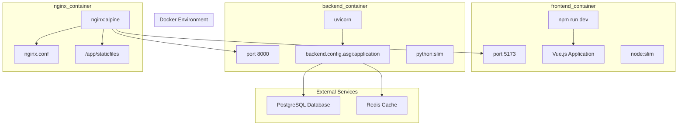
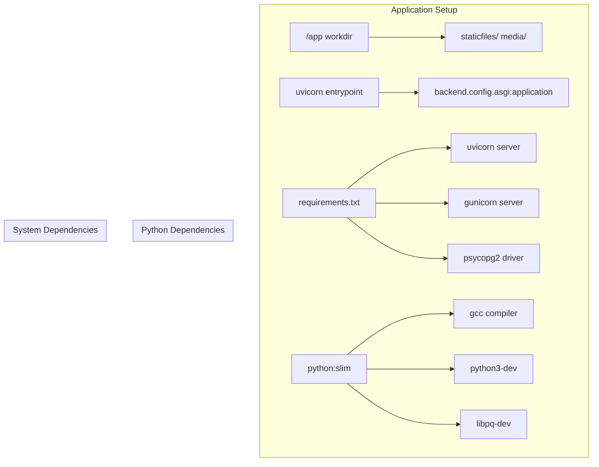
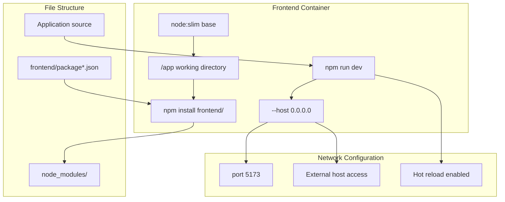
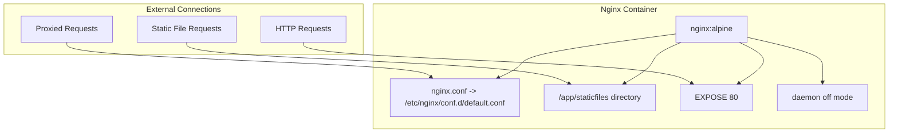
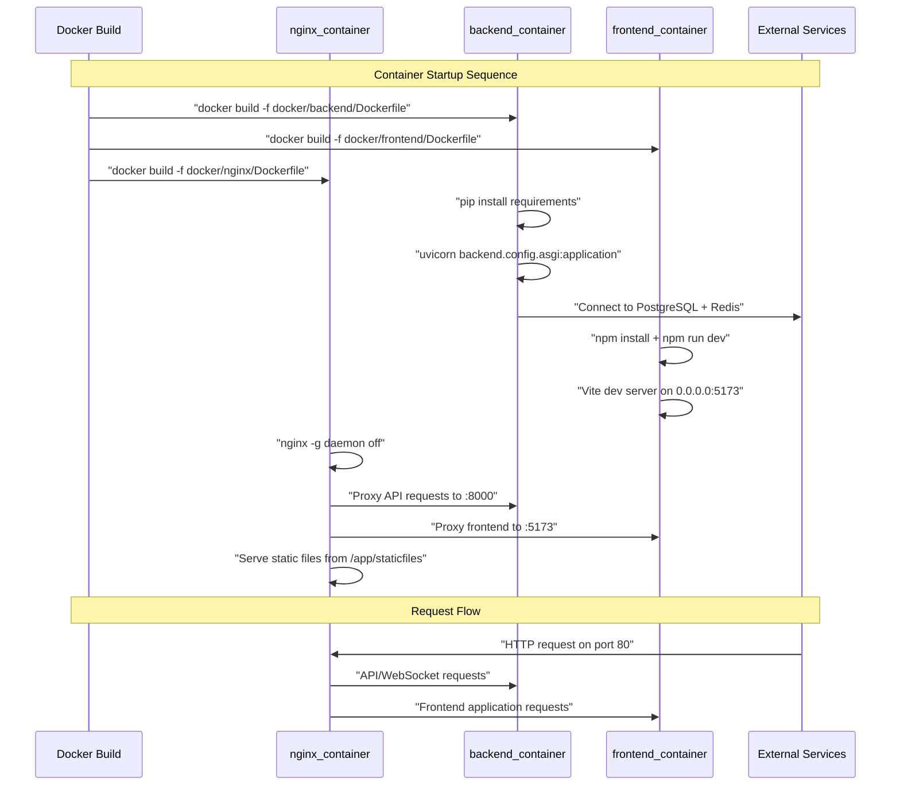

# Docker Configuration

> **Relevant source files**
> * [.dockerignore](../.dockerignore)
> * [docker/backend/Dockerfile](../docker/backend/Dockerfile)
> * [docker/frontend/Dockerfile](../docker/frontend/Dockerfile)
> * [docker/nginx/Dockerfile](../docker/nginx/Dockerfile)

This document covers the Docker containerization setup for EduSphere, including the individual service containers and their configurations. The Docker setup enables development environment consistency and simplified deployment through container orchestration.

For broader infrastructure topics including service integration and production deployment, see [Infrastructure Setup](./Infrastructure-Setup.md). For application-specific configuration details, see [Backend Configuration](./Configuration.md) and [Frontend Application Setup](./Application-Setup.md).

## Container Architecture Overview

EduSphere uses a multi-container architecture with separate containers for each service layer. The following diagram shows the container structure and their relationships:



**Container Communication Flow**

* Nginx serves as the reverse proxy and static file server
* Backend container runs the Django ASGI application via Uvicorn
* Frontend container serves the Vue.js development server
* External databases are typically managed separately or via Docker Compose

Sources: [docker/nginx/Dockerfile L1-L11](../docker/nginx/Dockerfile#L1-L11)

 [docker/backend/Dockerfile L1-L27](../docker/backend/Dockerfile#L1-L27)

 [docker/frontend/Dockerfile L1-L15](../docker/frontend/Dockerfile#L1-L15)

## Backend Container Configuration

The backend container uses a Python slim base image and sets up the Django application with ASGI server support.

### Base Image and Dependencies

The backend Dockerfile starts with `python:slim` and installs essential system dependencies for PostgreSQL connectivity and Python compilation:



The container configuration includes:

| Configuration | Value | Purpose |
| --- | --- | --- |
| Base Image | `python:slim` | Lightweight Python runtime |
| Working Directory | `/app` | Application root directory |
| Entry Point | `uvicorn` | ASGI server for async Django |
| Application Target | `backend.config.asgi:application` | Django ASGI application |
| Default Port | `8000` | HTTP service port |
| Host Binding | `0.0.0.0` | Accept external connections |

### Key Installation Steps

The backend container setup follows this sequence:

1. **System dependencies installation** [docker/backend/Dockerfile L6-L11](../docker/backend/Dockerfile#L6-L11)  - Installs `gcc`, `python3-dev`, and `libpq-dev` for PostgreSQL support
2. **Python dependencies installation** [docker/backend/Dockerfile L14-L16](../docker/backend/Dockerfile#L14-L16)  - Installs from `requirements.txt` plus additional servers
3. **Application setup** [docker/backend/Dockerfile L18-L22](../docker/backend/Dockerfile#L18-L22)  - Copies source code and creates required directories
4. **Server configuration** [docker/backend/Dockerfile L25-L26](../docker/backend/Dockerfile#L25-L26)  - Configures Uvicorn with host and port settings

Sources: [docker/backend/Dockerfile L1-L27](../docker/backend/Dockerfile#L1-L27)

## Frontend Container Configuration

The frontend container provides a Node.ts environment for the Vue.js development server with hot reloading capabilities.

### Development Server Setup



The frontend container configuration provides:

| Configuration | Value | Purpose |
| --- | --- | --- |
| Base Image | `node:slim` | Lightweight Node.ts runtime |
| Package Installation | `frontend/package*.json` | Dependencies from package files |
| Development Command | `npm run dev` | Vite development server |
| Host Configuration | `--host 0.0.0.0` | External access for container networking |
| Entry Point | `npm --prefix frontend run` | Run commands in frontend directory |

### Build Process

The frontend build process [docker/frontend/Dockerfile L5-L14](../docker/frontend/Dockerfile#L5-L14)

:

1. **Dependency installation** - Copies `package*.json` files and runs `npm install` in the frontend directory
2. **Source code copying** - Copies the entire application source code
3. **Development server startup** - Configures the entry point to run the Vite development server with external host access

Sources: [docker/frontend/Dockerfile L1-L15](../docker/frontend/Dockerfile#L1-L15)

## Nginx Container Configuration

The Nginx container serves as a reverse proxy and static file server, using the lightweight Alpine Linux base image.

### Nginx Service Architecture



### Container Specifications

The Nginx container [docker/nginx/Dockerfile L1-L11](../docker/nginx/Dockerfile#L1-L11)

 provides:

| Configuration | Value | Purpose |
| --- | --- | --- |
| Base Image | `nginx:alpine` | Lightweight Nginx server |
| Configuration File | `/etc/nginx/conf.d/default.conf` | Custom Nginx configuration |
| Static Files Directory | `/app/staticfiles` | Shared static file serving |
| Exposed Port | `80` | Standard HTTP port |
| Runtime Mode | `daemon off` | Foreground execution for containers |

The container setup includes:

1. **Configuration mounting** [docker/nginx/Dockerfile L3](../docker/nginx/Dockerfile#L3-L3)  - Copies custom `nginx.conf` to the default location
2. **Static directory creation** [docker/nginx/Dockerfile L5](../docker/nginx/Dockerfile#L5-L5)  - Creates directory for static file serving
3. **Foreground execution** [docker/nginx/Dockerfile L10](../docker/nginx/Dockerfile#L10-L10)  - Runs Nginx in non-daemon mode for container compatibility

Sources: [docker/nginx/Dockerfile L1-L11](../docker/nginx/Dockerfile#L1-L11)

## Build Optimization and Exclusions

The `.dockerignore` file optimizes Docker builds by excluding unnecessary files and directories from the build context.

### File Exclusion Categories

```

```

### Exclusion Rules

The `.dockerignore` configuration [.dockerignore L1-L59](../.dockerignore#L1-L59)

 excludes:

| Category | Files/Directories | Benefit |
| --- | --- | --- |
| Version Control | `.git`, `.gitignore` | Reduces build context size |
| Python Artifacts | `__pycache__/`, `*.pyc`, `*.egg-info/` | Prevents stale bytecode |
| Node.ts Dependencies | `node_modules/`, `npm-debug.log` | Avoids platform-specific modules |
| Virtual Environments | `venv/`, `.env`, `.venv` | Excludes local development setup |
| Build Outputs | `build/`, `dist/`, `staticfiles/` | Prevents conflicts with container builds |
| Development Tools | `.idea/`, `.vscode/`, `*.swp` | Removes IDE-specific files |

### Build Context Impact

Key exclusions for build optimization:

* **Python cache files** [.dockerignore L11-L30](../.dockerignore#L11-L30)  - Prevents Python bytecode conflicts across platforms
* **Node.ts modules** [.dockerignore L32-L37](../.dockerignore#L32-L37)  - Forces fresh npm install in container environment
* **Local development artifacts** [.dockerignore L45-L50](../.dockerignore#L45-L50)  - Excludes local database files and generated content
* **Docker meta-files** [.dockerignore L5-L8](../.dockerignore#L5-L8)  - Prevents recursive Docker file inclusion

Sources: [.dockerignore L1-L59](../.dockerignore#L1-L59)

## Container Integration Flow

The complete container ecosystem works together to provide the full EduSphere application stack:



This integration enables:

* **Isolated service development** - Each container manages its own dependencies and runtime
* **Consistent environments** - Docker ensures the same runtime across development and production
* **Scalable deployment** - Containers can be orchestrated and scaled independently
* **Development workflow** - Hot reloading and live updates work seamlessly across containers

Sources: [docker/backend/Dockerfile L25-L26](../docker/backend/Dockerfile#L25-L26)

 [docker/frontend/Dockerfile L13-L14](../docker/frontend/Dockerfile#L13-L14)

 [docker/nginx/Dockerfile L9-L10](../docker/nginx/Dockerfile#L9-L10)