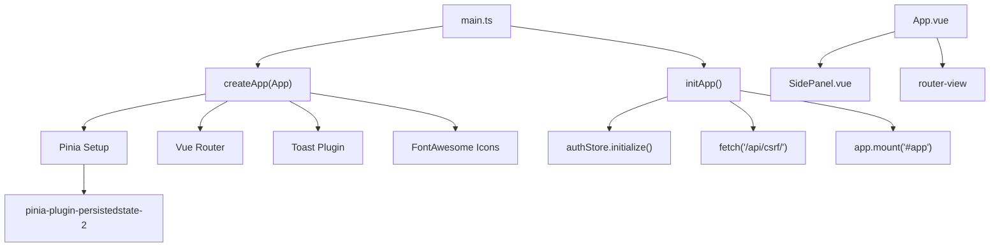
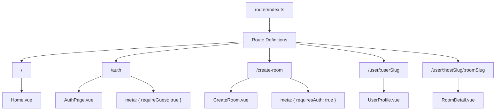
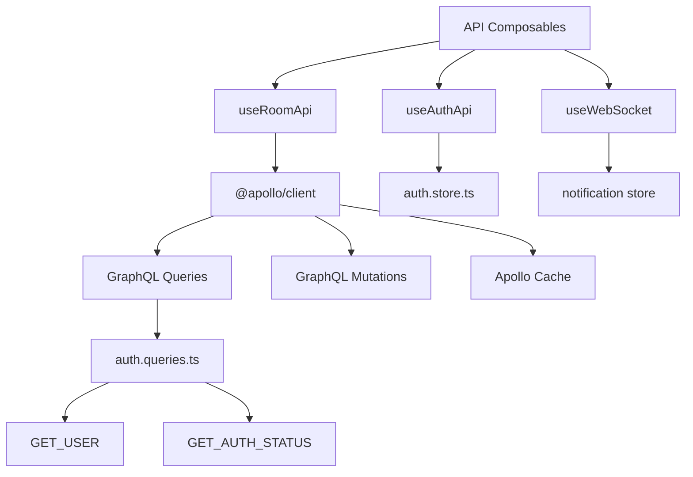
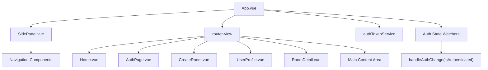
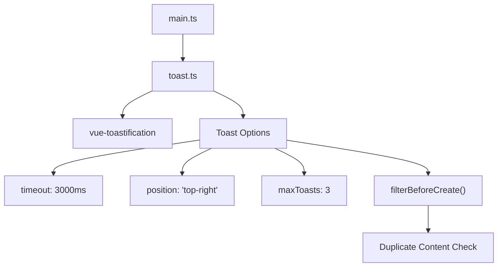

# Frontend Architecture

> **Relevant source files**
> * [frontend/package-lock.json](../frontend/pnpm-lock.yaml)
> * [frontend/package.json](../frontend/package.json)
> * [frontend/src/App.vue](../frontend/src/App.vue)
> * [frontend/src/api/graphql/auth.queries.ts](../frontend/src/api/graphql/auth.queries.ts)
> * [frontend/src/main.ts](../frontend/src/main.ts)
> * [frontend/src/plugins/toast.ts](../frontend/src/plugins/toast.ts)
> * [frontend/src/router/index.ts](../frontend/src/router/index.ts)
> * [frontend/src/stores/auth.store.ts](../frontend/src/stores/auth.store.ts)

## Purpose and Scope

This document describes the Vue.js frontend architecture of EduSphere, covering application initialization, routing, state management, API communication, and component organization. The frontend is a single-page application built with Vue 3 that communicates with the Django backend via GraphQL and WebSocket APIs.

For backend API specifications, see [GraphQL Queries](./GraphQL-Queries.md), [GraphQL Mutations](./GraphQL-Mutations.md), and [WebSocket API](./WebSocket-API.md). For detailed component implementation, see [Component Library](./Component-Library.md).

## Application Bootstrap and Configuration

The frontend application follows a standard Vue 3 setup with modern tooling and plugins. The main entry point initializes all core services and establishes the application foundation.

### Application Initialization Flow

**Application Bootstrap Sequence**

Sources: [frontend/src/main.ts L1-L46](../frontend/src/main.ts#L1-L46)

The application initialization follows this sequence:

1. **Core Setup**: `createApp(App)` creates the Vue application instance
2. **Plugin Registration**: Pinia, Vue Router, Toast notifications, and FontAwesome icons are registered
3. **State Persistence**: `pinia-plugin-persistedstate-2` enables automatic localStorage persistence
4. **Authentication Initialization**: `authStore.initialize()` validates stored authentication state
5. **CSRF Protection**: Fetches CSRF token from `/api/csrf/` endpoint
6. **DOM Mounting**: Application mounts to the `#app` element

### Technology Stack and Dependencies

| Category | Technologies | Purpose |
| --- | --- | --- |
| **Core Framework** | Vue 3.5.13 | Reactive UI framework with Composition API |
| **Build Tool** | Vite 6.3.5 | Fast development server and build tool |
| **State Management** | Pinia 3.0.2 | Modern Vuex alternative with TypeScript support |
| **Routing** | Vue Router 4.5.0 | Client-side routing and navigation |
| **API Client** | Apollo Client 3.13.1 | GraphQL client with caching |
| **Icons** | FontAwesome 6.7.2 | Icon library for UI components |
| **Notifications** | vue-toastification 2.0.0-rc.5 | Toast notification system |
| **Utilities** | @vueuse/core 13.1.0, timeago.ts 4.0.2 | Composition utilities and time formatting |

Sources: [frontend/package.json L13-L29](../frontend/package.json#L13-L29)

## Routing Architecture

The frontend uses Vue Router with programmatic route guards for authentication and navigation control.

### Route Configuration

**Route Protection System**

Sources: [frontend/src/router/index.ts L4-L38](../frontend/src/router/index.ts#L4-L38)

 [frontend/src/router/index.ts L45-L62](../frontend/src/router/index.ts#L45-L62)

The router implements authentication-based route protection through meta fields and navigation guards:

* **Guest Routes** (`requireGuest: true`): `/auth`, `/login`, `/register` - redirect authenticated users to home
* **Protected Routes** (`requiresAuth: true`): `/create-room` - redirect unauthenticated users to auth with redirect parameter
* **Public Routes**: `/`, `/user/:userSlug`, `/user/:hostSlug/:roomSlug` - accessible to all users

The `router.beforeEach` guard evaluates `authStore.isAuthenticated` and enforces these rules on every navigation.

## State Management with Pinia

The application uses Pinia stores for centralized state management with automatic persistence to localStorage.

### Authentication Store Architecture

```mermaid
flowchart TD

authstore["auth.store.ts"]
state["State Properties"]
getters["Computed Getters"]
actions["Action Methods"]
persist["Persistence Config"]
isAuthenticated["isAuthenticated: boolean"]
user["user: object"]
tokenExpiration["tokenExpiration: number"]
tokenIssueTime["tokenIssueTime: number"]
refreshTokenExpiration["refreshTokenExpiration: number"]
tokenRevoked["tokenRevoked: boolean"]
isTokenExpired["isTokenExpired"]
isRefreshTokenExpired["isRefreshTokenExpired"]
tokenLifePercentage["tokenLifePercentage"]
hasValidAuthState["hasValidAuthState"]
setAuthenticated["setAuthenticated(status)"]
setUser["setUser(user)"]
setTokenExpiration["setTokenExpiration(exp)"]
clearAuth["clearAuth()"]
initialize["initialize()"]
localStorage["localStorage persistence"]

    authstore --> state
    authstore --> getters
    authstore --> actions
    authstore --> persist
    state --> isAuthenticated
    state --> user
    state --> tokenExpiration
    state --> tokenIssueTime
    state --> refreshTokenExpiration
    state --> tokenRevoked
    getters --> isTokenExpired
    getters --> isRefreshTokenExpired
    getters --> tokenLifePercentage
    getters --> hasValidAuthState
    actions --> setAuthenticated
    actions --> setUser
    actions --> setTokenExpiration
    actions --> clearAuth
    actions --> initialize
    persist --> localStorage
```

**Token Management System**

Sources: [frontend/src/stores/auth.store.ts L6-L74](../frontend/src/stores/auth.store.ts#L6-L74)

 [frontend/src/stores/auth.store.ts L76-L134](../frontend/src/stores/auth.store.ts#L76-L134)

The auth store implements sophisticated JWT token lifecycle management:

* **Grace Period**: 30-second buffer before token expiration (`TOKEN_EXPIRATION_GRACE_PERIOD`)
* **Lifecycle Tracking**: Monitors token issue time, expiration, and usage percentage
* **Automatic Validation**: `initialize()` method validates stored tokens and clears invalid sessions
* **State Persistence**: All authentication state persists to localStorage for session recovery

## API Communication Layer

The frontend communicates with the backend through GraphQL using Apollo Client, with specialized composables for different API domains.

### GraphQL Integration Architecture

**Authentication Queries**

Sources: [frontend/src/api/graphql/auth.queries.ts L1-L26](../frontend/src/api/graphql/auth.queries.ts#L1-L26)

The GraphQL API layer provides structured queries for user authentication:

* `GET_USER`: Fetches current user profile (`id`, `name`, `username`, `avatar`)
* `GET_AUTH_STATUS`: Returns authentication status with user data

These queries integrate with the auth store to maintain consistent authentication state across the application.

## Application Structure and Component Hierarchy

The application follows a hierarchical component structure with clear separation of concerns.

### Root Application Layout

**Root Component Responsibilities**

Sources: [frontend/src/App.vue L1-L55](../frontend/src/App.vue#L1-L55)

The root `App.vue` component manages:

* **Layout Structure**: Side panel navigation and main content area
* **Authentication Service**: Initializes and monitors `authTokenService`
* **State Watching**: Monitors auth state changes and triggers service updates
* **Application Readiness**: Controls rendering until initialization completes

The layout uses flexbox with a persistent side panel and dynamic main content area that responds to route changes.

## Plugin and Service Integration

The application integrates several plugins and services for enhanced functionality.

### Toast Notification System

**Notification Configuration**

Sources: [frontend/src/plugins/toast.ts L1-L47](../frontend/src/plugins/toast.ts#L1-L47)

The toast system provides user feedback with:

* **Automatic Timeout**: 3-second display duration
* **Duplicate Prevention**: `filterBeforeCreate` prevents identical notifications
* **Mobile Optimization**: Custom CSS classes and responsive transitions
* **Position Control**: Top-right positioning with maximum 3 concurrent toasts

### Development and Build Configuration

The application uses Vite for development and build processes with modern JavaScript tooling.

**Build Tool Configuration**

Sources: [frontend/package.json L6-L12](../frontend/package.json#L6-L12)

| Script | Command | Purpose |
| --- | --- | --- |
| `dev` | `vite` | Development server with hot reload |
| `build` | `vite build` | Production build optimization |
| `preview` | `vite preview` | Preview production build locally |
| `lint` | `eslint . --fix` | Code linting with automatic fixes |
| `format` | `prettier --write src/` | Code formatting |

The development environment supports:

* **Hot Module Replacement**: Instant updates during development
* **ESLint Integration**: Automatic code quality enforcement
* **Prettier Formatting**: Consistent code style
* **Vue DevTools**: Advanced debugging capabilities via `vite-plugin-vue-devtools`