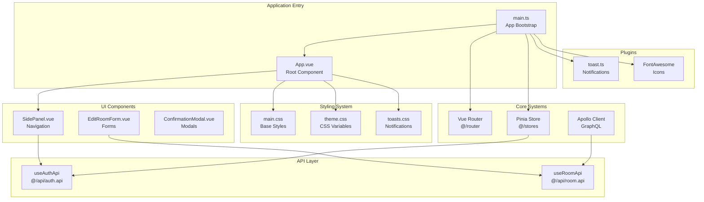
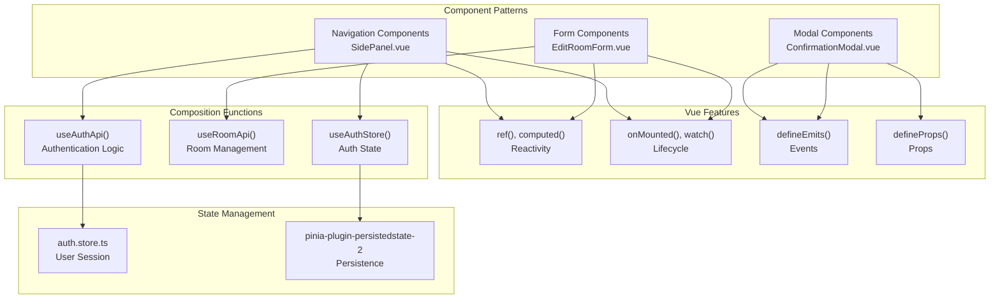
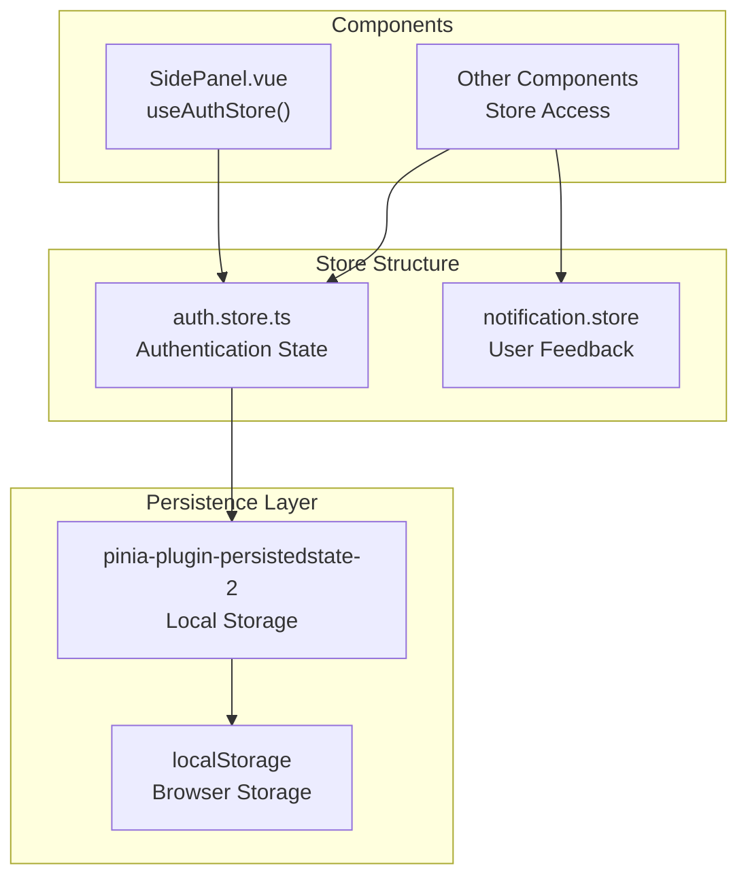
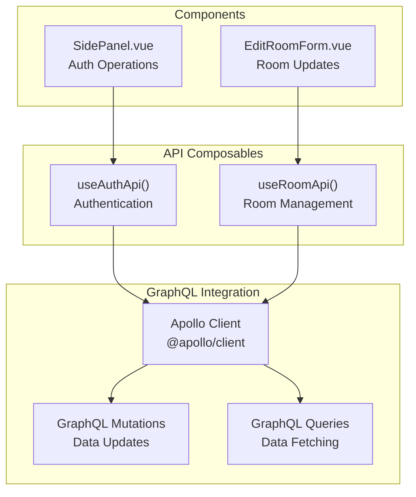

# Frontend Development Guide

> **Relevant source files**
> * [frontend/package-lock.json](../frontend/pnpm-lock.yaml)
> * [frontend/package.json](../frontend/package.json)
> * [frontend/src/assets/styles/main.css](../frontend/src/assets/styles/main.css)
> * [frontend/src/assets/styles/theme.css](../frontend/src/assets/styles/theme.css)
> * [frontend/src/assets/styles/toasts.css](../frontend/src/assets/styles/toasts.css)
> * [frontend/src/components/ConfirmationModal.vue](../frontend/src/components/ConfirmationModal.vue)
> * [frontend/src/components/EditRoomForm.vue](../frontend/src/components/EditRoomForm.vue)
> * [frontend/src/components/SidePanel.vue](../frontend/src/components/SidePanel.vue)
> * [frontend/src/main.ts](../frontend/src/main.ts)
> * [frontend/src/plugins/toast.ts](../frontend/src/plugins/toast.ts)

## Purpose and Scope

This document covers the Vue.js frontend implementation of EduSphere, including application architecture, component patterns, state management, and development practices. For backend API specifications, see [API Documentation](./API-Documentation.md). For deployment configuration, see [Docker Configuration](./Docker-Configuration.md).

The frontend is built with Vue 3 using the Composition API, Pinia for state management, and Apollo Client for GraphQL communication. It provides a responsive single-page application with real-time messaging capabilities.

## Application Architecture Overview

The frontend follows a modern Vue 3 architecture with clear separation of concerns and modular organization.

Sources: [frontend/src/main.ts L1-L46](../frontend/src/main.ts#L1-L46)

 [frontend/package.json L13-L29](../frontend/package.json#L13-L29)

## Component System Architecture

The component system uses Vue 3's Composition API with reusable patterns for forms, modals, and navigation.

Sources: [frontend/src/components/SidePanel.vue L80-L146](../frontend/src/components/SidePanel.vue#L80-L146)

 [frontend/src/components/EditRoomForm.vue L62-L166](../frontend/src/components/EditRoomForm.vue#L62-L166)

 [frontend/src/components/ConfirmationModal.vue L26-L88](../frontend/src/components/ConfirmationModal.vue#L26-L88)

## Application Initialization

The application bootstrap process in `main.ts` sets up all core systems and plugins before mounting the Vue app.

| Step | Component | Purpose |
| --- | --- | --- |
| 1 | Pinia Setup | State management with persistence |
| 2 | Router | Client-side routing |
| 3 | Toast Plugin | Notification system |
| 4 | FontAwesome | Icon library |
| 5 | Auth Initialization | User session restoration |
| 6 | CSRF Setup | Security token fetch |
| 7 | App Mount | DOM attachment |

The initialization sequence includes:

* **Pinia Store Configuration**: [frontend/src/main.ts L20-L23](../frontend/src/main.ts#L20-L23)  sets up the state management system with persistence
* **Plugin Registration**: [frontend/src/main.ts L27-L31](../frontend/src/main.ts#L27-L31)  registers router, toast notifications, and FontAwesome icons
* **Asynchronous Bootstrap**: [frontend/src/main.ts L33-L45](../frontend/src/main.ts#L33-L45)  initializes authentication and security before mounting

Sources: [frontend/src/main.ts L1-L46](../frontend/src/main.ts#L1-L46)

## State Management with Pinia

The application uses Pinia for centralized state management with automatic persistence.

Key state management patterns:

* **Store Composition**: [frontend/src/components/SidePanel.vue L85](../frontend/src/components/SidePanel.vue#L85-L85)  shows `useAuthStore()` usage
* **Reactive Updates**: [frontend/src/components/SidePanel.vue L121-L138](../frontend/src/components/SidePanel.vue#L121-L138)  demonstrates reactive authentication state watching
* **Persistence Configuration**: [frontend/src/main.ts L21-L23](../frontend/src/main.ts#L21-L23)  configures automatic state persistence

Sources: [frontend/src/main.ts L3-L4](../frontend/src/main.ts#L3-L4)

 [frontend/src/main.ts L20-L23](../frontend/src/main.ts#L20-L23)

 [frontend/src/components/SidePanel.vue L82-L138](../frontend/src/components/SidePanel.vue#L82-L138)

## Styling and Theming System

The application implements a CSS custom property-based theming system with dark mode support.

### Theme Architecture

| File | Purpose | Scope |
| --- | --- | --- |
| `theme.css` | CSS custom properties for colors and spacing | Global variables |
| `main.css` | Base styles and utility classes | Component foundations |
| `toasts.css` | Notification styling with responsive design | Toast components |

### Theme Variables

The theming system uses CSS custom properties for consistent styling:

* **Light Theme**: [frontend/src/assets/styles/theme.css L1-L13](../frontend/src/assets/styles/theme.css#L1-L13)  defines primary colors and spacing
* **Dark Theme**: [frontend/src/assets/styles/theme.css L15-L25](../frontend/src/assets/styles/theme.css#L15-L25)  overrides variables for dark mode
* **Theme Toggle**: [frontend/src/components/SidePanel.vue L101-L105](../frontend/src/components/SidePanel.vue#L101-L105)  implements theme switching logic

### Responsive Design Patterns

Components use consistent responsive patterns:

* **Mobile-First Breakpoints**: [frontend/src/components/SidePanel.vue L354-L358](../frontend/src/components/SidePanel.vue#L354-L358)  shows mobile adaptations
* **Touch-Friendly Interfaces**: [frontend/src/assets/styles/toasts.css L14-L54](../frontend/src/assets/styles/toasts.css#L14-L54)  demonstrates mobile toast styling
* **Flexible Layouts**: [frontend/src/components/EditRoomForm.vue L318-L332](../frontend/src/components/EditRoomForm.vue#L318-L332)  shows responsive form layouts

Sources: [frontend/src/assets/styles/theme.css L1-L26](../frontend/src/assets/styles/theme.css#L1-L26)

 [frontend/src/assets/styles/main.css L1-L241](../frontend/src/assets/styles/main.css#L1-L241)

 [frontend/src/assets/styles/toasts.css L1-L55](../frontend/src/assets/styles/toasts.css#L1-L55)

## API Integration Patterns

The frontend integrates with the backend through standardized API patterns using composables and Apollo Client.

### Composable API Pattern

### API Usage Patterns

* **Authentication Flow**: [frontend/src/components/SidePanel.vue L86](../frontend/src/components/SidePanel.vue#L86-L86)  demonstrates `useAuthApi` integration
* **Form Submission**: [frontend/src/components/EditRoomForm.vue L75](../frontend/src/components/EditRoomForm.vue#L75-L75)  shows `useRoomApi` for updates
* **Async Operations**: [frontend/src/components/EditRoomForm.vue L147-L165](../frontend/src/components/EditRoomForm.vue#L147-L165)  implements loading states and error handling

### Error Handling and Loading States

Components implement consistent patterns for API interaction:

* **Loading Indicators**: [frontend/src/components/EditRoomForm.vue L79](../frontend/src/components/EditRoomForm.vue#L79-L79)  tracks operation state
* **Error Feedback**: Form submission uses try-catch with user notifications
* **Optimistic Updates**: Components update UI immediately before API confirmation

Sources: [frontend/src/components/SidePanel.vue L82-L119](../frontend/src/components/SidePanel.vue#L82-L119)

 [frontend/src/components/EditRoomForm.vue L62-L166](../frontend/src/components/EditRoomForm.vue#L62-L166)

## Development Workflow and Tooling

The frontend development environment includes modern tooling for efficient development and code quality.

### Build System

| Tool | Purpose | Configuration |
| --- | --- | --- |
| Vite | Build tool and dev server | Default Vue 3 configuration |
| ESLint | Code linting and formatting | Vue-specific rules |
| Prettier | Code formatting | Integrated with ESLint |

### Development Scripts

The package.json defines standard development commands:

* **Development Server**: `npm run dev` starts Vite dev server on port 5173
* **Production Build**: `npm run build` creates optimized production bundle
* **Code Quality**: `npm run lint` and `npm run format` maintain code standards

### Component Development Patterns

Components follow consistent patterns for maintainability:

* **Composition API**: All components use `<script setup>` syntax
* **TypeScript-ready**: Structure supports TypeScript migration
* **Prop Validation**: [frontend/src/components/EditRoomForm.vue L66-L71](../frontend/src/components/EditRoomForm.vue#L66-L71)  shows prop definitions
* **Event Emission**: [frontend/src/components/EditRoomForm.vue L73](../frontend/src/components/EditRoomForm.vue#L73-L73)  demonstrates event patterns

### Plugin Integration

The application integrates several plugins for enhanced functionality:

* **Toast Notifications**: [frontend/src/plugins/toast.ts L1-L47](../frontend/src/plugins/toast.ts#L1-L47)  configures vue-toastification
* **FontAwesome Icons**: [frontend/src/main.ts L10-L18](../frontend/src/main.ts#L10-L18)  sets up icon library
* **Apollo GraphQL**: Package dependencies show GraphQL client integration

Sources: [frontend/package.json L6-L11](../frontend/package.json#L6-L11)

 [frontend/src/plugins/toast.ts L1-L47](../frontend/src/plugins/toast.ts#L1-L47)

 [frontend/src/main.ts L10-L32](../frontend/src/main.ts#L10-L32)