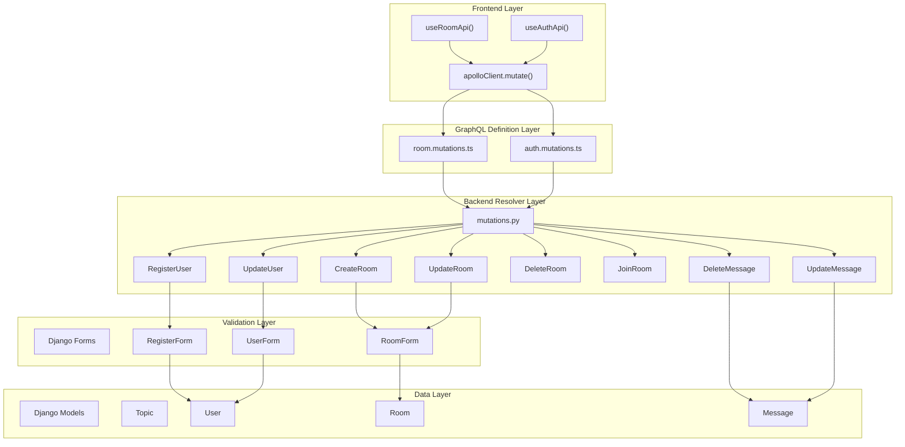
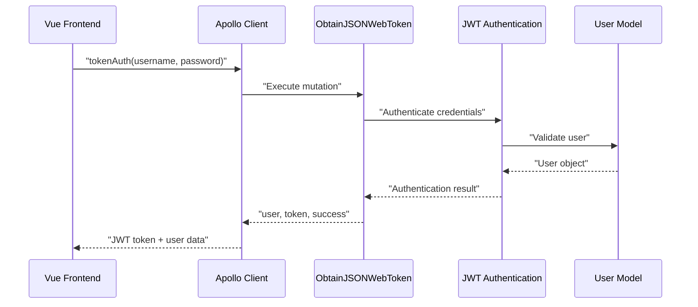
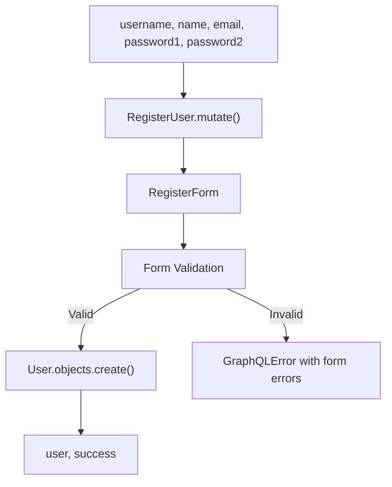
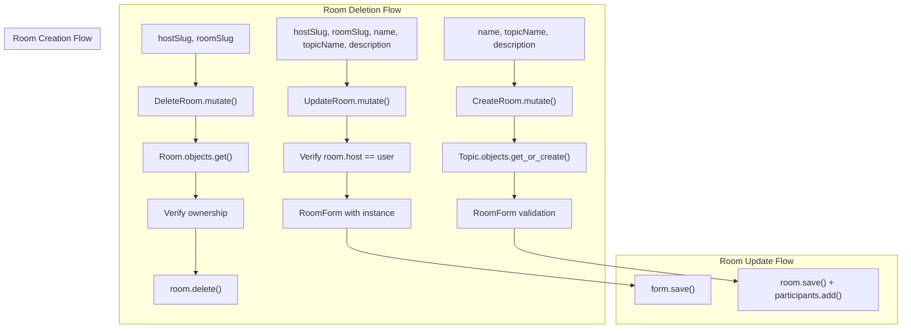
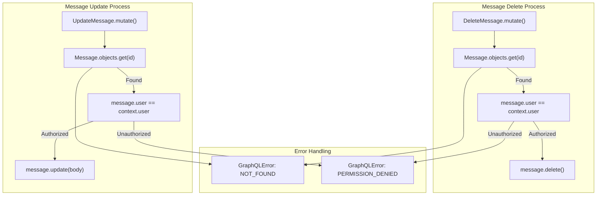
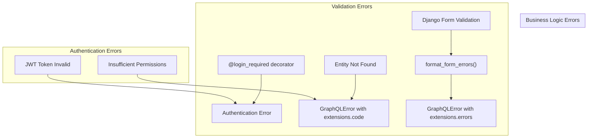

# GraphQL Mutations

> **Relevant source files**
> * [backend/core/admin.py](../backend/core/admin.py)
> * [backend/core/apps.py](../backend/core/apps.py)
> * [backend/core/graphql/mutations.py](../backend/core/graphql/mutations.py)
> * [backend/core/tests/test_mutations.py](../backend/core/tests/test_mutations.py)
> * [backend/core/tests/test_queries.py](../backend/core/tests/test_queries.py)
> * [backend/core/tests/utils.py](../backend/core/tests/utils.py)
> * [frontend/src/api/graphql/room.mutations.ts](../frontend/src/api/graphql/room.mutations.ts)
> * [frontend/src/api/room.api.ts](../frontend/src/api/room.api.ts)
> * [scripts/setup.sh](../scripts/setup.sh)

This document covers the GraphQL mutation system in EduSphere, which handles all data modification operations including user registration, authentication, room management, and message operations. Mutations provide a structured way to create, update, and delete entities while enforcing proper authentication and validation.

For information about data fetching operations, see [GraphQL Queries](./GraphQL-Queries.md). For real-time communication protocols, see [WebSocket API](./WebSocket-API.md).

## Mutation System Architecture

The EduSphere GraphQL mutation system follows a layered architecture where frontend mutation definitions connect to backend resolver classes through Apollo Client.



**Sources:**

| File | Lines |
|------|-------|
| [`mutations.py`](../backend/core/graphql/mutations.py#L1-L244) | L1–L244 |
| [`room.mutations.ts`](../frontend/src/api/graphql/room.mutations.ts#L1-L93) | L1–L93 |
| [`room.api.ts`](../frontend/src/api/room.api.ts#L1-L187) | L1–L187 |

## Authentication Mutations

The authentication system provides JWT-based login functionality and user registration through dedicated mutation classes.

| Mutation | Purpose | Authentication Required | Returns |
| --- | --- | --- | --- |
| `tokenAuth` | User login with JWT token generation | No | `user`, `token`, `success` |
| `registerUser` | Create new user account | No | `user`, `success` |
| `verifyToken` | Validate existing JWT token | No | `payload` |
| `refreshToken` | Generate new JWT from refresh token | No | `token`, `refreshToken` |

### Authentication Flow



The `ObtainJSONWebToken` class extends the base JWT mutation to include user data and success status in the response.

**Sources:**

| File | Lines |
|------|-------|
| [`mutations.py`](../backend/core/graphql/mutations.py#L15-L22) | L15–L22 |
| [`mutations.py`](../backend/core/graphql/mutations.py#L235-L241) | L235–L241 |

## User Management Mutations

User-related mutations handle registration and profile updates with comprehensive validation and file upload support.

### RegisterUser Mutation

The `RegisterUser` mutation creates new user accounts with password confirmation and email validation.



**Sources:**

| File | Lines |
|------|-------|
| [`mutations.py`](../backend/core/graphql/mutations.py#L23-L42) | L23–L42 |
| [`test_mutations.py`](../backend/core/tests/test_mutations.py#L23-L57) | L23–L57 |

### UpdateUser Mutation

The `UpdateUser` mutation allows authenticated users to modify their profile information including avatar uploads.

| Field | Type | Required | Purpose |
| --- | --- | --- | --- |
| `username` | String | No | Update username |
| `name` | String | No | Update display name |
| `bio` | String | No | Update user biography |
| `avatar` | Upload | No | Update profile picture |

**Sources:**

| File | Lines |
|------|-------|
| [`mutations.py`](../backend/core/graphql/mutations.py#L43-L74) | L43–L74 |
| [`test_mutations.py`](../backend/core/tests/test_mutations.py#L91-L133) | L91–L133 |

## Room Management Mutations

Room mutations provide comprehensive management capabilities for chat rooms including creation, updates, deletion, and participant management.

### Room Mutation Operations



**Sources:**

| File | Lines |
|------|-------|
| [`mutations.py`](../backend/core/graphql/mutations.py#L76-L162) | L76–L162 |
| [`room.mutations.ts`](../frontend/src/api/graphql/room.mutations.ts#L3-L59) | L3–L59 |

### JoinRoom Mutation

The `JoinRoom` mutation adds users to a room's participant list without requiring ownership permissions.

```javascript
# Frontend usage pattern
const response = await apolloClient.mutate({
  mutation: JOIN_ROOM_MUTATION,
  variables: { hostSlug, roomSlug }
});
```

**Sources:**

| File | Lines |
|------|-------|
| [`mutations.py`](../backend/core/graphql/mutations.py#L164-L182) | L164–L182 |
| [`room.mutations.ts`](../frontend/src/api/graphql/room.mutations.ts#L61-L72) | L61–L72 |
| [`room.api.ts`](../frontend/src/api/room.api.ts#L113-L127) | L113–L127 |

## Message Management Mutations

Message mutations handle the modification and deletion of chat messages with strict ownership validation.

### Message Operation Security



**Sources:**

| File | Lines |
|------|-------|
| [`mutations.py`](../backend/core/graphql/mutations.py#L184-L223) | L184–L223 |
| [`room.mutations.ts`](../frontend/src/api/graphql/room.mutations.ts#L74-L92) | L74–L92 |

### Message Mutation Details

| Mutation | Arguments | Returns | Validation |
| --- | --- | --- | --- |
| `deleteMessage` | `messageId: UUID!` | `success: Boolean` | User ownership |
| `updateMessage` | `messageId: UUID!`, `body: String!` | `message: MessageType` | User ownership |

Both mutations require the authenticated user to be the message author. The `updateMessage` mutation calls the model's `update()` method which sets the `edited` flag and updates the `updated` timestamp.

**Sources:**

| File | Lines |
|------|-------|
| [`mutations.py`](../backend/core/graphql/mutations.py#L204-L222) | L204–L222 |
| [`test_mutations.py`](../backend/core/tests/test_mutations.py#L196-L222) | L196–L222 |

## Error Handling and Validation

The mutation system implements comprehensive error handling using GraphQL errors with structured extension data.

### Error Response Structure



### Error Code Categories

| Error Type | Extension Key | Usage |
| --- | --- | --- |
| Validation Errors | `extensions.errors` | Form field validation failures |
| Not Found | `extensions.code = "NOT_FOUND"` | Entity lookup failures |
| Permission Denied | `extensions.code = "PERMISSION_DENIED"` | Authorization failures |
| Authentication Required | Decorator enforcement | Missing or invalid JWT |

**Sources:**

| File | Lines |
|------|-------|
| [`mutations.py`](../backend/core/graphql/mutations.py#L8-L8) | L8 |
| [`mutations.py`](../backend/core/graphql/mutations.py#L41-L41) | L41 |
| [`mutations.py`](../backend/core/graphql/mutations.py#L121-L121) | L121 |
| [`test_mutations.py`](../backend/core/tests/test_mutations.py#L86-L90) | L86–L90 |

## Frontend Integration Patterns

The frontend implements consistent patterns for executing mutations through the Apollo Client and handling responses.

### API Wrapper Pattern

```mermaid
sequenceDiagram
  participant Vue Component
  participant useRoomApi()
  participant useApiWrapper()
  participant apolloClient.mutate()
  participant Django Resolver

  Vue Component->>useRoomApi(): "createRoom(name, topic, desc)"
  useRoomApi()->>useApiWrapper(): "apiWrapper.callApi()"
  useApiWrapper()->>apolloClient.mutate(): "mutation execution"
  apolloClient.mutate()->>Django Resolver: "GraphQL request"
  Django Resolver-->>apolloClient.mutate(): "GraphQL response"
  apolloClient.mutate()-->>useApiWrapper(): "Apollo result"
  useApiWrapper()-->>useRoomApi(): "Unwrapped data"
  useRoomApi()-->>Vue Component: "Room object or null"
```

The `useApiWrapper` composable provides consistent error handling, loading states, and response normalization across all mutation operations.

**Sources:**

| File | Lines |
|------|-------|
| [`room.api.ts`](../frontend/src/api/room.api.ts#L22-L22) | L22 |
| [`room.api.ts`](../frontend/src/api/room.api.ts#L58-L78) | L58–L78 |

### Mutation Response Handling

| Function | Success Return | Error Return | Side Effects |
| --- | --- | --- | --- |
| `createRoom` | Room object | `null` | Router navigation |
| `deleteRoom` | `true` | `false` | Router navigation to home |
| `updateRoom` | Room object | `false` | None |
| `joinRoom` | Room object | `null` | None |
| `deleteMessage` | `true` | `false` | None |
| `updateMessage` | Message object | `false` | None |

**Sources:**

| File | Lines |
|------|-------|
| [`room.api.ts`](../frontend/src/api/room.api.ts#L58-L159) | L58–L159 |
