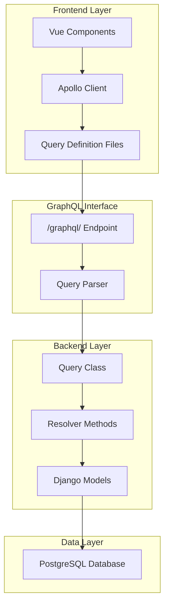
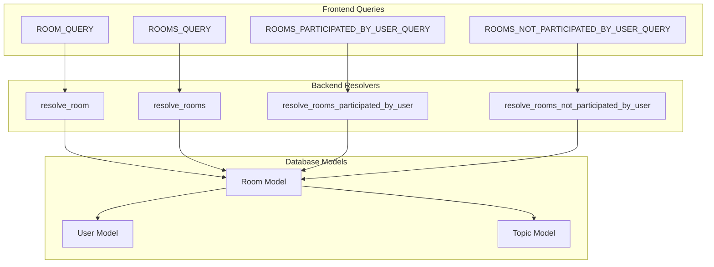
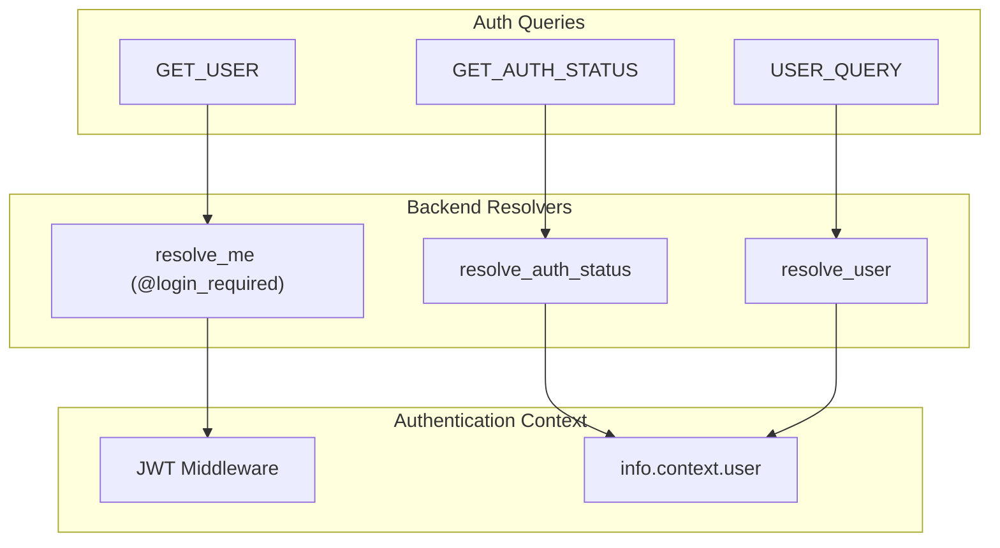
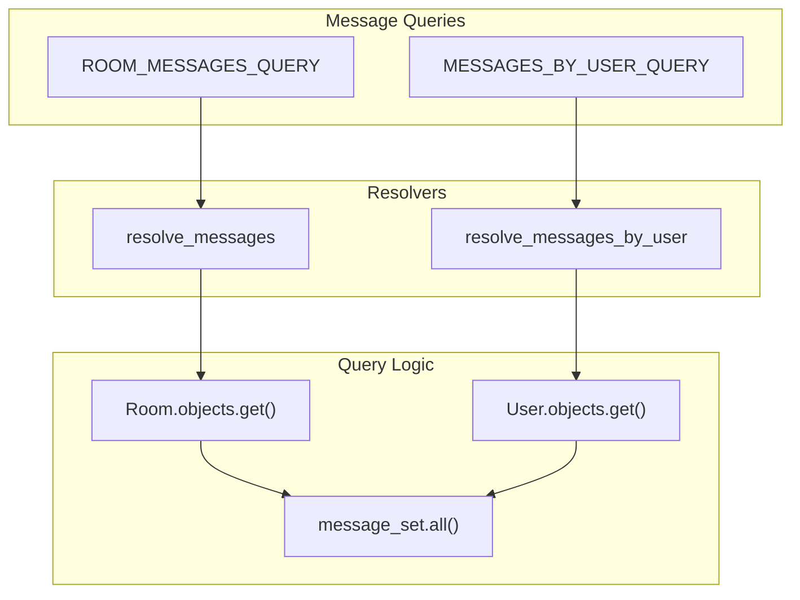
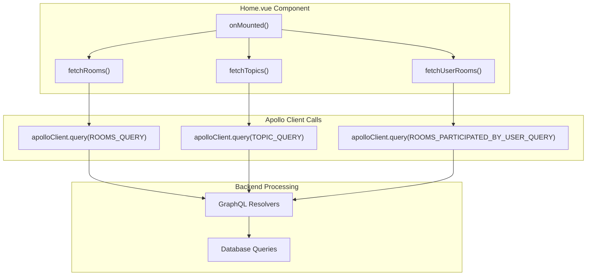

# GraphQL Queries

> **Relevant source files**
> * [backend/core/graphql/queries.py](../backend/core/graphql/queries.py)
> * [frontend/src/App.vue](../frontend/src/App.vue)
> * [frontend/src/api/graphql/auth.queries.ts](../frontend/src/api/graphql/auth.queries.ts)
> * [frontend/src/api/graphql/room.queries.ts](../frontend/src/api/graphql/room.queries.ts)
> * [frontend/src/views/Home.vue](../frontend/src/views/HomePage.vue)
> * [frontend/src/views/RoomDetail.vue](../frontend/src/views/RoomDetail.vue)

This document covers the GraphQL query operations in the EduSphere platform, which provide read-only data fetching capabilities for rooms, users, messages, and topics. These queries form the primary data access layer between the Vue.js frontend and Django backend.

For information about data modification operations, see [GraphQL Mutations](./GraphQL-Mutations.md). For real-time communication capabilities, see [WebSocket API](./WebSocket-API.md).

## GraphQL Query Architecture

The GraphQL query system follows a client-server architecture where frontend queries are resolved by backend resolvers that interact with Django models.



Sources: [frontend/src/api/graphql/room.queries.ts L1-L122](../frontend/src/api/graphql/room.queries.ts#L1-L122)

 [backend/core/graphql/queries.py L1-L168](../backend/core/graphql/queries.py#L1-L168)

## Room Queries

The room query system provides comprehensive access to room data with filtering, search, and relationship capabilities.

### Core Room Queries

| Query Name | Purpose | Key Parameters | Return Type |
| --- | --- | --- | --- |
| `rooms` | List all rooms with filtering | `hostSlug`, `search`, `topic` | `List[RoomType]` |
| `room` | Get single room details | `hostSlug`, `roomSlug` | `RoomType` |
| `roomsParticipatedByUser` | User's joined rooms | `userSlug` | `List[RoomType]` |
| `roomsNotParticipatedByUser` | Recommended rooms | `userSlug` | `List[RoomType]` |

### Room Query Data Flow



Sources: [frontend/src/api/graphql/room.queries.ts L3-L67](../frontend/src/api/graphql/room.queries.ts#L3-L67)

 [backend/core/graphql/queries.py L65-L106](../backend/core/graphql/queries.py#L65-L106)

### Room Query Fields

The `ROOM_QUERY` provides detailed room information including relationships:

```
query Room($hostSlug: String!, $roomSlug: String!) {
    room(hostSlug: $hostSlug, roomSlug: $roomSlug) {
        name
        slug
        description
        created
        host {
            id
            username
            name
            avatar
        }
        participants {
            id
            username
            avatar
        }
        topic {
            name
        }
    }
}
```

Sources: [frontend/src/api/graphql/room.queries.ts L3-L26](../frontend/src/api/graphql/room.queries.ts#L3-L26)

## User and Authentication Queries

The authentication system provides user data access and session management through dedicated queries.

### Authentication Query Types

| Query Name | Purpose | Authentication Required | Return Type |
| --- | --- | --- | --- |
| `me` | Get current user | Yes | `UserType` |
| `user` | Get user by slug | No | `UserType` |
| `users` | Search users | No | `List[UserType]` |
| `authStatus` | Get auth state | No | `AuthStatusType` |

### Authentication Query Flow



Sources: [frontend/src/api/graphql/auth.queries.ts L1-L26](../frontend/src/api/graphql/auth.queries.ts#L1-L26)

 [backend/core/graphql/queries.py L54-L67](../backend/core/graphql/queries.py#L54-L67)

## Message Queries

Message queries provide access to chat messages with room-based and user-based filtering.

### Message Query Operations

The system supports two primary message query patterns:

1. **Room-based messages**: `ROOM_MESSAGES_QUERY` retrieves all messages for a specific room
2. **User-based messages**: `MESSAGES_BY_USER_QUERY` retrieves all messages by a specific user



Sources: [frontend/src/api/graphql/room.queries.ts L69-L102](../frontend/src/api/graphql/room.queries.ts#L69-L102)

 [backend/core/graphql/queries.py L132-L149](../backend/core/graphql/queries.py#L132-L149)

### Message Query Implementation

The `ROOM_MESSAGES_QUERY` includes user relationship data for message display:

```
query RoomMessages($hostSlug: String!, $roomSlug: String!) {
    messages(hostSlug: $hostSlug, roomSlug: $roomSlug) {
        id
        user {
            id
            username
            avatar
        }
        body
        edited
        created
        updated
    }
}
```

Sources: [frontend/src/api/graphql/room.queries.ts L69-L84](../frontend/src/api/graphql/room.queries.ts#L69-L84)

## Topic Queries

Topic queries provide access to room categorization data with usage statistics.

### Topic Query Structure

The `TOPIC_QUERY` retrieves all available topics for filtering and room creation:

```
query Topics {
    topics {
        name
    }
}
```

The backend resolver `resolve_topics` supports advanced filtering with room count annotations:

```python
def resolve_topics(self, info, search=None, min_rooms=None):
    queryset = Topic.objects.annotate(
        room_count=Count('room')
    )
    # Additional filtering logic
    return queryset.order_by('-room_count')
```

Sources: [frontend/src/api/graphql/room.queries.ts L104-L110](../frontend/src/api/graphql/room.queries.ts#L104-L110)

 [backend/core/graphql/queries.py L108-L119](../backend/core/graphql/queries.py#L108-L119)

## Query Usage Patterns

The application demonstrates several common query usage patterns that show how GraphQL queries integrate with Vue.js components.

### Component Query Integration



Sources: [frontend/src/views/Home.vue L390-L470](../frontend/src/views/HomePage.vue#L390-L470)

 [frontend/src/views/RoomDetail.vue L172-L188](../frontend/src/views/RoomDetail.vue#L172-L188)

### Error Handling and Loading States

The query system implements consistent error handling patterns:

1. **Loading states**: Components track loading state during query execution
2. **Error handling**: GraphQL errors are caught and displayed via notifications
3. **Network policies**: Queries use `fetchPolicy: 'network-only'` for fresh data

Sources: [frontend/src/views/Home.vue L392-L414](../frontend/src/views/HomePage.vue#L392-L414)

 [backend/core/graphql/queries.py L88-L100](../backend/core/graphql/queries.py#L88-L100)