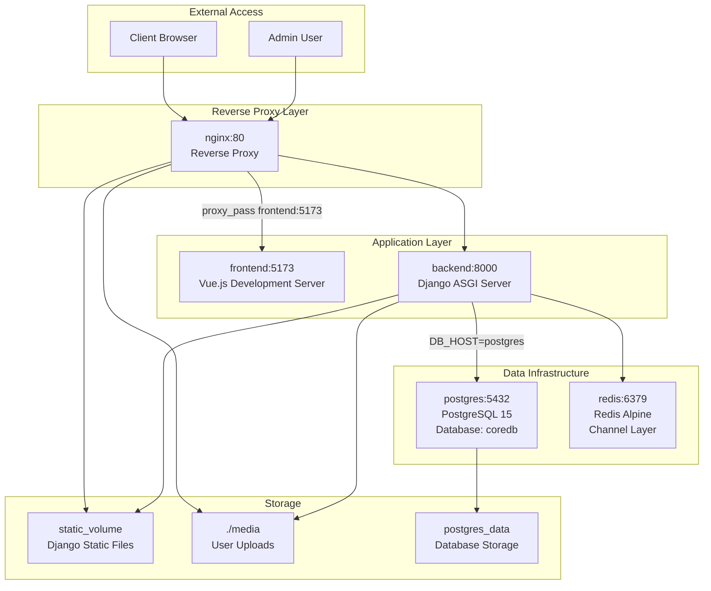
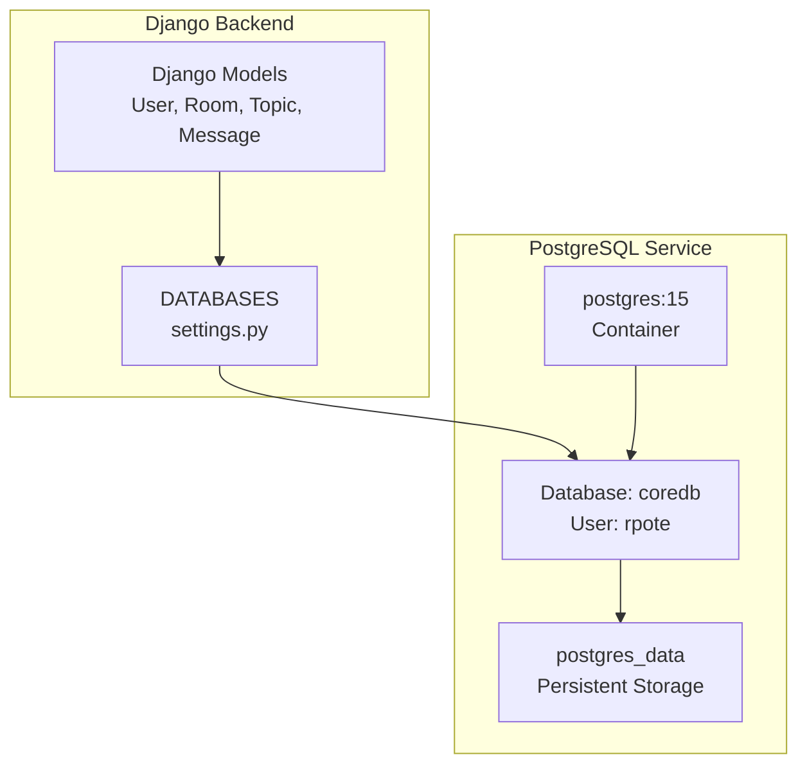
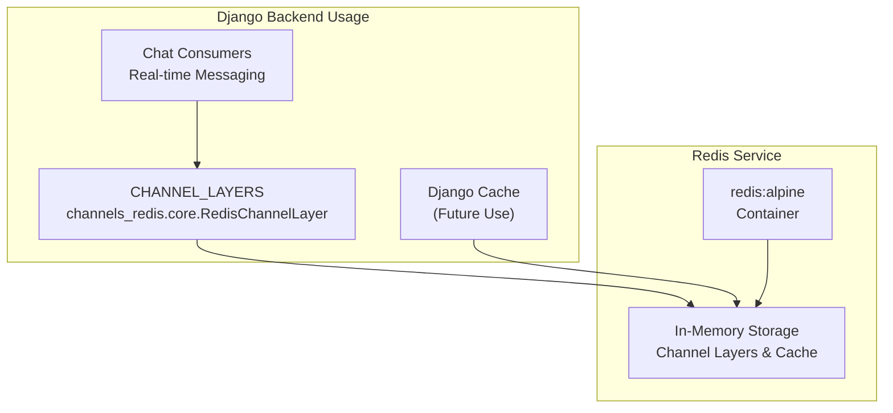
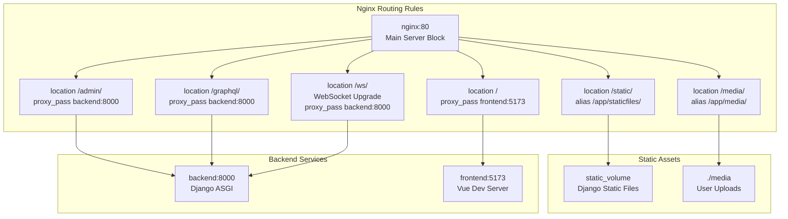
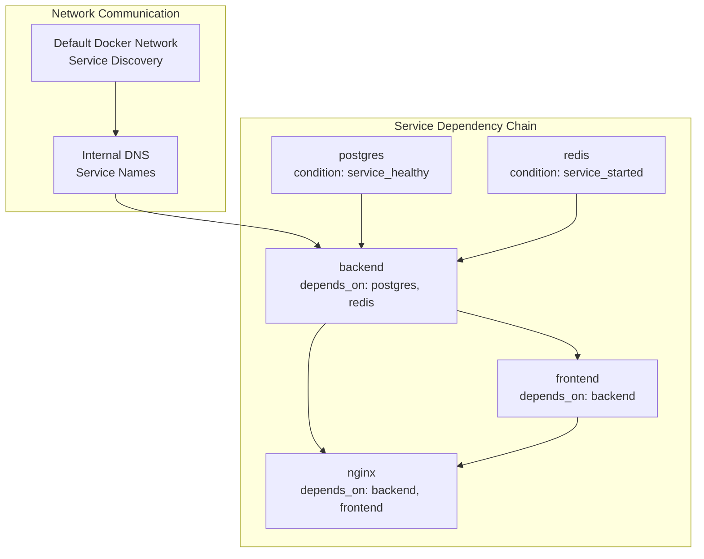
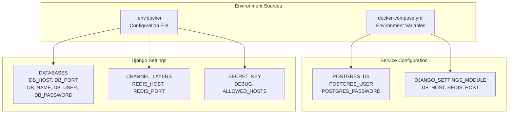

# Infrastructure Setup

> **Relevant source files**
> * [README.md](../README.md)
> * [backend/README.md](../backend/README.md)
> * [backend/config/settings.py](../backend/config/settings.py)
> * [backend/config/urls.py](../backend/config/urls.py)
> * [docker-compose.yml](../docker-compose.yml)
> * [docker/nginx/nginx.conf](../docker/nginx/nginx.conf)
> * [frontend/README.md](../frontend/README.md)
> * [frontend/vite.config.ts](../frontend/vite.config.ts)
> * [requirements.txt](../requirements.txt)

This document covers the infrastructure configuration and setup for the EduSphere platform, including database setup, caching layer, reverse proxy configuration, and service networking. This page focuses on the underlying infrastructure components and their configuration. For container orchestration and Docker-specific setup, see [Docker Configuration](./Docker-Configuration.md).

## Service Architecture Overview

The EduSphere platform uses a multi-service architecture with distinct infrastructure components handling different aspects of the system.

### Infrastructure Service Topology



**Sources:**

| File | Lines |
|------|-------|
| [`docker-compose.yml`](../docker-compose.yml#L1-L77) | L1–L77 |
| [`nginx.conf`](../docker/nginx/nginx.conf#L1-L75) | L1–L75 |

### Port Configuration and Service Communication

| Service | Internal Port | External Port | Protocol | Purpose |
| --- | --- | --- | --- | --- |
| `nginx` | 80 | 80 | HTTP | Reverse proxy and static file serving |
| `backend` | 8000 | 8000 | HTTP/WebSocket | Django ASGI application |
| `frontend` | 5173 | 5173 | HTTP | Vue.js development server |
| `postgres` | 5432 | 5432 | TCP | PostgreSQL database |
| `redis` | 6379 | 6379 | TCP | Redis cache and channel layer |

**Sources:**

| File | Lines |
|------|-------|
| [`docker-compose.yml`](../docker-compose.yml#L11-L72) | L11–L72 |

## Database Infrastructure

### PostgreSQL Configuration

The system uses PostgreSQL 15 as the primary database with the following configuration:



**Database Connection Settings:**

* **Engine**: `django.db.backends.postgresql`
* **Host**: `postgres` (service name in Docker network)
* **Port**: `5432`
* **Database Name**: Configured via `DB_NAME` environment variable
* **Authentication**: Username and password via `DB_USER` and `DB_PASSWORD`

**Health Check Configuration:**
The PostgreSQL service includes a health check to ensure database availability before dependent services start:

* **Test Command**: `pg_isready -U rpote -d coredb`
* **Interval**: 5 seconds
* **Timeout**: 5 seconds
* **Retries**: 5 attempts

**Sources:**

| File | Lines |
|------|-------|
| [`docker-compose.yml`](../docker-compose.yml#L3-L17) | L3–L17 |
| [`settings.py`](../backend/config/settings.py#L192-L201) | L192–L201 |

## Cache and Real-time Infrastructure

### Redis Configuration

Redis serves dual purposes in the infrastructure: caching and real-time communication via Django Channels.



**Channel Layer Configuration:**

* **Backend**: `channels_redis.core.RedisChannelLayer`
* **Host**: `redis` (service name)
* **Port**: `6379`
* **Usage**: WebSocket group management and message distribution

**Sources:**

| File | Lines |
|------|-------|
| [`docker-compose.yml`](../docker-compose.yml#L19-L24) | L19–L24 |
| [`settings.py`](../backend/config/settings.py#L203-L210) | L203–L210 |

## Reverse Proxy Configuration

### Nginx Service Configuration

Nginx acts as the entry point for all client requests, routing traffic to appropriate backend services and serving static content.



**Key Nginx Directives:**

| Location | Purpose | Configuration |
| --- | --- | --- |
| `/static/` | Django static files | `alias /app/staticfiles/; expires 7d;` |
| `/media/` | User uploaded files | `alias /app/media/; expires 7d;` |
| `/admin/` | Django admin interface | `proxy_pass http://backend:8000` |
| `/graphql/` | GraphQL API endpoint | `proxy_pass http://backend:8000` |
| `/ws/` | WebSocket connections | WebSocket upgrade headers |
| `/` | Vue.js frontend | `proxy_pass http://frontend:5173` |

**WebSocket Support:**

```
proxy_http_version 1.1;
proxy_set_header Upgrade $http_upgrade;
proxy_set_header Connection "Upgrade";
```

**Sources:**

| File | Lines |
|------|-------|
| [`nginx.conf`](../docker/nginx/nginx.conf#L1-L75) | L1–L75 |

## Network Configuration

### Service Networking and Dependencies



**Service Dependencies:**

* **backend**: Waits for `postgres` (healthy) and `redis` (started)
* **frontend**: Waits for `backend` to be available
* **nginx**: Waits for both `backend` and `frontend`

**Internal Service Discovery:**
Services communicate using Docker's built-in DNS resolution:

* `postgres` → PostgreSQL database
* `redis` → Redis server
* `backend` → Django application
* `frontend` → Vue.js development server

**Sources:**

| File | Lines |
|------|-------|
| [`docker-compose.yml`](../docker-compose.yml#L36-L72) | L36–L72 |

## Environment Configuration

### Environment Variables and Settings

The infrastructure relies on environment variables for configuration across services:



**Critical Environment Variables:**

| Variable | Service | Purpose | Example Value |
| --- | --- | --- | --- |
| `DB_HOST` | backend | Database connection | `postgres` |
| `DB_PORT` | backend | Database port | `5432` |
| `REDIS_HOST` | backend | Redis connection | `redis` |
| `REDIS_PORT` | backend | Redis port | `6379` |
| `DJANGO_SETTINGS_MODULE` | backend | Django configuration | `backend.config.settings` |
| `POSTGRES_DB` | postgres | Database name | `coredb` |
| `POSTGRES_USER` | postgres | Database user | `rpote` |

**Sources:**

| File | Lines |
|------|-------|
| [`docker-compose.yml`](../docker-compose.yml#L41-L46) | L41–L46 |
| [`settings.py`](../backend/config/settings.py#L25-L31) | L25–L31 |
| [`settings.py`](../backend/config/settings.py#L192-L210) | L192–L210 |

### Volume Management

Persistent data storage is handled through Docker volumes:

| Volume | Purpose | Mount Point | Persistence |
| --- | --- | --- | --- |
| `postgres_data` | Database files | `/var/lib/postgresql/data/` | Persistent |
| `static_volume` | Django static files | `/app/staticfiles` | Shared |
| `./media` | User uploads | `/app/media` | Host-mounted |

**Sources:**

| File | Lines |
|------|-------|
| [`docker-compose.yml`](../docker-compose.yml#L74-L76) | L74–L76 |
| [`docker-compose.yml`](../docker-compose.yml#L31-L33) | L31–L33 |
| [`docker-compose.yml`](../docker-compose.yml#L65-L67) | L65–L67 |
