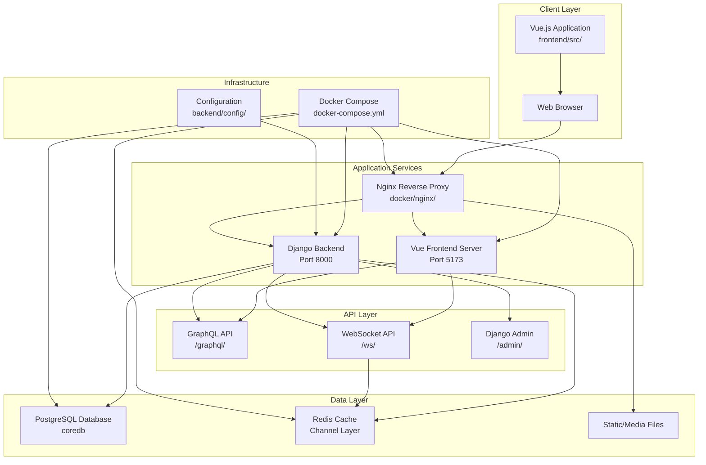
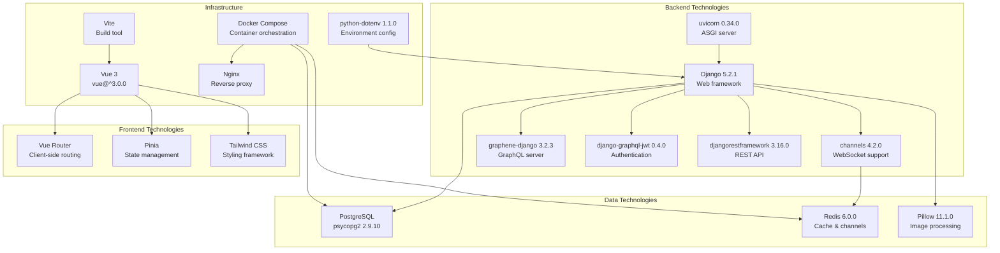
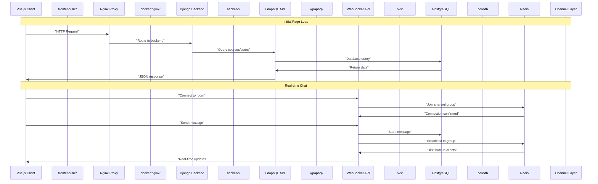

# Overview

> **Relevant source files**
> * [README.md](../README.md)
> * [backend/README.md](../backend/README.md)
> * [frontend/README.md](../frontend/README.md)
> * [requirements.txt](../requirements.txt)

## Purpose and Scope

This document provides a comprehensive overview of EduSphere, a full-stack real-time messaging platform designed for educational collaboration. EduSphere combines course management capabilities with real-time chat functionality, built using Django for the backend and Vue.js for the frontend.

This overview covers the system's high-level architecture, core technologies, and primary features. For detailed implementation information, see [System Architecture](./System-Architecture.md#overall-system-architecture) for technical design patterns, [Core Features](./Core-Features.md) for functionality specifics, and [Deployment and Infrastructure](./Deployment-and-Infrastructure.md) for containerization and production setup.

*Sources: [README.md L1-L25](../README.md#L1-L25)*

## System Architecture Overview

EduSphere follows a decoupled architecture pattern with distinct frontend and backend services communicating through GraphQL APIs and WebSocket connections for real-time features.

### High-Level Component Architecture



*Sources: [README.md L25-L44](../README.md#L25-L44)

 [README.md L188-L211](../README.md#L188-L211)*

### Technology Stack Overview



*Sources: [requirements.txt L1-L42](../requirements.txt#L1-L42)

 [README.md L36-L43](../README.md#L36-L43)

 [README.md L27-L34](../README.md#L27-L34)*

## Core Features and Capabilities

EduSphere provides a comprehensive set of features organized around educational collaboration and real-time communication:

| Feature Category | Components | Description |
| --- | --- | --- |
| **User Management** | Multi-role system | Creators, Learners, and Admins with different permissions |
| **Course Management** | CRUD operations | Create, publish, and sell courses with content management |
| **Real-time Communication** | WebSocket chat | Live messaging system using `channels` and `redis` |
| **Payment Processing** | Stripe/PayPal integration | Monetization capabilities for course creators |
| **Search & Discovery** | Advanced filtering | Filter courses by price, rating, and category |
| **Administration** | Django Admin dashboard | Manage users, courses, and transactions |
| **Authentication** | JWT-based security | Secure login with `django-graphql-jwt` |

*Sources: [README.md L17-L24](../README.md#L17-L24)

 [README.md L32-L34](../README.md#L32-L34)

 [README.md L40-L43](../README.md#L40-L43)*

### System Data Flow



*Sources: [README.md L20](../README.md#L20-L20)

 [README.md L28-L30](../README.md#L28-L30)

 [README.md L33](../README.md#L33-L33)*

## Development Environment Structure

The project follows a monorepo structure with clear separation between frontend, backend, and infrastructure components:

```go
EduSphere/
├── backend/                    # Django application
│   ├── config/                # Django settings and URL routing
│   ├── core/                  # Main application logic and models
│   ├── requirements.txt       # Python dependencies
│   └── manage.py             # Django management commands
├── frontend/                  # Vue.js application  
│   ├── src/                  # Vue components and stores
│   ├── public/               # Static assets
│   ├── package.json          # Node.ts dependencies
│   └── vite.config.ts        # Build configuration
├── docker/                   # Containerization
│   ├── backend/              # Django Docker setup
│   ├── frontend/             # Vue.js Docker setup
│   └── nginx/                # Nginx configuration
├── scripts/                  # Automation scripts
│   ├── run.sh               # Development server startup
│   └── test.sh              # Test execution
├── docker-compose.yml        # Multi-container orchestration
└── .env.docker              # Environment configuration
```

*Sources: [README.md L188-L211](../README.md#L188-L211)*

## Deployment and Infrastructure

EduSphere supports both manual development setup and containerized deployment through Docker Compose. The system uses environment-based configuration to support different deployment scenarios.

### Environment Configuration

| Environment Variable | Purpose | Example |
| --- | --- | --- |
| `SECRET_KEY` | Django security | Generated secret key |
| `DB_NAME` | PostgreSQL database | `coredb` |
| `DB_HOST` | Database hostname | `postgres` (Docker) or `localhost` |
| `REDIS_HOST` | Redis hostname | `redis` (Docker) or `localhost` |
| `DEBUG` | Development mode | `True` or `False` |

### Service Ports

| Service | Development Port | Docker Port | Purpose |
| --- | --- | --- | --- |
| Frontend | 5173 | 80 (via Nginx) | Vue.js development server |
| Backend | 8000 | 8000 | Django application server |
| PostgreSQL | 5432 | 5432 | Database connections |
| Redis | 6379 | 6379 | Cache and WebSocket channels |

*Sources: [README.md L61-L72](../README.md#L61-L72)

 [README.md L127-L140](../README.md#L127-L140)

 [README.md L159-L162](../README.md#L159-L162)*

This architecture provides a scalable foundation for educational platforms requiring real-time collaboration features while maintaining clear separation of concerns between presentation, business logic, and data layers.