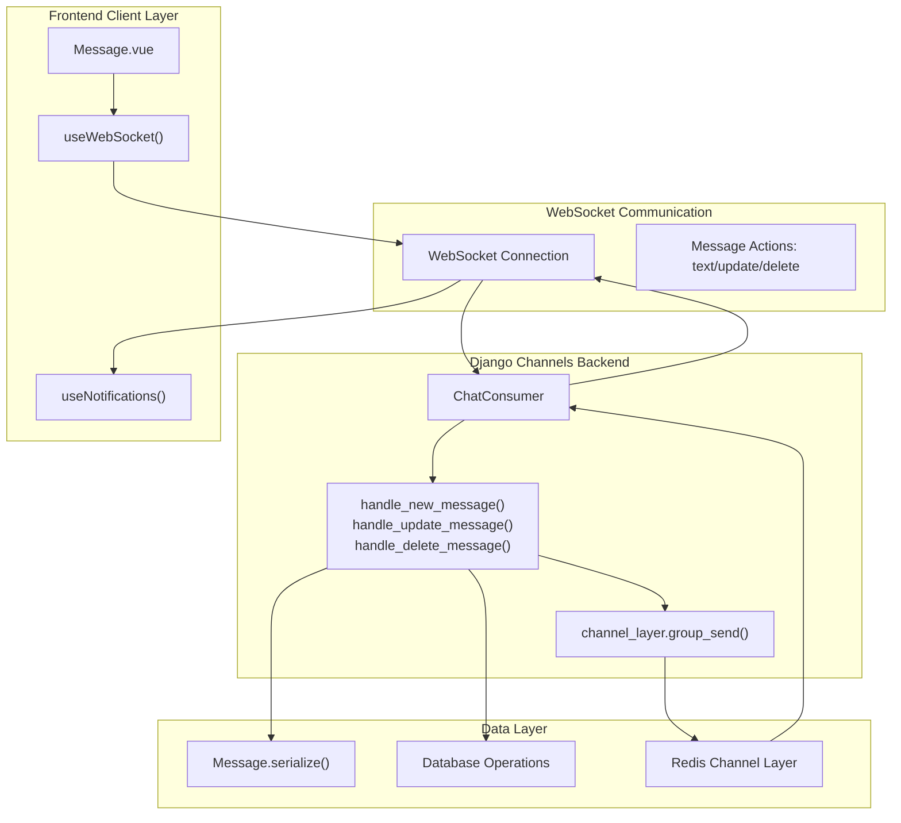
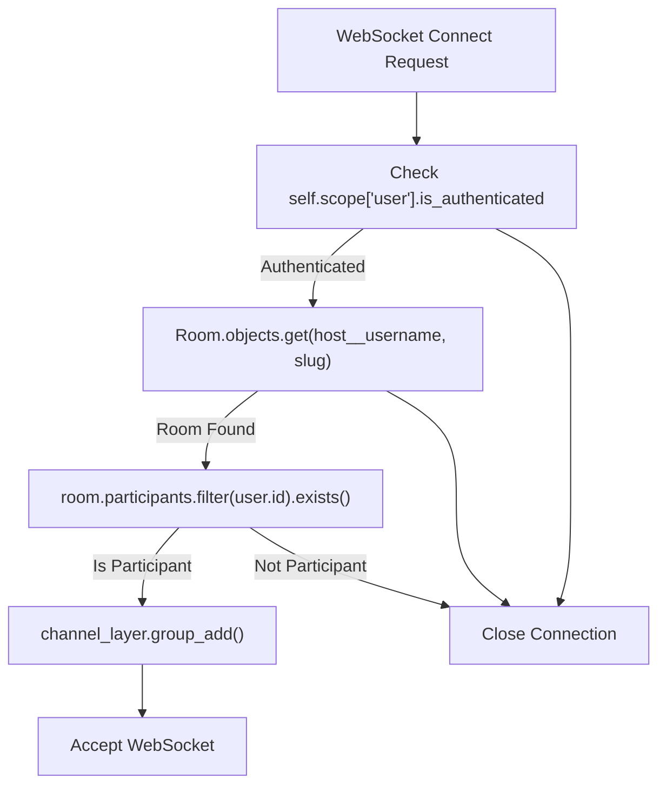

# Real-time Communication

> **Relevant source files**
> * [backend/core/chat/consumers.py](../backend/core/chat/consumers.py)
> * [backend/core/models.py](../backend/core/models.py)
> * [frontend/src/api/websocket.ts](../frontend/src/api/websocket.ts)
> * [frontend/src/components/Message.vue](../frontend/src/components/MessageView.vue)
> * [frontend/src/composables/useNotifications.ts](../frontend/src/composables/useNotifications.ts)

This document covers the WebSocket-based real-time communication system in EduSphere, including Django Channels configuration, message handling, and frontend WebSocket integration. For authentication mechanisms used in WebSocket connections, see [Authentication System](./Authentication-System.md). For the overall messaging feature implementation, see [Real-time Messaging](./Real-time-Messaging.md).

## WebSocket Architecture Overview

EduSphere implements real-time communication using Django Channels on the backend and native WebSocket API on the frontend. The system supports real-time message creation, editing, and deletion within chat rooms.

### Connection Flow

```mermaid
sequenceDiagram
  participant Vue Component
  participant useWebSocket()
  participant ChatConsumer
  participant PostgreSQL
  participant Redis Channel Layer
  participant Other Connected Users

  Vue Component->>useWebSocket(): "initializeWebSocket(userSlug, roomSlug)"
  useWebSocket()->>ChatConsumer: "WebSocket Connection: /ws/chat/{username}/{room}"
  ChatConsumer->>PostgreSQL: "Verify user authentication"
  ChatConsumer->>PostgreSQL: "Check room participation"
  loop [User is authorized]
    ChatConsumer->>Redis Channel Layer: "group_add(room_group_name, channel_name)"
    ChatConsumer->>useWebSocket(): "Connection accepted"
    useWebSocket()->>Vue Component: "connectionStatus: 'connected'"
    ChatConsumer->>useWebSocket(): "Connection closed"
  end
```

Sources: [backend/core/chat/consumers.py L23-L62](../backend/core/chat/consumers.py#L23-L62)

 [frontend/src/api/websocket.ts L17-L119](../frontend/src/api/websocket.ts#L17-L119)

### Message Broadcasting System



Sources: [backend/core/chat/consumers.py L100-L216](../backend/core/chat/consumers.py#L100-L216)

 [frontend/src/api/websocket.ts L121-L160](../frontend/src/api/websocket.ts#L121-L160)

 [frontend/src/components/Message.vue L45-L73](../frontend/src/components/MessageView.vue#L45-L73)

## Backend WebSocket Implementation

### ChatConsumer Class

The `ChatConsumer` class in [backend/core/chat/consumers.py](../backend/core/chat/consumers.py)

 handles all WebSocket connections and message operations.

| Method | Purpose | Authentication Check |
| --- | --- | --- |
| `connect()` | Establishes WebSocket connection | User authentication + room participation |
| `receive()` | Routes incoming messages by type | Implicit (connection required) |
| `handle_new_message()` | Creates new messages | Implicit (connection required) |
| `handle_update_message()` | Updates existing messages | Message ownership verification |
| `handle_delete_message()` | Deletes messages | Message ownership verification |

Sources: [backend/core/chat/consumers.py L7-L217](../backend/core/chat/consumers.py#L7-L217)

### Authentication and Authorization

WebSocket connections require both user authentication and room participation verification:



Sources: [backend/core/chat/consumers.py L23-L62](../backend/core/chat/consumers.py#L23-L62)

### Message Operations

The consumer handles three types of message operations:

#### New Message Creation

* Validates message body length against `Message.max_length`
* Creates `Message` instance with `full_clean()` validation
* Broadcasts via `group_send()` with `action: 'new'`

#### Message Updates

* Verifies message ownership (`message.user_id == self.user.id`)
* Uses `Message.update()` method which sets `edited: True`
* Broadcasts updated content with `action: 'update'`

#### Message Deletion

* Verifies message ownership
* Deletes from database
* Broadcasts `messageId` with `action: 'delete'`

Sources: [backend/core/chat/consumers.py L88-L216](../backend/core/chat/consumers.py#L88-L216)

### Message Serialization

The `Message` model provides a `serialize()` method specifically for WebSocket communication:

```python
def serialize(self):
    return {
        'id': str(self.id),
        'user': self.user.username,
        'user_id': str(self.user.id),
        'body': self.body,
        'created': self.created.isoformat(),
        'edited': self.edited,
        'updated': self.updated.isoformat(),
        'userAvatar': self.user.avatar.name if self.user.avatar else None,
    }
```

Sources: [backend/core/models.py L128-L141](../backend/core/models.py#L128-L141)

## Frontend WebSocket Integration

### useWebSocket Composable

The `useWebSocket` composable manages WebSocket connections and message state:

| Function | Purpose | Return Type |
| --- | --- | --- |
| `initializeWebSocket()` | Establishes connection and loads messages | `Promise<WebSocket>` |
| `sendMessage(message, type)` | Sends new messages | `void` |
| `updateMessage(messageId, body)` | Updates existing messages | `boolean` |
| `deleteMessage(messageId)` | Deletes messages | `boolean` |
| `closeWebSocket()` | Closes connection | `void` |

Sources: [frontend/src/api/websocket.ts L6-L177](../frontend/src/api/websocket.ts#L6-L177)

### Connection Management

The WebSocket client implements automatic reconnection with exponential backoff:

```css
#mermaid-ss3tm0cegej{font-family:ui-sans-serif,-apple-system,system-ui,Segoe UI,Helvetica;font-size:16px;fill:#333;}@keyframes edge-animation-frame{from{stroke-dashoffset:0;}}@keyframes dash{to{stroke-dashoffset:0;}}#mermaid-ss3tm0cegej .edge-animation-slow{stroke-dasharray:9,5!important;stroke-dashoffset:900;animation:dash 50s linear infinite;stroke-linecap:round;}#mermaid-ss3tm0cegej .edge-animation-fast{stroke-dasharray:9,5!important;stroke-dashoffset:900;animation:dash 20s linear infinite;stroke-linecap:round;}#mermaid-ss3tm0cegej .error-icon{fill:#dddddd;}#mermaid-ss3tm0cegej .error-text{fill:#222222;stroke:#222222;}#mermaid-ss3tm0cegej .edge-thickness-normal{stroke-width:1px;}#mermaid-ss3tm0cegej .edge-thickness-thick{stroke-width:3.5px;}#mermaid-ss3tm0cegej .edge-pattern-solid{stroke-dasharray:0;}#mermaid-ss3tm0cegej .edge-thickness-invisible{stroke-width:0;fill:none;}#mermaid-ss3tm0cegej .edge-pattern-dashed{stroke-dasharray:3;}#mermaid-ss3tm0cegej .edge-pattern-dotted{stroke-dasharray:2;}#mermaid-ss3tm0cegej .marker{fill:#999;stroke:#999;}#mermaid-ss3tm0cegej .marker.cross{stroke:#999;}#mermaid-ss3tm0cegej svg{font-family:ui-sans-serif,-apple-system,system-ui,Segoe UI,Helvetica;font-size:16px;}#mermaid-ss3tm0cegej p{margin:0;}#mermaid-ss3tm0cegej defs #statediagram-barbEnd{fill:#999;stroke:#999;}#mermaid-ss3tm0cegej g.stateGroup text{fill:#dddddd;stroke:none;font-size:10px;}#mermaid-ss3tm0cegej g.stateGroup text{fill:#333;stroke:none;font-size:10px;}#mermaid-ss3tm0cegej g.stateGroup .state-title{font-weight:bolder;fill:#333;}#mermaid-ss3tm0cegej g.stateGroup rect{fill:#ffffff;stroke:#dddddd;}#mermaid-ss3tm0cegej g.stateGroup line{stroke:#999;stroke-width:1;}#mermaid-ss3tm0cegej .transition{stroke:#999;stroke-width:1;fill:none;}#mermaid-ss3tm0cegej .stateGroup .composit{fill:#f4f4f4;border-bottom:1px;}#mermaid-ss3tm0cegej .stateGroup .alt-composit{fill:#e0e0e0;border-bottom:1px;}#mermaid-ss3tm0cegej .state-note{stroke:#e6d280;fill:#fff5ad;}#mermaid-ss3tm0cegej .state-note text{fill:#333;stroke:none;font-size:10px;}#mermaid-ss3tm0cegej .stateLabel .box{stroke:none;stroke-width:0;fill:#ffffff;opacity:0.5;}#mermaid-ss3tm0cegej .edgeLabel .label rect{fill:#ffffff;opacity:0.5;}#mermaid-ss3tm0cegej .edgeLabel{background-color:#ffffff;text-align:center;}#mermaid-ss3tm0cegej .edgeLabel p{background-color:#ffffff;}#mermaid-ss3tm0cegej .edgeLabel rect{opacity:0.5;background-color:#ffffff;fill:#ffffff;}#mermaid-ss3tm0cegej .edgeLabel .label text{fill:#333;}#mermaid-ss3tm0cegej .label div .edgeLabel{color:#333;}#mermaid-ss3tm0cegej .stateLabel text{fill:#333;font-size:10px;font-weight:bold;}#mermaid-ss3tm0cegej .node circle.state-start{fill:#999;stroke:#999;}#mermaid-ss3tm0cegej .node .fork-join{fill:#999;stroke:#999;}#mermaid-ss3tm0cegej .node circle.state-end{fill:#dddddd;stroke:#f4f4f4;stroke-width:1.5;}#mermaid-ss3tm0cegej .end-state-inner{fill:#f4f4f4;stroke-width:1.5;}#mermaid-ss3tm0cegej .node rect{fill:#ffffff;stroke:#dddddd;stroke-width:1px;}#mermaid-ss3tm0cegej .node polygon{fill:#ffffff;stroke:#dddddd;stroke-width:1px;}#mermaid-ss3tm0cegej #statediagram-barbEnd{fill:#999;}#mermaid-ss3tm0cegej .statediagram-cluster rect{fill:#ffffff;stroke:#dddddd;stroke-width:1px;}#mermaid-ss3tm0cegej .cluster-label,#mermaid-ss3tm0cegej .nodeLabel{color:#333;}#mermaid-ss3tm0cegej .statediagram-cluster rect.outer{rx:5px;ry:5px;}#mermaid-ss3tm0cegej .statediagram-state .divider{stroke:#dddddd;}#mermaid-ss3tm0cegej .statediagram-state .title-state{rx:5px;ry:5px;}#mermaid-ss3tm0cegej .statediagram-cluster.statediagram-cluster .inner{fill:#f4f4f4;}#mermaid-ss3tm0cegej .statediagram-cluster.statediagram-cluster-alt .inner{fill:#f8f8f8;}#mermaid-ss3tm0cegej .statediagram-cluster .inner{rx:0;ry:0;}#mermaid-ss3tm0cegej .statediagram-state rect.basic{rx:5px;ry:5px;}#mermaid-ss3tm0cegej .statediagram-state rect.divider{stroke-dasharray:10,10;fill:#f8f8f8;}#mermaid-ss3tm0cegej .note-edge{stroke-dasharray:5;}#mermaid-ss3tm0cegej .statediagram-note rect{fill:#fff5ad;stroke:#e6d280;stroke-width:1px;rx:0;ry:0;}#mermaid-ss3tm0cegej .statediagram-note rect{fill:#fff5ad;stroke:#e6d280;stroke-width:1px;rx:0;ry:0;}#mermaid-ss3tm0cegej .statediagram-note text{fill:#333;}#mermaid-ss3tm0cegej .statediagram-note .nodeLabel{color:#333;}#mermaid-ss3tm0cegej .statediagram .edgeLabel{color:red;}#mermaid-ss3tm0cegej #dependencyStart,#mermaid-ss3tm0cegej #dependencyEnd{fill:#999;stroke:#999;stroke-width:1;}#mermaid-ss3tm0cegej .statediagramTitleText{text-anchor:middle;font-size:18px;fill:#333;}#mermaid-ss3tm0cegej :root{--mermaid-font-family:"trebuchet ms",verdana,arial,sans-serif;}"initializeWebSocket()""onopen""onerror""onclose (clean)""onclose (unclean) / onerror""attemptReconnect()""setTimeout(RECONNECT_DELAY * attempts)""MAX_RECONNECT_ATTEMPTS reached"DisconnectedConnectingConnectedErrorReconnectingFailed
```

The reconnection logic uses `RECONNECT_DELAY = 3000ms` and `MAX_RECONNECT_ATTEMPTS = 5`.

Sources: [frontend/src/api/websocket.ts L107-L116](../frontend/src/api/websocket.ts#L107-L116)

### Message State Management

The composable maintains reactive message state and handles different message actions:

```sql
// Message handlers in onmessage callback
switch (action) {
  case 'new': handleNewMessage(receivedMessage); break;
  case 'delete': handleDeleteMessage(receivedMessage); break;
  case 'update': handleUpdateMessage(receivedMessage); break;
}
```

Each handler updates the `messages.value` reactive array to trigger UI updates.

Sources: [frontend/src/api/websocket.ts L45-L105](../frontend/src/api/websocket.ts#L45-L105)

## Error Handling

### Backend Error Responses

The `ChatConsumer` sends error messages for various failure scenarios:

* Message length validation failures
* Message not found errors
* Ownership verification failures

Error format: `{"error": "error_message"}`

Sources: [backend/core/chat/consumers.py L16-L21](../backend/core/chat/consumers.py#L16-L21)

 [backend/core/chat/consumers.py L117-L121](../backend/core/chat/consumers.py#L117-L121)

### Frontend Error Processing

The frontend uses `useNotifications` to display WebSocket errors:

```
if (receivedMessage.error) {
  notifications.error(receivedMessage);
  return;
}
```

Connection errors trigger automatic reconnection attempts with user notifications.

Sources: [frontend/src/api/websocket.ts L40-L43](../frontend/src/api/websocket.ts#L40-L43)

 [frontend/src/composables/useNotifications.ts L55-L62](../frontend/src/composables/useNotifications.ts#L55-L62)

## Message Component Integration

The `Message.vue` component emits events that trigger WebSocket operations:

| Event | WebSocket Operation | Parameters |
| --- | --- | --- |
| `delete-message` | `deleteMessage(messageId)` | `messageId` |
| `update-message` | `updateMessage(messageId, body)` | `messageId, newBody` |

The component provides real-time editing capabilities with keyboard shortcuts (Ctrl+Enter to save, Esc to cancel).

Sources: [frontend/src/components/Message.vue L16-L73](../frontend/src/components/MessageView.vue#L16-L73)

 [frontend/src/components/Message.vue L102-L111](../frontend/src/components/MessageView.vue#L102-L111)