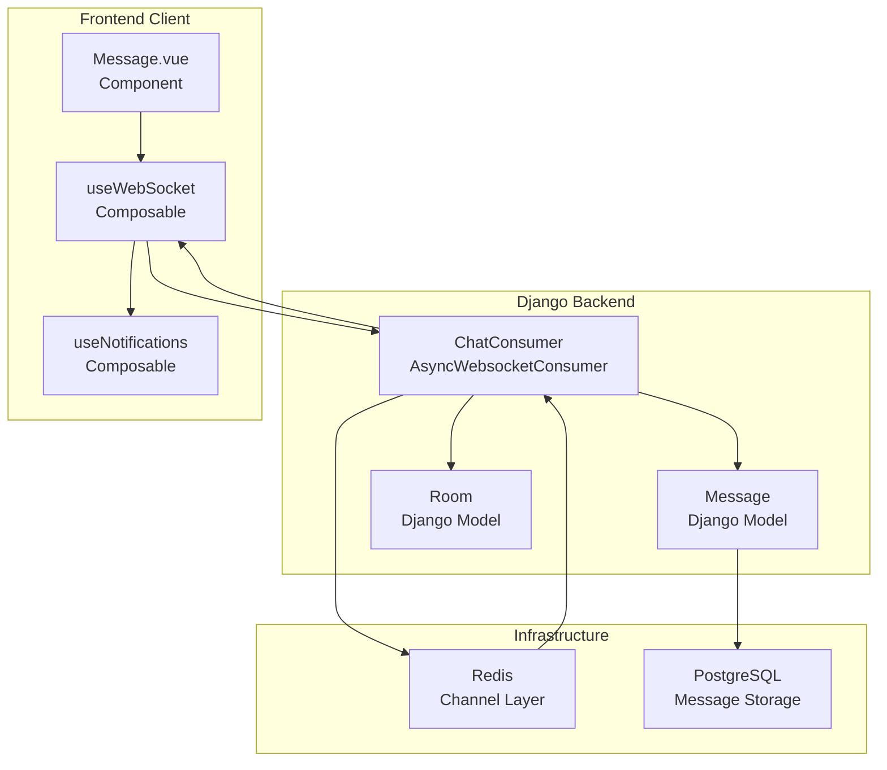
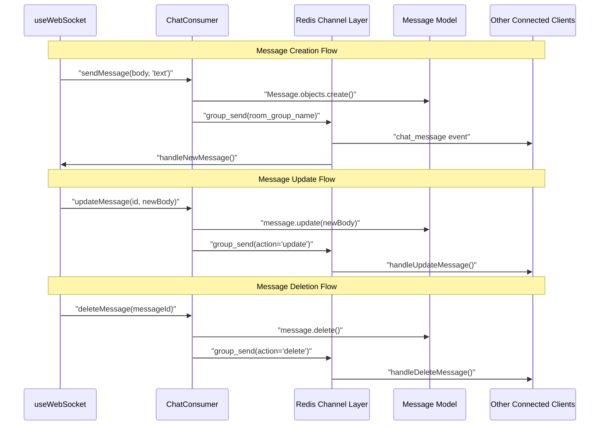
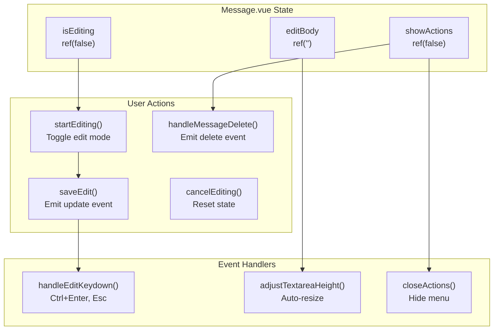
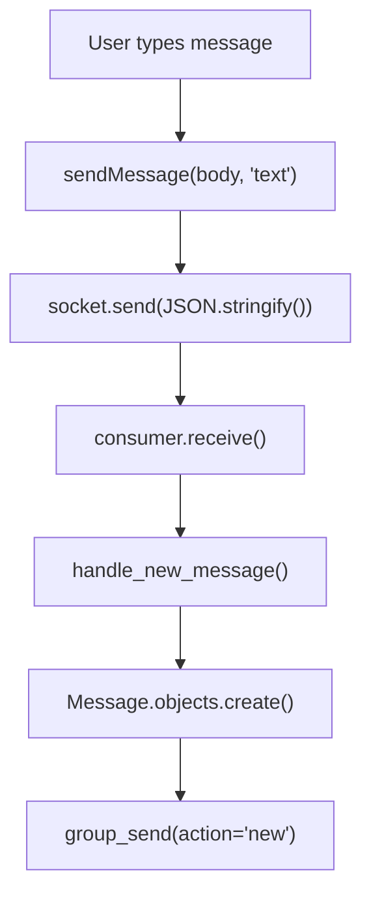
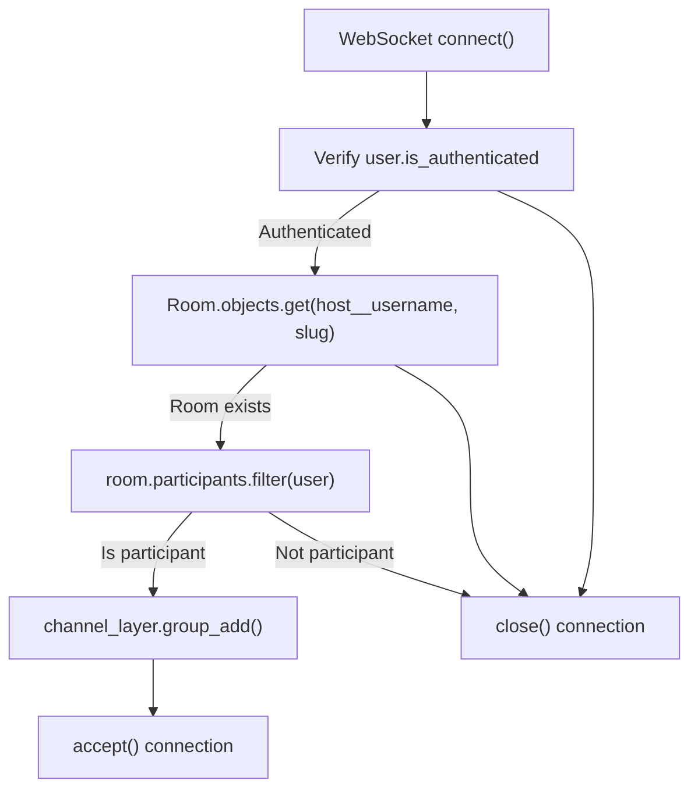

# Real-time Messaging

> **Relevant source files**
> * [backend/core/chat/consumers.py](../backend/core/chat/consumers.py)
> * [backend/core/models.py](../backend/core/models.py)
> * [frontend/src/api/websocket.ts](../frontend/src/api/websocket.ts)
> * [frontend/src/components/Message.vue](../frontend/src/components/MessageView.vue)
> * [frontend/src/composables/useNotifications.ts](../frontend/src/composables/useNotifications.ts)

This document covers the real-time messaging functionality in EduSphere, including message creation, editing, deletion, and live synchronization across connected clients. The system uses WebSocket connections through Django Channels to provide instant message delivery and updates within chat rooms.

For information about room creation and management, see [Room Management](./Room-Management.md). For details about user authentication and session management, see [Authentication System](./Authentication-System.md). For WebSocket protocol specifications, see [WebSocket API](./WebSocket-API.md).

## System Overview

The real-time messaging system consists of three main components: the `Message` model for data persistence, the `ChatConsumer` for WebSocket handling, and the frontend WebSocket client for real-time communication. Messages are synchronized instantly across all connected clients in a room using Redis channel layers.

Sources: [backend/core/chat/consumers.py L1-L217](../backend/core/chat/consumers.py#L1-L217)

 [frontend/src/api/websocket.ts L1-L177](../frontend/src/api/websocket.ts#L1-L177)

 [frontend/src/components/Message.vue L1-L422](../frontend/src/components/MessageView.vue#L1-L422)

 [backend/core/models.py L105-L150](../backend/core/models.py#L105-L150)

## Message Data Model

The `Message` model defines the core data structure for chat messages, including validation, serialization, and update methods. Each message belongs to a specific room and user, with support for editing and timestamps.

| Field | Type | Description |
| --- | --- | --- |
| `id` | UUIDField | Primary key using UUID4 |
| `user` | ForeignKey | Reference to message author |
| `room` | ForeignKey | Reference to containing room |
| `body` | TextField | Message content (max 500 chars) |
| `edited` | BooleanField | Tracks if message was modified |
| `created` | DateTimeField | Message creation timestamp |
| `updated` | DateTimeField | Last modification timestamp |

The model includes a `serialize()` method that formats message data for WebSocket transmission and a `update()` method for editing message content while preserving the edit history.

Sources: [backend/core/models.py L105-L150](../backend/core/models.py#L105-L150)

## WebSocket Communication Flow

The WebSocket communication uses Django Channels with a specific protocol for message operations. The `ChatConsumer` handles three message types: `text` for new messages, `delete` for removals, and `update` for edits.

Sources: [backend/core/chat/consumers.py L73-L217](../backend/core/chat/consumers.py#L73-L217)

 [frontend/src/api/websocket.ts L121-L160](../frontend/src/api/websocket.ts#L121-L160)

## Frontend Message Component

The `Message.vue` component handles message display, editing interface, and user interactions. It provides inline editing capabilities with keyboard shortcuts and permission-based action menus for message owners.

The component uses computed properties to determine message ownership (`isMessageOwner`) and formats timestamps using the `timeago.ts` library. Edit mode includes validation to prevent saving empty messages and provides visual feedback for the editing state.

Sources: [frontend/src/components/Message.vue L1-L422](../frontend/src/components/MessageView.vue#L1-L422)

## Message Operations

### Creating Messages

New messages are created through the `sendMessage()` function in `useWebSocket`, which validates the connection state and sends a JSON payload with type `text`. The `ChatConsumer.handle_new_message()` method creates a `Message` instance and broadcasts it to all room participants.

Sources: [frontend/src/api/websocket.ts L121-L131](../frontend/src/api/websocket.ts#L121-L131)

 [backend/core/chat/consumers.py L100-L131](../backend/core/chat/consumers.py#L100-L131)

### Updating Messages

Message updates use the `updateMessage()` function to send the message ID and new content. The backend verifies ownership through `check_owner()` before calling the model's `update()` method, which sets the `edited` flag and updates the timestamp.

The frontend handles update events in `handleUpdateMessage()` by finding the message in the local array and updating its properties while preserving other fields like creation timestamp and user information.

Sources: [frontend/src/api/websocket.ts L147-L160](../frontend/src/api/websocket.ts#L147-L160)

 [backend/core/chat/consumers.py L167-L210](../backend/core/chat/consumers.py#L167-L210)

 [backend/core/models.py L143-L149](../backend/core/models.py#L143-L149)

### Deleting Messages

Message deletion requires ownership verification on the backend. The `handle_delete_message()` method checks if the requesting user owns the message before removing it from the database. The deletion is then broadcast to all room participants.

Frontend clients receive delete events and filter the message from their local `messages` array using the message ID. The `Message.vue` component only shows delete options to message owners through the `isMessageOwner` computed property.

Sources: [frontend/src/api/websocket.ts L133-L145](../frontend/src/api/websocket.ts#L133-L145)

 [backend/core/chat/consumers.py L133-L165](../backend/core/chat/consumers.py#L133-L165)

 [frontend/src/components/Message.vue L23-L25](../frontend/src/components/MessageView.vue#L23-L25)

## Error Handling and Connection Management

The WebSocket client includes comprehensive error handling with automatic reconnection logic. Connection failures trigger exponential backoff reconnection attempts up to a maximum of 5 tries. The `useNotifications` composable displays user-friendly error messages for various failure scenarios.

| Error Type | Handling Method | User Feedback |
| --- | --- | --- |
| Authentication failure | Close connection immediately | "Authentication required" |
| Message validation error | Send error to client | "Message exceeds X characters" |
| Ownership violation | Send error message | "You can only edit your own messages" |
| Connection loss | Automatic reconnection | "WebSocket connection error" |
| Max reconnect attempts | Stop trying | "Connection failed after multiple attempts" |

The backend validates message length against the model's `max_length` constraint and sends structured error responses. Permission checks ensure users can only modify their own messages.

Sources: [frontend/src/api/websocket.ts L64-L116](../frontend/src/api/websocket.ts#L64-L116)

 [backend/core/chat/consumers.py L16-L21](../backend/core/chat/consumers.py#L16-L21)

 [frontend/src/composables/useNotifications.ts L1-L63](../frontend/src/composables/useNotifications.ts#L1-L63)

## Connection Authentication and Room Access

WebSocket connections require JWT authentication and room participation verification. The `ChatConsumer.connect()` method validates the user's authentication status and checks if they are a participant in the requested room before accepting the connection.

The room group name follows the pattern `chat_{username}_{room_slug}` to ensure proper message routing. Only authenticated users who are participants in the room can establish WebSocket connections and send messages.

Sources: [backend/core/chat/consumers.py L23-L62](../backend/core/chat/consumers.py#L23-L62)