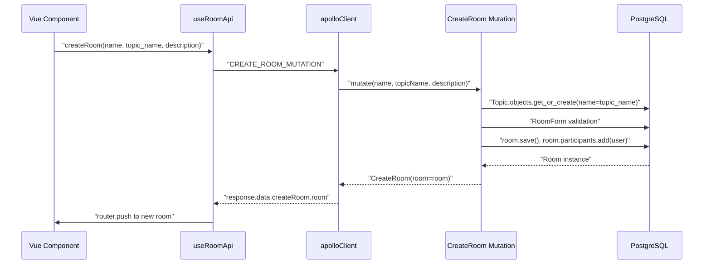
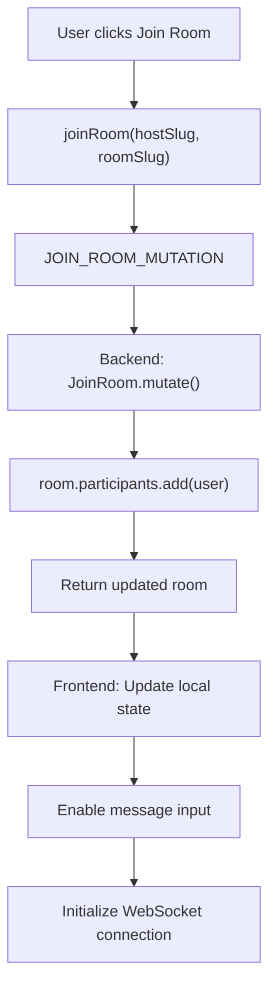
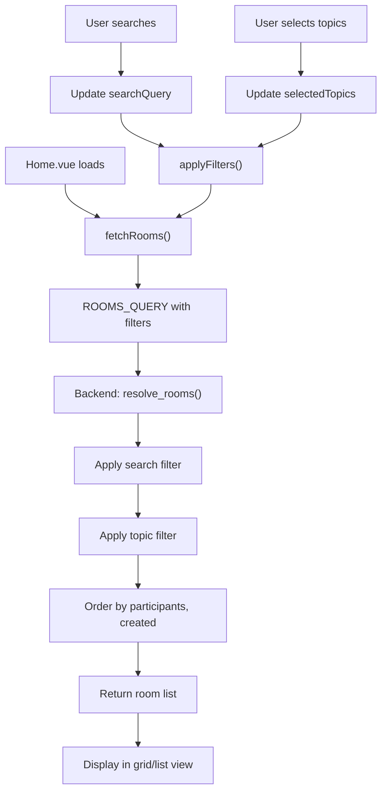
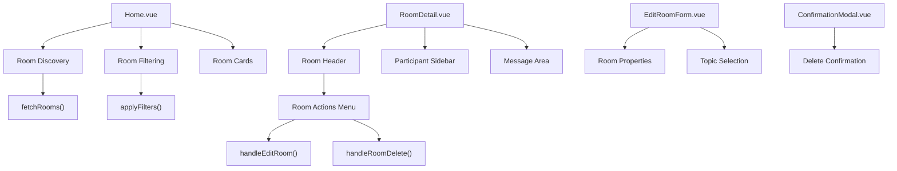

# Room Management

> **Relevant source files**
> * [backend/core/admin.py](../backend/core/admin.py)
> * [backend/core/graphql/mutations.py](../backend/core/graphql/mutations.py)
> * [backend/core/graphql/queries.py](../backend/core/graphql/queries.py)
> * [frontend/src/api/graphql/room.mutations.ts](../frontend/src/api/graphql/room.mutations.ts)
> * [frontend/src/api/graphql/room.queries.ts](../frontend/src/api/graphql/room.queries.ts)
> * [frontend/src/api/room.api.ts](../frontend/src/api/room.api.ts)
> * [frontend/src/views/Home.vue](../frontend/src/views/HomePage.vue)
> * [frontend/src/views/RoomDetail.vue](../frontend/src/views/RoomDetail.vue)
> * [scripts/setup.sh](../scripts/setup.sh)

## Purpose and Scope

This document covers the room management functionality in EduSphere, which enables users to create, configure, discover, and participate in chat rooms organized by topics. Room management encompasses the complete lifecycle from room creation to deletion, participant management, and content organization through topics.

For real-time messaging within rooms, see [Real-time Messaging](./Real-time-Messaging.md). For user authentication and permissions, see [Authentication System](./Authentication-System.md). For database schema details, see [Database Design](./Database-Design.md).

## Room Data Model and Relationships

Rooms are the central organizing unit for conversations in EduSphere. Each room has a host (creator), belongs to a topic, maintains a participant list, and contains messages.

```css
#mermaid-uzbqr7nys8{font-family:ui-sans-serif,-apple-system,system-ui,Segoe UI,Helvetica;font-size:16px;fill:#333;}@keyframes edge-animation-frame{from{stroke-dashoffset:0;}}@keyframes dash{to{stroke-dashoffset:0;}}#mermaid-uzbqr7nys8 .edge-animation-slow{stroke-dasharray:9,5!important;stroke-dashoffset:900;animation:dash 50s linear infinite;stroke-linecap:round;}#mermaid-uzbqr7nys8 .edge-animation-fast{stroke-dasharray:9,5!important;stroke-dashoffset:900;animation:dash 20s linear infinite;stroke-linecap:round;}#mermaid-uzbqr7nys8 .error-icon{fill:#dddddd;}#mermaid-uzbqr7nys8 .error-text{fill:#222222;stroke:#222222;}#mermaid-uzbqr7nys8 .edge-thickness-normal{stroke-width:1px;}#mermaid-uzbqr7nys8 .edge-thickness-thick{stroke-width:3.5px;}#mermaid-uzbqr7nys8 .edge-pattern-solid{stroke-dasharray:0;}#mermaid-uzbqr7nys8 .edge-thickness-invisible{stroke-width:0;fill:none;}#mermaid-uzbqr7nys8 .edge-pattern-dashed{stroke-dasharray:3;}#mermaid-uzbqr7nys8 .edge-pattern-dotted{stroke-dasharray:2;}#mermaid-uzbqr7nys8 .marker{fill:#999;stroke:#999;}#mermaid-uzbqr7nys8 .marker.cross{stroke:#999;}#mermaid-uzbqr7nys8 svg{font-family:ui-sans-serif,-apple-system,system-ui,Segoe UI,Helvetica;font-size:16px;}#mermaid-uzbqr7nys8 p{margin:0;}#mermaid-uzbqr7nys8 .entityBox{fill:#ffffff;stroke:#dddddd;}#mermaid-uzbqr7nys8 .relationshipLabelBox{fill:#dddddd;opacity:0.7;background-color:#dddddd;}#mermaid-uzbqr7nys8 .relationshipLabelBox rect{opacity:0.5;}#mermaid-uzbqr7nys8 .labelBkg{background-color:rgba(221, 221, 221, 0.5);}#mermaid-uzbqr7nys8 .edgeLabel .label{fill:#dddddd;font-size:14px;}#mermaid-uzbqr7nys8 .label{font-family:ui-sans-serif,-apple-system,system-ui,Segoe UI,Helvetica;color:#333;}#mermaid-uzbqr7nys8 .edge-pattern-dashed{stroke-dasharray:8,8;}#mermaid-uzbqr7nys8 .node rect,#mermaid-uzbqr7nys8 .node circle,#mermaid-uzbqr7nys8 .node ellipse,#mermaid-uzbqr7nys8 .node polygon{fill:#ffffff;stroke:#dddddd;stroke-width:1px;}#mermaid-uzbqr7nys8 .relationshipLine{stroke:#999;stroke-width:1;fill:none;}#mermaid-uzbqr7nys8 .marker{fill:none!important;stroke:#999!important;stroke-width:1;}#mermaid-uzbqr7nys8 :root{--mermaid-font-family:"trebuchet ms",verdana,arial,sans-serif;}hosted_bybelongs_tocontainsparticipantsauthored_byRoomuuididstringnamestringslugtextdescriptiondatetimecreateddatetimeupdatedUseruuididstringusernamestringnamestringemailtextbiostringavatarTopicuuididstringnameMessageuuididtextbodybooleanediteddatetimecreateddatetimeupdated
```

**Sources:**

| File | Lines |
|------|-------|
| [`types.py`](../backend/core/graphql/types.py) | — |
| [`models.py`](../backend/core/models.py) | — |

## Room Lifecycle Operations

### Room Creation

Room creation follows a structured flow involving topic selection or creation, form validation, and automatic host participation.



The `createRoom` function in [frontend/src/api/room.api.ts L58-L78](../frontend/src/api/room.api.ts#L58-L78)

 handles the frontend flow, calling the `CREATE_ROOM_MUTATION` defined in [frontend/src/api/graphql/room.mutations.ts L3-L18](../frontend/src/api/graphql/room.mutations.ts#L3-L18)

 The backend `CreateRoom` mutation in [backend/core/graphql/mutations.py L76-L101](../backend/core/graphql/mutations.py#L76-L101)

 manages topic creation and room persistence.

**Sources:**

| File | Lines |
|------|-------|
| [`room.api.ts`](../frontend/src/api/room.api.ts#L58-L78) | L58–L78 |
| [`room.mutations.ts`](../frontend/src/api/graphql/room.mutations.ts#L3-L18) | L3–L18 |
| [`mutations.py`](../backend/core/graphql/mutations.py#L76-L101) | L76–L101 |

### Room Updates

Room hosts can modify room properties including name, description, and topic. The update process includes permission validation and form handling.

| Property | Editable | Validation |
| --- | --- | --- |
| `name` | Yes | Required, unique per host |
| `description` | Yes | Optional text field |
| `topic` | Yes | Existing or new topic |
| `slug` | No | Auto-generated from name |
| `host` | No | Set at creation |
| `participants` | No | Managed via join/leave |

The `updateRoom` function in [frontend/src/api/room.api.ts L97-L111](../frontend/src/api/room.api.ts#L97-L111)

 sends updates via `UPDATE_ROOM_MUTATION` [frontend/src/api/graphql/room.mutations.ts L28-L59](../frontend/src/api/graphql/room.mutations.ts#L28-L59)

 processed by the backend `UpdateRoom` mutation in [backend/core/graphql/mutations.py L103-L138](../backend/core/graphql/mutations.py#L103-L138)

**Sources:**

| File | Lines |
|------|-------|
| [`room.api.ts`](../frontend/src/api/room.api.ts#L97-L111) | L97–L111 |
| [`room.mutations.ts`](../frontend/src/api/graphql/room.mutations.ts#L28-L59) | L28–L59 |
| [`mutations.py`](../backend/core/graphql/mutations.py#L103-L138) | L103–L138 |

### Room Deletion

Room deletion is restricted to hosts and requires confirmation. The operation cascades to remove associated messages and participant relationships.

The `deleteRoom` function in [frontend/src/api/room.api.ts L80-L95](../frontend/src/api/room.api.ts#L80-L95)

 calls the `DELETE_ROOM_MUTATION` [frontend/src/api/graphql/room.mutations.ts L20-L26](../frontend/src/api/graphql/room.mutations.ts#L20-L26)

 which is handled by the `DeleteRoom` mutation in [backend/core/graphql/mutations.py L141-L162](../backend/core/graphql/mutations.py#L141-L162)

 with host permission validation.

**Sources:**

| File | Lines |
|------|-------|
| [`room.api.ts`](../frontend/src/api/room.api.ts#L80-L95) | L80–L95 |
| [`room.mutations.ts`](../frontend/src/api/graphql/room.mutations.ts#L20-L26) | L20–L26 |
| [`mutations.py`](../backend/core/graphql/mutations.py#L141-L162) | L141–L162 |

## Room Participation

### Joining Rooms

Users can join rooms they're not already participating in. The join operation adds them to the participant list and enables message sending.



The `joinRoom` function in [frontend/src/api/room.api.ts L113-L127](../frontend/src/api/room.api.ts#L113-L127)

 handles the frontend flow, while the backend `JoinRoom` mutation in [backend/core/graphql/mutations.py L164-L182](../backend/core/graphql/mutations.py#L164-L182)

 manages the participant relationship.

**Sources:**

| File | Lines |
|------|-------|
| [`room.api.ts`](../frontend/src/api/room.api.ts#L113-L127) | L113–L127 |
| [`room.mutations.ts`](../frontend/src/api/graphql/room.mutations.ts#L61-L72) | L61–L72 |
| [`mutations.py`](../backend/core/graphql/mutations.py#L164-L182) | L164–L182 |

### Participant Management

Room participants are managed through a many-to-many relationship. The system tracks the host separately and displays participant lists with host indicators.

The `participants` computed property in [frontend/src/views/RoomDetail.vue L51-L66](../frontend/src/views/RoomDetail.vue#L51-L66)

 processes the participant list, marking the host and enabling profile navigation. Participant data is fetched via the `ROOM_QUERY` in [frontend/src/api/graphql/room.queries.ts L3-L26](../frontend/src/api/graphql/room.queries.ts#L3-L26)

**Sources:**

| File | Lines |
|------|-------|
| [`RoomDetail.vue`](../frontend/src/views/RoomDetail.vue#L51-L66) | L51–L66 |
| [`room.queries.ts`](../frontend/src/api/graphql/room.queries.ts#L16-L20) | L16–L20 |

## Room Discovery and Filtering

### Room Browsing

The home page provides comprehensive room discovery with search and topic-based filtering capabilities.



The `fetchRooms` function in [frontend/src/views/Home.vue L391-L414](../frontend/src/views/HomePage.vue#L391-L414)

 calls the `ROOMS_QUERY` [frontend/src/api/graphql/room.queries.ts L28-L41](../frontend/src/api/graphql/room.queries.ts#L28-L41)

 with optional search and topic filters, processed by `resolve_rooms` in [backend/core/graphql/queries.py L65-L82](../backend/core/graphql/queries.py#L65-L82)

**Sources:**

| File | Lines |
|------|-------|
| [`Home.vue`](../frontend/src/views/HomePage.vue#L391-L414) | L391–L414 |
| [`room.queries.ts`](../frontend/src/api/graphql/room.queries.ts#L28-L41) | L28–L41 |
| [`queries.py`](../backend/core/graphql/queries.py#L65-L82) | L65–L82 |

### User-Specific Room Lists

The system provides personalized room recommendations and tracks user participation history.

| Query | Purpose | Implementation |
| --- | --- | --- |
| `roomsParticipatedByUser` | User's joined rooms | [backend/core/graphql/queries.py L84-L94](../backend/core/graphql/queries.py#L84-L94) |
| `roomsNotParticipatedByUser` | Recommendations | [backend/core/graphql/queries.py L96-L106](../backend/core/graphql/queries.py#L96-L106) |

These queries power the "Joined Rooms" and "Recommended For You" sections in [frontend/src/views/Home.vue L429-L470](../frontend/src/views/HomePage.vue#L429-L470)

**Sources:**

| File | Lines |
|------|-------|
| [`Home.vue`](../frontend/src/views/HomePage.vue#L429-L470) | L429–L470 |
| [`queries.py`](../backend/core/graphql/queries.py#L84-L106) | L84–L106 |
| [`room.queries.ts`](../frontend/src/api/graphql/room.queries.ts#L43-L67) | L43–L67 |

## Topic Management

Topics organize rooms into categories and enable filtering. Topics are created automatically when rooms are created with new topic names.

### Topic Creation and Assignment

The `get_or_create` pattern ensures topics exist before room creation:

```
topic, created = Topic.objects.get_or_create(name=topic_name)
```

This approach in [backend/core/graphql/mutations.py L86](../backend/core/graphql/mutations.py#L86-L86)

 and [backend/core/graphql/mutations.py L126](../backend/core/graphql/mutations.py#L126-L126)

 prevents orphaned topics while allowing dynamic topic creation.

### Topic Queries

The `fetchTopics` function in [frontend/src/api/room.api.ts L161-L174](../frontend/src/api/room.api.ts#L161-L174)

 retrieves available topics via the `TOPIC_QUERY` [frontend/src/api/graphql/room.queries.ts L104-L110](../frontend/src/api/graphql/room.queries.ts#L104-L110)

 resolved by [backend/core/graphql/queries.py L108-L119](../backend/core/graphql/queries.py#L108-L119)

 with room count annotations.

**Sources:**

| File | Lines |
|------|-------|
| [`room.api.ts`](../frontend/src/api/room.api.ts#L161-L174) | L161–L174 |
| [`room.queries.ts`](../frontend/src/api/graphql/room.queries.ts#L104-L110) | L104–L110 |
| [`queries.py`](../backend/core/graphql/queries.py#L108-L119) | L108–L119 |

## Permissions and Authorization

Room management implements role-based permissions with host privileges for modification operations.

### Permission Matrix

| Operation | Host | Participant | Non-participant | Anonymous |
| --- | --- | --- | --- | --- |
| View room | ✓ | ✓ | ✓ | ✓ |
| Join room | ✓ | ✗ | ✓ | ✗ |
| Send message | ✓ | ✓ | ✗ | ✗ |
| Update room | ✓ | ✗ | ✗ | ✗ |
| Delete room | ✓ | ✗ | ✗ | ✗ |

### Authorization Implementation

Permission checks are implemented at multiple levels:

1. **Frontend guards:** `isHost` and `isParticipant` computed properties in [frontend/src/views/RoomDetail.vue L38-L49](../frontend/src/views/RoomDetail.vue#L38-L49)
2. **GraphQL decorators:** `@login_required` on mutations in [backend/core/graphql/mutations.py L84](../backend/core/graphql/mutations.py#L84-L84)
3. **Business logic:** Host validation in update/delete operations [backend/core/graphql/mutations.py L123-L124](../backend/core/graphql/mutations.py#L123-L124)

**Sources:**

| File | Lines |
|------|-------|
| [`RoomDetail.vue`](../frontend/src/views/RoomDetail.vue#L38-L49) | L38–L49 |
| [`mutations.py`](../backend/core/graphql/mutations.py#L84-L84) | L84 |
| [`mutations.py`](../backend/core/graphql/mutations.py#L123-L124) | L123–L124 |

## Frontend Components

### Room Management UI Components

The room management interface spans multiple Vue components with distinct responsibilities:



The `Home.vue` component in [frontend/src/views/Home.vue](../frontend/src/views/HomePage.vue)

 manages room discovery and filtering, while `RoomDetail.vue` in [frontend/src/views/RoomDetail.vue](../frontend/src/views/RoomDetail.vue)

 handles individual room interactions. The `EditRoomForm` component provides room modification capabilities.

**Sources:**

| File | Lines |
|------|-------|
| [`Home.vue`](../frontend/src/views/HomePage.vue) | — |
| [`RoomDetail.vue`](../frontend/src/views/RoomDetail.vue) | — |
| [`EditRoomForm.vue`](../frontend/src/components/EditRoomForm.vue) | — |

### State Management

Room state is managed through a combination of local component state and API calls, with no centralized room store. The `useRoomApi` composable in [frontend/src/api/room.api.ts](../frontend/src/api/room.api.ts)

 provides a clean interface for all room operations.

**Sources:**

| File | Lines |
|------|-------|
| [`room.api.ts`](../frontend/src/api/room.api.ts) | — |
| [`Home.vue`](../frontend/src/views/HomePage.vue#L273-L285) | L273–L285 |
| [`RoomDetail.vue`](../frontend/src/views/RoomDetail.vue#L19-L27) | L19–L27 |
