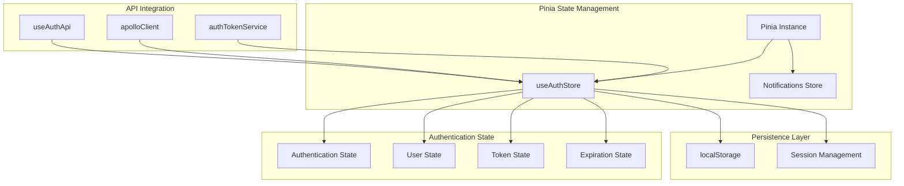
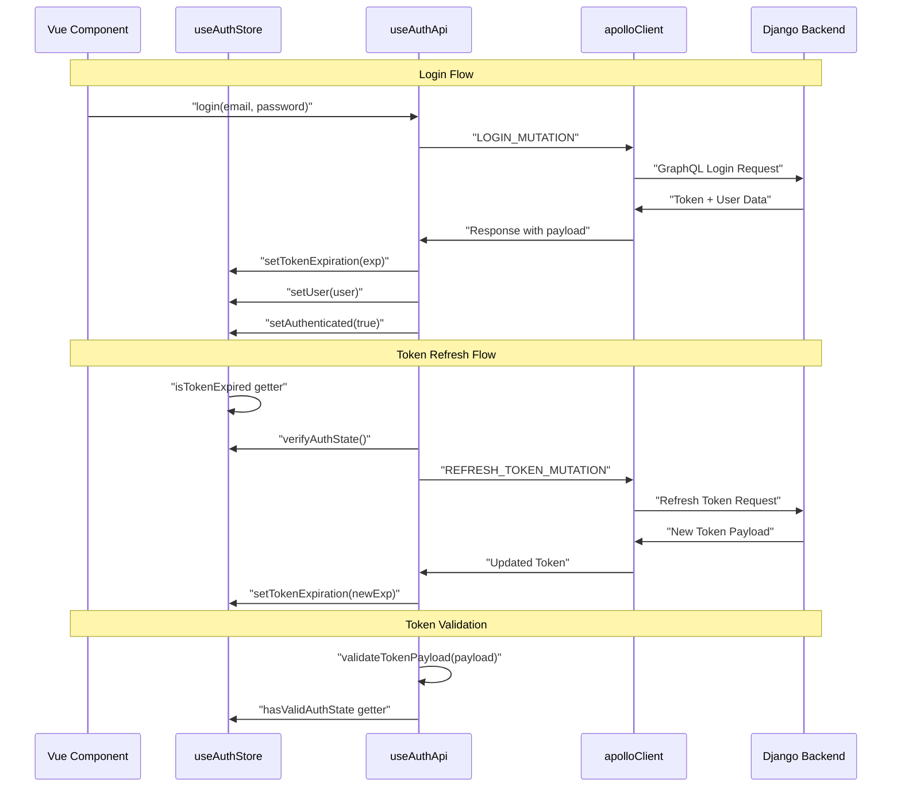
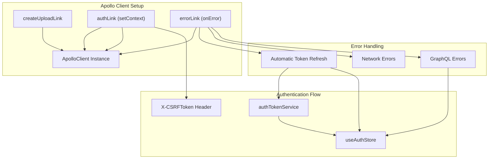
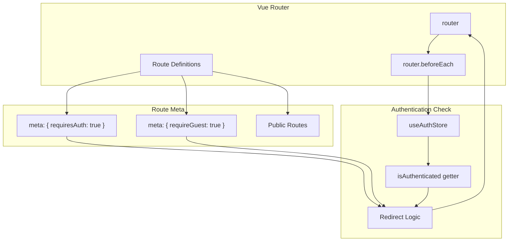

# State Management

> **Relevant source files**
> * [frontend/src/api/apollo.client.ts](../frontend/src/api/apollo.client.ts)
> * [frontend/src/api/auth.api.ts](../frontend/src/api/auth.api.ts)
> * [frontend/src/api/graphql/auth.mutations.ts](../frontend/src/api/graphql/auth.mutations.ts)
> * [frontend/src/router/index.ts](../frontend/src/router/index.ts)
> * [frontend/src/stores/auth.store.ts](../frontend/src/stores/auth.store.ts)

This document covers the frontend state management implementation using Pinia stores, focusing on reactive data patterns, authentication state, and integration with the API layer and routing system. For information about the Vue.js application setup and plugin configuration, see [Application Setup](./Application-Setup.md). For component-specific state patterns, see [Component Library](./Component-Library.md).

## Pinia Store Architecture

The application uses Pinia as the primary state management solution, with stores implementing reactive data patterns and persistence strategies.

### Store Structure



**Sources:**

| File | Lines |
|------|-------|
| [`auth.store.ts`](../frontend/src/stores/auth.store.ts#L1-L153) | L1–L153 |
| [`auth.api.ts`](../frontend/src/api/auth.api.ts#L1-L265) | L1–L265 |

## Authentication State Management

The `useAuthStore` serves as the central authentication state container, managing user sessions, token lifecycle, and authentication status.

### State Properties

| Property | Type | Purpose |
| --- | --- | --- |
| `isAuthenticated` | Boolean | Authentication status flag |
| `user` | Object/null | Current user information |
| `tokenExpiration` | Number/null | JWT token expiration timestamp |
| `tokenIssueTime` | Number/null | Token issue time for lifecycle calculations |
| `refreshTokenExpiration` | Number/null | Refresh token expiration timestamp |
| `tokenRevoked` | Boolean | Manual token revocation flag |

### Computed Getters

The store implements reactive getters for real-time authentication state monitoring:

* `isTokenExpired` - Checks token expiration with grace period [frontend/src/stores/auth.store.ts L19-L25](../frontend/src/stores/auth.store.ts#L19-L25)
* `isRefreshTokenExpired` - Validates refresh token status [frontend/src/stores/auth.store.ts L27-L32](../frontend/src/stores/auth.store.ts#L27-L32)
* `tokenLifePercentage` - Calculates token usage percentage [frontend/src/stores/auth.store.ts L35-L47](../frontend/src/stores/auth.store.ts#L35-L47)
* `tokenRemainingSeconds` - Returns remaining token lifetime [frontend/src/stores/auth.store.ts L50-L57](../frontend/src/stores/auth.store.ts#L50-L57)
* `hasValidAuthState` - Comprehensive authentication validation [frontend/src/stores/auth.store.ts L67-L73](../frontend/src/stores/auth.store.ts#L67-L73)

**Sources:**

| File | Lines |
|------|-------|
| [`auth.store.ts`](../frontend/src/stores/auth.store.ts#L6-L74) | L6–L74 |

## Token Management and Refresh Logic

The authentication system implements automatic token refresh with expiration handling and validation.

### Token Lifecycle Flow



### Token Validation Logic

The `validateTokenPayload` function implements comprehensive token validation [frontend/src/api/auth.api.ts L23-L47](../frontend/src/api/auth.api.ts#L23-L47)

:

* Payload existence verification
* Expiration time validation
* Grace period enforcement (30 seconds)
* Minimum lifespan validation

### Automatic Refresh Mechanism

The `refreshToken` function handles automatic token renewal [frontend/src/api/auth.api.ts L92-L140](../frontend/src/api/auth.api.ts#L92-L140)

:

1. Checks for token revocation status
2. Validates refresh token expiration
3. Executes `REFRESH_TOKEN_MUTATION`
4. Updates store with new expiration times
5. Handles refresh failures with cleanup

**Sources:**

| File | Lines |
|------|-------|
| [`auth.api.ts`](../frontend/src/api/auth.api.ts#L23-L140) | L23–L140 |
| [`auth.store.ts`](../frontend/src/stores/auth.store.ts#L19-L32) | L19–L32 |

## Integration with API Layer

The state management system integrates closely with Apollo Client for GraphQL operations and error handling.

### Apollo Client Authentication Integration



### Error Link Integration

The Apollo error link automatically handles authentication errors [frontend/src/api/apollo.client.ts L34-L76](../frontend/src/api/apollo.client.ts#L34-L76)

:

* Detects `UNAUTHENTICATED` errors
* Identifies expired signature messages
* Triggers automatic token refresh
* Clears authentication state on failure

### Authentication API Composable

The `useAuthApi` composable provides authentication operations with store integration [frontend/src/api/auth.api.ts L18-L265](../frontend/src/api/auth.api.ts#L18-L265)

:

| Function | Purpose | Store Integration |
| --- | --- | --- |
| `login` | User authentication | Sets user, tokens, and auth status |
| `registerUser` | User registration | Calls login after successful registration |
| `updateUser` | Profile updates | Updates user state in store |
| `logout` | Session termination | Clears all authentication state |
| `refreshToken` | Token renewal | Updates token expiration times |
| `verifyAuthState` | State validation | Validates and refreshes if needed |

**Sources:**

| File | Lines |
|------|-------|
| [`apollo.client.ts`](../frontend/src/api/apollo.client.ts#L1-L81) | L1–L81 |
| [`auth.api.ts`](../frontend/src/api/auth.api.ts#L18-L265) | L18–L265 |

## Router Integration and Route Protection

The authentication store integrates with Vue Router for route protection and navigation guards.

### Route Protection Implementation



### Navigation Guard Logic

The router implements authentication-based navigation control [frontend/src/router/index.ts L45-L62](../frontend/src/router/index.ts#L45-L62)

:

1. **Guest-only routes**: Redirect authenticated users to home
2. **Protected routes**: Redirect unauthenticated users to auth page
3. **Error handling**: Clear auth state and redirect on authentication failures

### Route Meta Properties

| Route | Meta Property | Behavior |
| --- | --- | --- |
| `/auth`, `/login`, `/register` | `requireGuest: true` | Accessible only when not authenticated |
| `/create-room` | `requiresAuth: true` | Requires valid authentication |
| `/`, `/user/:userSlug`, `/user/:hostSlug/:roomSlug` | None | Public access |

**Sources:**

| File | Lines |
|------|-------|
| [`index.ts`](../frontend/src/router/index.ts#L1-L64) | L1–L64 |

## State Persistence

The authentication store implements persistent state management using localStorage with selective property persistence.

### Persistence Configuration

The store uses Pinia's persistence plugin [frontend/src/stores/auth.store.ts L136-L152](../frontend/src/stores/auth.store.ts#L136-L152)

:

```yaml
persist: {
  enabled: true,
  strategies: [
    {
      key: 'auth',
      storage: localStorage,
      paths: [
        'isAuthenticated', 
        'user', 
        'tokenExpiration', 
        'tokenIssueTime',
        'refreshTokenExpiration',
        'tokenRevoked'
      ]
    }
  ]
}
```

### Initialization and Validation

The `initialize` method validates persisted state on application startup [frontend/src/stores/auth.store.ts L124-L133](../frontend/src/stores/auth.store.ts#L124-L133)

:

* Checks token expiration status
* Validates refresh token status
* Clears invalid authentication state
* Prevents stale session restoration

**Sources:**

| File | Lines |
|------|-------|
| [`auth.store.ts`](../frontend/src/stores/auth.store.ts#L124-L152) | L124–L152 |
