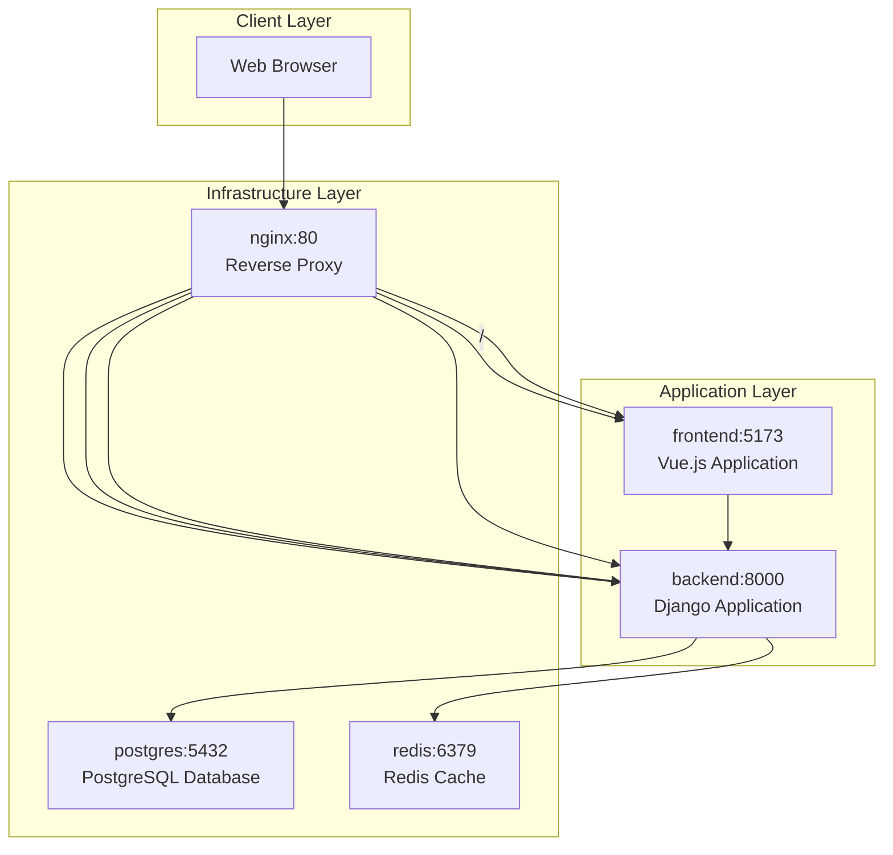
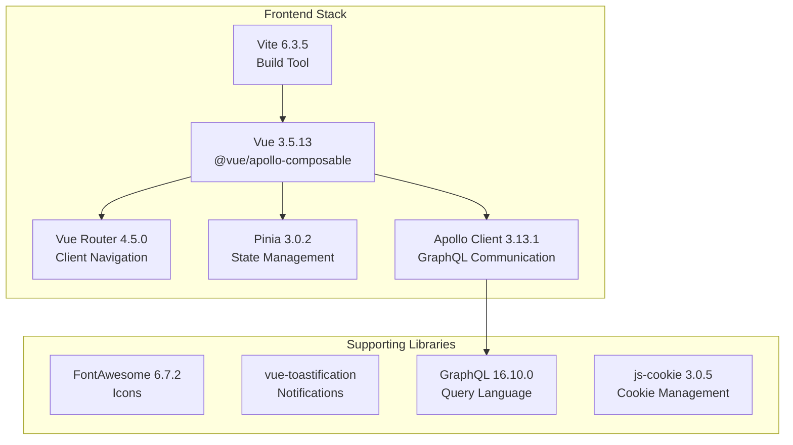
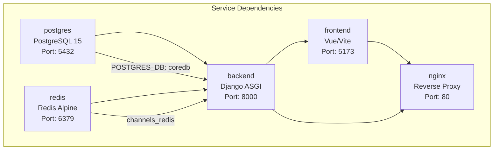
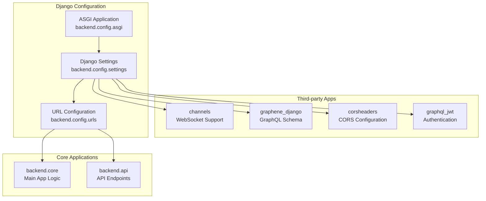
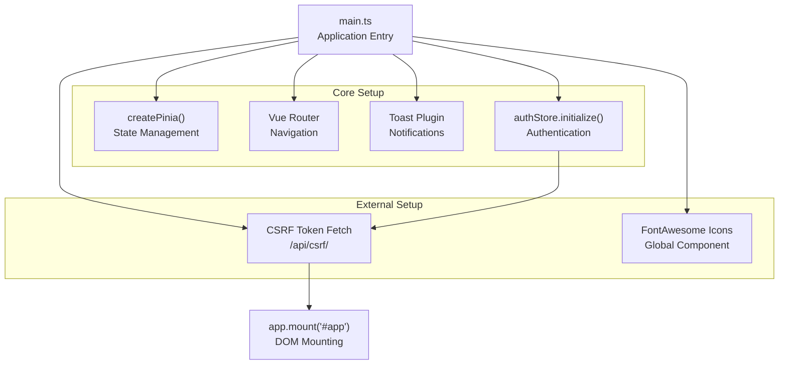
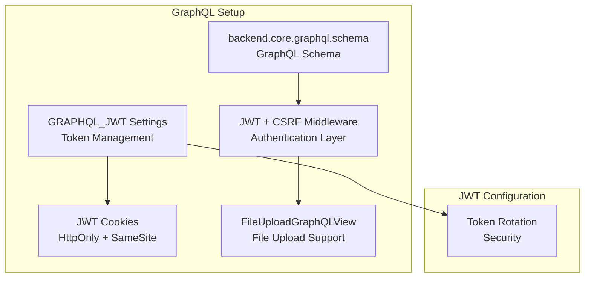
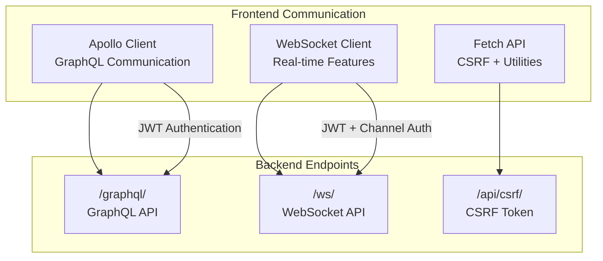
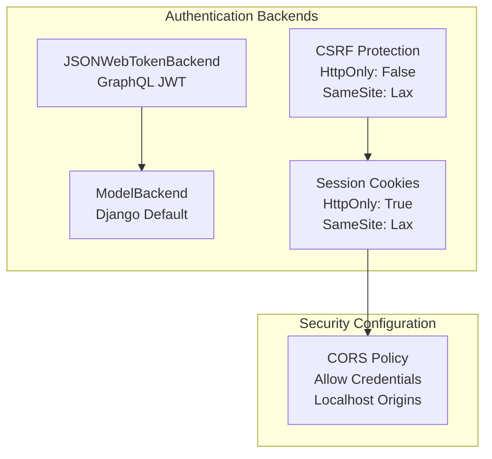

# System Architecture

> **Relevant source files**
> * [README.md](../README.md)
> * [backend/README.md](../backend/README.md)
> * [backend/config/settings.py](../backend/config/settings.py)
> * [backend/config/urls.py](../backend/config/urls.py)
> * [docker-compose.yml](../docker-compose.yml)
> * [docker/nginx/nginx.conf](../docker/nginx/nginx.conf)
> * [frontend/README.md](../frontend/README.md)
> * [frontend/package-lock.json](../frontend/pnpm-lock.yaml)
> * [frontend/package.json](../frontend/package.json)
> * [frontend/src/main.ts](../frontend/src/main.ts)
> * [frontend/src/plugins/toast.ts](../frontend/src/plugins/toast.ts)
> * [frontend/vite.config.ts](../frontend/vite.config.ts)
> * [requirements.txt](../requirements.txt)

This document provides a comprehensive overview of the EduSphere system architecture, covering the high-level design, technology stack, component relationships, and communication patterns. EduSphere is a full-stack real-time messaging platform built with Django backend and Vue.js frontend, supporting multi-role systems, course management, and real-time chat functionality.

For specific implementation details about frontend components and routing, see [Frontend Architecture](./Frontend-Architecture.md). For backend-specific configuration and service integration, see [Backend Architecture](./Backend-Architecture.md). For real-time communication implementation, see [Real-time Communication](./Real-time-Communication.md).

## Overall System Architecture

The EduSphere platform follows a modern microservices-oriented architecture with clear separation between frontend, backend, and infrastructure layers. The system is designed for real-time communication with WebSocket support and containerized deployment.

### High-Level System Overview

**System Service Communication**

Sources: [docker-compose.yml L1-L77](../docker-compose.yml#L1-L77)

 [docker/nginx/nginx.conf L1-L75](../docker/nginx/nginx.conf#L1-L75)

The architecture consists of five main services orchestrated via Docker Compose: `nginx` serves as the entry point and reverse proxy, `frontend` handles the Vue.js application, `backend` manages the Django application with GraphQL and WebSocket APIs, `postgres` provides persistent data storage, and `redis` enables real-time communication through Django Channels.

## Technology Stack

### Core Technologies

| Layer | Technology | Version | Purpose |
| --- | --- | --- | --- |
| Frontend Framework | Vue.js | 3.5.13 | Progressive web framework |
| State Management | Pinia | 3.0.2 | Centralized state management |
| Build Tool | Vite | 6.3.5 | Fast build and development server |
| Backend Framework | Django | 5.2.1 | Web application framework |
| Real-time Communication | Django Channels | 4.2.0 | WebSocket and async support |
| API Layer | Graphene Django | 3.2.3 | GraphQL implementation |
| Authentication | django-graphql-jwt | 0.4.0 | JWT authentication |
| Database | PostgreSQL | 15 | Primary data storage |
| Cache/Message Broker | Redis | alpine | Real-time features |
| Reverse Proxy | Nginx | latest | Load balancing and static files |

Sources: [requirements.txt L1-L43](../requirements.txt#L1-L43)

 [frontend/package.json L13-L29](../frontend/package.json#L13-L29)

 [docker-compose.yml L3-L24](../docker-compose.yml#L3-L24)

### Frontend Dependencies

The frontend utilizes modern Vue 3 ecosystem tools including Apollo Client for GraphQL communication, Vue Router for navigation, FontAwesome for icons, and Vue Toastification for user notifications.

Sources: [frontend/package.json L13-L29](../frontend/package.json#L13-L29)

 [frontend/src/main.ts L1-L46](../frontend/src/main.ts#L1-L46)

### Backend Dependencies

The backend stack centers around Django 5.2.1 with Channels for async/WebSocket support, Graphene for GraphQL APIs, and JWT authentication. Additional tools include django-cleanup for file management and django-cors-headers for cross-origin requests.

## Service Architecture

### Docker Compose Configuration

**Service Health and Dependencies**

Sources: [docker-compose.yml L2-L77](../docker-compose.yml#L2-L77)

The `postgres` service includes health checks using `pg_isready` command, ensuring the database is available before dependent services start. The `backend` service depends on both `postgres` (with health condition) and `redis` services. Volume mounts enable development with hot reloading for both frontend and backend services.

### Nginx Reverse Proxy Configuration

The nginx service handles routing based on URL patterns, directing static files, API requests, and WebSocket connections to appropriate services.

| Route Pattern | Target Service | Purpose |
| --- | --- | --- |
| `/static/`, `/media/` | File system | Static and media file serving |
| `/admin/` | `backend:8000` | Django admin interface |
| `/graphql/` | `backend:8000` | GraphQL API endpoint |
| `/ws/` | `backend:8000` | WebSocket connections |
| `/` | `frontend:5173` | Vue.js application |

Sources: [docker/nginx/nginx.conf L6-L64](../docker/nginx/nginx.conf#L6-L64)

## Application Layer Architecture

### Django Backend Configuration

The Django backend uses ASGI (Asynchronous Server Gateway Interface) to support both HTTP and WebSocket protocols through a single application instance.

Sources: [backend/config/settings.py L50-L63](../backend/config/settings.py#L50-L63)

 [backend/config/settings.py L141](../backend/config/settings.py#L141-L141)

 [backend/config/urls.py L9-L17](../backend/config/urls.py#L9-L17)

### Vue.js Frontend Initialization

The frontend application initializes through a structured boot process that sets up core dependencies, authentication, and CSRF protection before mounting the application.

Sources: [frontend/src/main.ts L20-L45](../frontend/src/main.ts#L20-L45)

The initialization sequence includes Pinia store setup with persistence, authentication state restoration, CSRF token acquisition for security, and FontAwesome icon registration as a global component.

## Communication Patterns

### GraphQL API Configuration

The backend exposes a GraphQL endpoint at `/graphql/` with JWT authentication middleware and CSRF protection. The configuration supports file uploads and provides a GraphiQL interface in debug mode.

Sources: [backend/config/settings.py L145-L151](../backend/config/settings.py#L145-L151)

 [backend/config/settings.py L153-L163](../backend/config/settings.py#L153-L163)

 [backend/config/urls.py L11-L15](../backend/config/urls.py#L11-L15)

### WebSocket and Channel Layers

Real-time communication utilizes Django Channels with Redis as the channel layer backend, enabling WebSocket connections for live messaging features.

| Configuration | Value | Purpose |
| --- | --- | --- |
| `ASGI_APPLICATION` | `backend.config.asgi.application` | ASGI routing |
| `CHANNEL_LAYERS.default.BACKEND` | `channels_redis.core.RedisChannelLayer` | Redis integration |
| `CHANNEL_LAYERS.default.CONFIG.hosts` | `[(REDIS_HOST, 6379)]` | Redis connection |

Sources: [backend/config/settings.py L141](../backend/config/settings.py#L141-L141)

 [backend/config/settings.py L203-L210](../backend/config/settings.py#L203-L210)

### Frontend API Integration

The Vue.js frontend communicates with the backend through multiple channels: Apollo Client for GraphQL queries and mutations, direct fetch requests for CSRF tokens, and WebSocket connections for real-time features.

Sources: [frontend/src/main.ts L37-L41](../frontend/src/main.ts#L37-L41)

 [docker/nginx/nginx.conf L36-L52](../docker/nginx/nginx.conf#L36-L52)

## Data Architecture

### Database Configuration

The system uses PostgreSQL as the primary database with environment-based configuration for flexible deployment across development and production environments.

| Setting | Environment Variable | Default | Purpose |
| --- | --- | --- | --- |
| `ENGINE` | - | `django.db.backends.postgresql` | Database backend |
| `NAME` | `DB_NAME` | - | Database name |
| `USER` | `DB_USER` | - | Database user |
| `HOST` | `DB_HOST` | `localhost` | Database host |
| `PORT` | `DB_PORT` | `5432` | Database port |

Sources: [backend/config/settings.py L192-L201](../backend/config/settings.py#L192-L201)

### Security and CORS Configuration

The application implements comprehensive security measures including CSRF protection, secure cookie configuration, and CORS policies for cross-origin requests.

Sources: [backend/config/settings.py L165-L181](../backend/config/settings.py#L165-L181)

 [backend/config/settings.py L184-L187](../backend/config/settings.py#L184-L187)

The security configuration balances development convenience with production security requirements, using environment-specific settings for cookie security and CORS policies. JWT authentication integrates with Django's authentication system through multiple backend support.