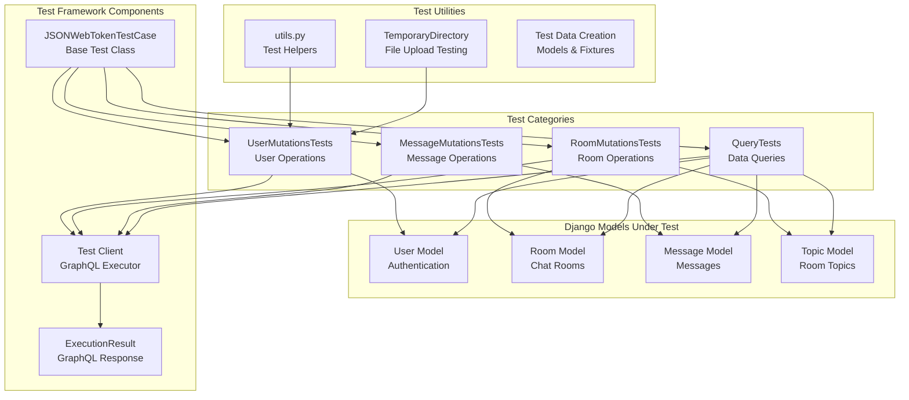
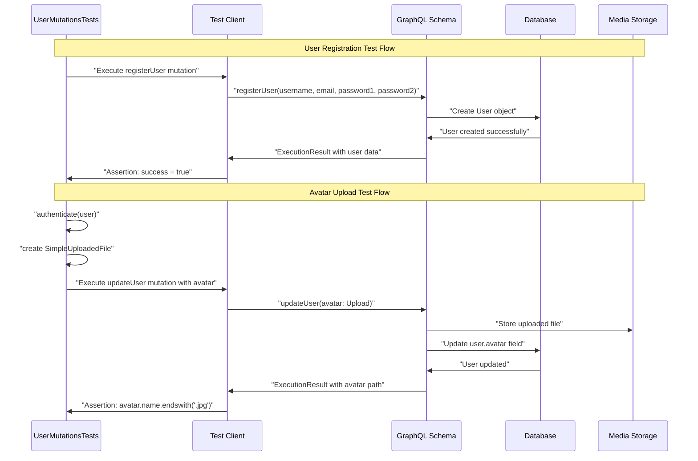
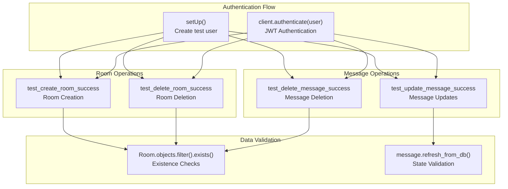
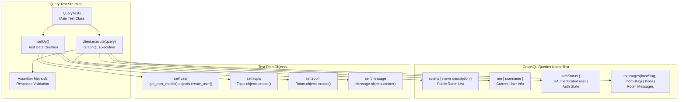
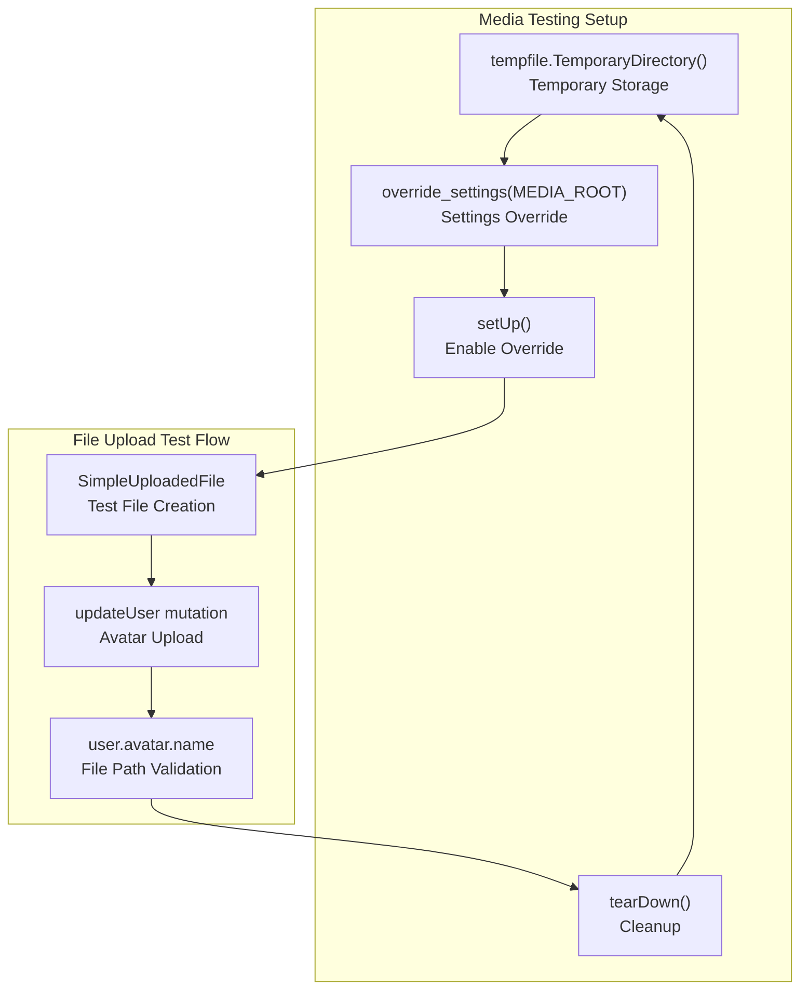
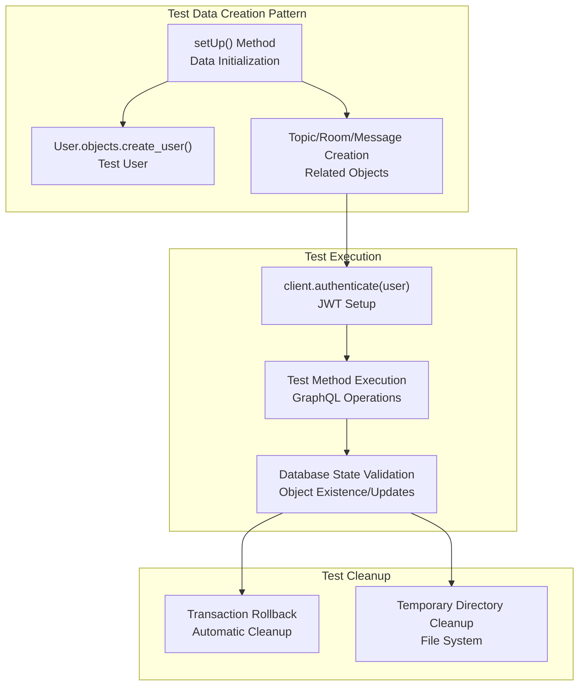

# Testing

> **Relevant source files**
> * [backend/core/apps.py](../backend/core/apps.py)
> * [backend/core/tests/test_mutations.py](../backend/core/tests/test_mutations.py)
> * [backend/core/tests/test_queries.py](../backend/core/tests/test_queries.py)
> * [backend/core/tests/utils.py](../backend/core/tests/utils.py)

This document covers the testing infrastructure and test suite for the EduSphere backend application. The testing system validates GraphQL API functionality, including mutations for data modification and queries for data retrieval, as well as authentication workflows and file upload operations.

For information about backend configuration and Django setup, see [Backend Configuration](./Configuration.md). For details about data models and relationships being tested, see [Data Models and Forms](./Data-Models-and-Forms.md).

## Testing Framework Overview

The EduSphere backend uses Django's testing framework extended with GraphQL-specific testing capabilities. The test suite is built around `JSONWebTokenTestCase` from the `graphql_jwt.testcases` module, which provides JWT authentication testing support for GraphQL operations.

### Test Architecture



**Sources:**

| File | Lines |
|------|-------|
| [`test_mutations.py`](../backend/core/tests/test_mutations.py#L1-L222) | L1–L222 |
| [`test_queries.py`](../backend/core/tests/test_queries.py#L1-L80) | L1–L80 |
| [`utils.py`](../backend/core/tests/utils.py#L1-L11) | L1–L11 |

## Mutation Testing

The mutation testing suite validates all GraphQL mutations that modify data in the system. Tests cover user management, room operations, and message handling with proper authentication and error handling validation.

### User Mutation Tests

The `UserMutationsTests` class in [backend/core/tests/test_mutations.py L13-L133](../backend/core/tests/test_mutations.py#L13-L133)

 tests user-related operations including registration, profile updates, and avatar uploads.

| Test Method | Purpose | Key Validations |
| --- | --- | --- |
| `test_register_user_success` | User registration flow | Username creation, email validation, success response |
| `test_register_user_password_mismatch` | Password validation | Error handling for mismatched passwords |
| `test_update_user_success` | Profile updates | Username changes, authentication required |
| `test_update_user_avatar` | File upload handling | Image upload, file storage, content type validation |



**Sources:**

| File | Lines |
|------|-------|
| [`test_mutations.py`](../backend/core/tests/test_mutations.py#L23-L133) | L23–L133 |
| [`utils.py`](../backend/core/tests/utils.py#L5-L10) | L5–L10 |

### Room and Message Mutation Tests

The `RoomMutationsTests` and `MessageMutationsTests` classes validate room management and message operations respectively.



**Sources:**

| File | Lines |
|------|-------|
| [`test_mutations.py`](../backend/core/tests/test_mutations.py#L134-L222) | L134–L222 |

## Query Testing

The `QueryTests` class in [backend/core/tests/test_queries.py L6-L80](../backend/core/tests/test_queries.py#L6-L80)

 validates GraphQL queries that retrieve data from the system. These tests ensure proper data filtering, authentication checks, and response formatting.

### Query Test Coverage

| Query | Test Method | Authentication Required | Key Assertions |
| --- | --- | --- | --- |
| `rooms` | `test_rooms_query` | No | Room count, name, description |
| `me` | `test_me_query` | Yes | Current user data |
| `authStatus` | `test_auth_status_authenticated` | Yes | Authentication state |
| `messages` | `test_messages_query` | No | Message content by room |



**Sources:**

| File | Lines |
|------|-------|
| [`test_queries.py`](../backend/core/tests/test_queries.py#L6-L80) | L6–L80 |

## Test Utilities and Helpers

### Test Image Creation

The `create_test_image()` function in [backend/core/tests/utils.py L5-L10](../backend/core/tests/utils.py#L5-L10)

 generates test images for file upload testing using the PIL library.

```python
# Function signature and usage
def create_test_image():
    # Creates a 1x1 red JPEG image in memory
    # Returns bytes that can be used with SimpleUploadedFile
```

### Media File Testing

User mutation tests implement temporary media directory management for testing file uploads without affecting the production media storage:



**Sources:**

| File | Lines |
|------|-------|
| [`test_mutations.py`](../backend/core/tests/test_mutations.py#L14-L21) | L14–L21 |
| [`utils.py`](../backend/core/tests/utils.py#L1-L11) | L1–L11 |

## Test Data Management

### Database Test Isolation

Each test class uses Django's transactional test case behavior to ensure test isolation. The `setUp()` method in each test class creates fresh test data:



### Authentication in Tests

The `JSONWebTokenTestCase` provides the `client.authenticate(user)` method for setting up JWT authentication in tests, simulating authenticated GraphQL requests.

**Sources:**

| File | Lines |
|------|-------|
| [`test_mutations.py`](../backend/core/tests/test_mutations.py#L97-L98) | L97–L98 |
| [`test_queries.py`](../backend/core/tests/test_queries.py#L7-L26) | L7–L26 |

## Running Tests

Tests can be executed using Django's standard test runner. The test suite is organized in the `backend/core/tests/` directory with the following structure:

* `test_mutations.py` - GraphQL mutation testing
* `test_queries.py` - GraphQL query testing
* `utils.py` - Test utility functions

The Django app configuration in [backend/core/apps.py L8-L9](../backend/core/apps.py#L8-L9)

 ensures that GraphQL signals are properly imported during testing, maintaining the same signal handling behavior as in production.

**Sources:**

| File | Lines |
|------|-------|
| [`apps.py`](../backend/core/apps.py#L1-L10) | L1–L10 |
