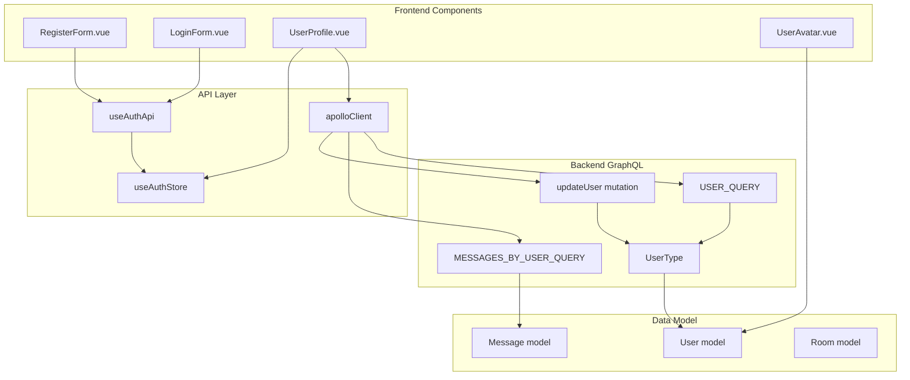
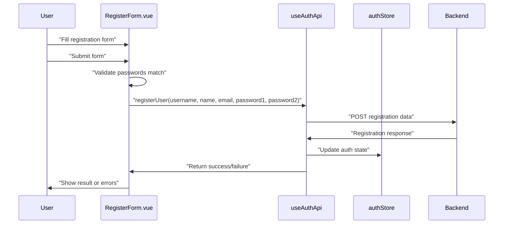
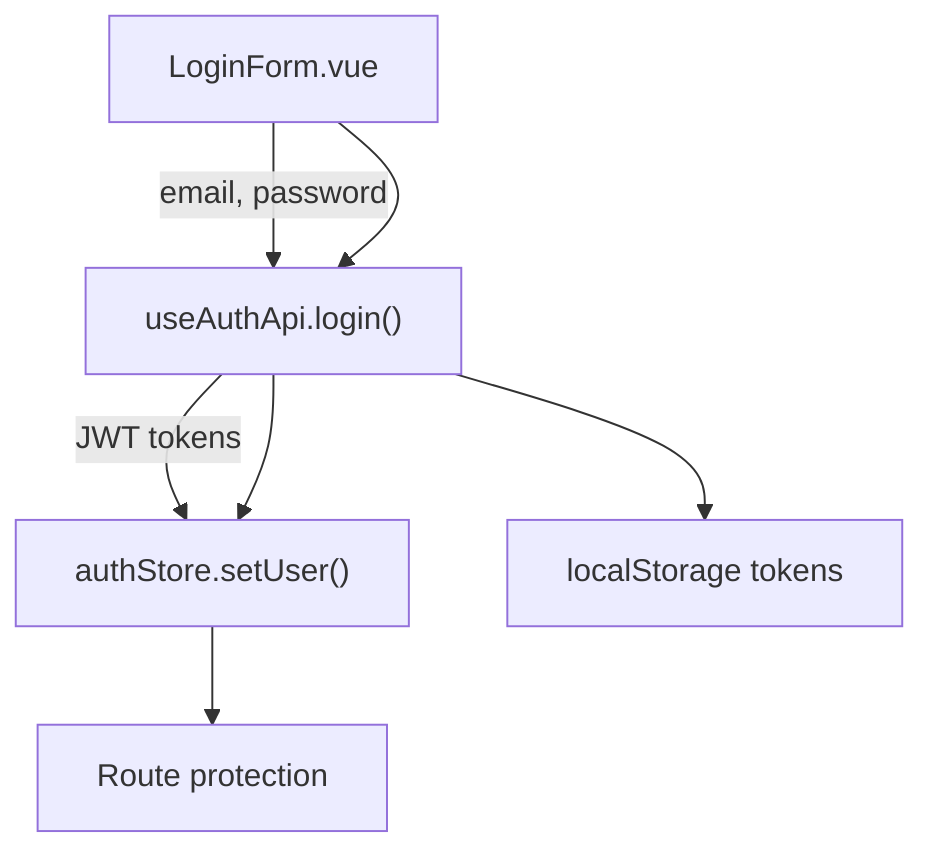
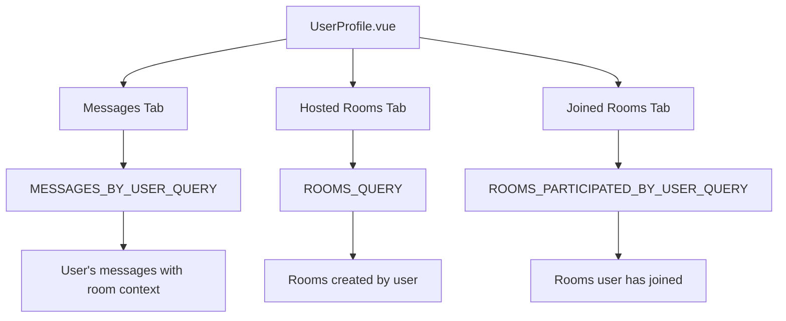
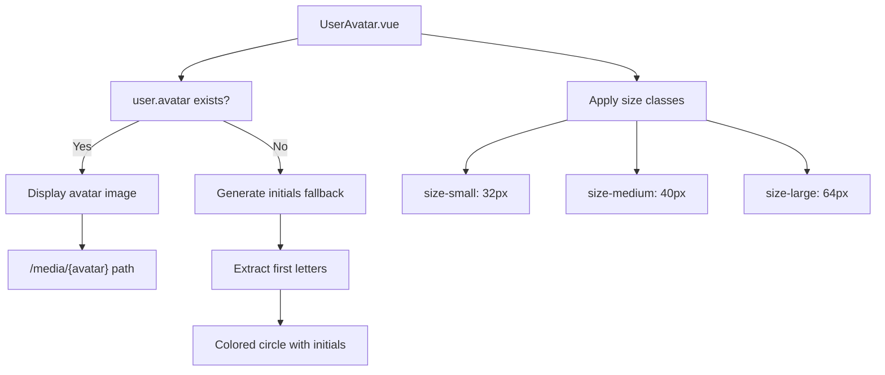
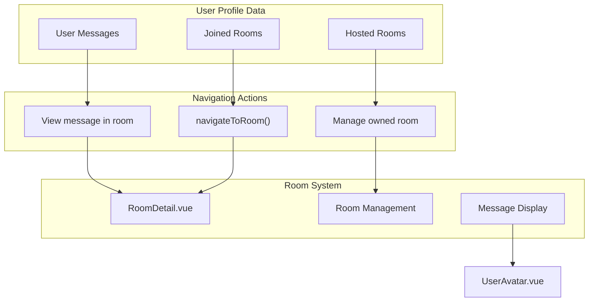

# User Management

> **Relevant source files**
> * [backend/core/graphql/types.py](../backend/core/graphql/types.py)
> * [frontend/src/assets/styles/form-styles.css](../frontend/src/assets/styles/form-styles.css)
> * [frontend/src/components/CreateRoomForm.vue](../frontend/src/components/CreateRoomForm.vue)
> * [frontend/src/components/LoginForm.vue](../frontend/src/components/LoginForm.vue)
> * [frontend/src/components/RegisterForm.vue](../frontend/src/components/RegisterForm.vue)
> * [frontend/src/components/UserAvatar.vue](../frontend/src/components/UserAvatar.vue)
> * [frontend/src/views/CreateRoom.vue](../frontend/src/views/CreateRoom.vue)
> * [frontend/src/views/UserProfile.vue](../frontend/src/views/UserProfile.vue)

This document covers the user management system in EduSphere, including user registration, authentication, profile management, and avatar handling. The user management system provides the foundation for identity and personalization across the platform.

For authentication flows and JWT token handling, see [Authentication System](./Authentication-System.md). For room creation and participation features, see [Room Management](./Room-Management.md).

## Overview

The user management system consists of frontend components for user registration, login, and profile management, along with backend GraphQL types and authentication APIs. Users can create accounts, manage profiles with bio and avatar information, and view their activity across rooms and messages.



**User Management Component Architecture**

Sources: [frontend/src/views/UserProfile.vue L1-L270](../frontend/src/views/UserProfile.vue#L1-L270)

 [frontend/src/components/RegisterForm.vue L1-L131](../frontend/src/components/RegisterForm.vue#L1-L131)

 [frontend/src/components/LoginForm.vue L1-L72](../frontend/src/components/LoginForm.vue#L1-L72)

 [backend/core/graphql/types.py L6-L10](../backend/core/graphql/types.py#L6-L10)

## User Data Model

The user data model defines the core structure for user information across the system. Users have basic profile information and participate in rooms and messaging.

| Field | Type | Description |
| --- | --- | --- |
| `id` | ID | Unique user identifier |
| `username` | String | Unique username for URL paths and mentions |
| `name` | String | Display name shown in UI |
| `bio` | String | Optional user biography text |
| `avatar` | File | Profile picture image file |

```css
#mermaid-siuxxf48ph{font-family:ui-sans-serif,-apple-system,system-ui,Segoe UI,Helvetica;font-size:16px;fill:#333;}@keyframes edge-animation-frame{from{stroke-dashoffset:0;}}@keyframes dash{to{stroke-dashoffset:0;}}#mermaid-siuxxf48ph .edge-animation-slow{stroke-dasharray:9,5!important;stroke-dashoffset:900;animation:dash 50s linear infinite;stroke-linecap:round;}#mermaid-siuxxf48ph .edge-animation-fast{stroke-dasharray:9,5!important;stroke-dashoffset:900;animation:dash 20s linear infinite;stroke-linecap:round;}#mermaid-siuxxf48ph .error-icon{fill:#dddddd;}#mermaid-siuxxf48ph .error-text{fill:#222222;stroke:#222222;}#mermaid-siuxxf48ph .edge-thickness-normal{stroke-width:1px;}#mermaid-siuxxf48ph .edge-thickness-thick{stroke-width:3.5px;}#mermaid-siuxxf48ph .edge-pattern-solid{stroke-dasharray:0;}#mermaid-siuxxf48ph .edge-thickness-invisible{stroke-width:0;fill:none;}#mermaid-siuxxf48ph .edge-pattern-dashed{stroke-dasharray:3;}#mermaid-siuxxf48ph .edge-pattern-dotted{stroke-dasharray:2;}#mermaid-siuxxf48ph .marker{fill:#999;stroke:#999;}#mermaid-siuxxf48ph .marker.cross{stroke:#999;}#mermaid-siuxxf48ph svg{font-family:ui-sans-serif,-apple-system,system-ui,Segoe UI,Helvetica;font-size:16px;}#mermaid-siuxxf48ph p{margin:0;}#mermaid-siuxxf48ph .entityBox{fill:#ffffff;stroke:#dddddd;}#mermaid-siuxxf48ph .relationshipLabelBox{fill:#dddddd;opacity:0.7;background-color:#dddddd;}#mermaid-siuxxf48ph .relationshipLabelBox rect{opacity:0.5;}#mermaid-siuxxf48ph .labelBkg{background-color:rgba(221, 221, 221, 0.5);}#mermaid-siuxxf48ph .edgeLabel .label{fill:#dddddd;font-size:14px;}#mermaid-siuxxf48ph .label{font-family:ui-sans-serif,-apple-system,system-ui,Segoe UI,Helvetica;color:#333;}#mermaid-siuxxf48ph .edge-pattern-dashed{stroke-dasharray:8,8;}#mermaid-siuxxf48ph .node rect,#mermaid-siuxxf48ph .node circle,#mermaid-siuxxf48ph .node ellipse,#mermaid-siuxxf48ph .node polygon{fill:#ffffff;stroke:#dddddd;stroke-width:1px;}#mermaid-siuxxf48ph .relationshipLine{stroke:#999;stroke-width:1;fill:none;}#mermaid-siuxxf48ph .marker{fill:none!important;stroke:#999!important;stroke-width:1;}#mermaid-siuxxf48ph :root{--mermaid-font-family:"trebuchet ms",verdana,arial,sans-serif;}hostsparticipates_increatescontainsUseridIDusernameStringnameStringbioStringavatarFileRoomidIDnameStringslugStringdescriptionStringMessageidIDbodyStringcreatedDateTimeupdatedDateTime
```

**User Data Model and Relationships**

Sources: [backend/core/graphql/types.py L6-L10](../backend/core/graphql/types.py#L6-L10)

 [frontend/src/views/UserProfile.vue L17-L28](../frontend/src/views/UserProfile.vue#L17-L28)

## User Registration

User registration is handled by the `RegisterForm` component, which collects required user information and validates password confirmation.



**User Registration Flow**

The registration form requires the following fields:

* **Username**: Unique identifier for the user
* **Full Name**: Display name for the user
* **Email**: Used for login and communication
* **Password**: Primary password
* **Confirm Password**: Must match primary password

Form validation includes:

* All fields are required
* Password confirmation must match
* Username uniqueness is validated on the backend

Sources: [frontend/src/components/RegisterForm.vue L82-L125](../frontend/src/components/RegisterForm.vue#L82-L125)

 [frontend/src/components/RegisterForm.vue L98-L119](../frontend/src/components/RegisterForm.vue#L98-L119)

## User Authentication

User login is managed through the `LoginForm` component using email and password credentials.



**Authentication Component Integration**

The login process:

1. User enters email and password in `LoginForm`
2. Form calls `useAuthApi.login()` with credentials
3. API stores JWT tokens and updates `authStore`
4. Successful login enables access to protected routes

Sources: [frontend/src/components/LoginForm.vue L44-L66](../frontend/src/components/LoginForm.vue#L44-L66)

 [frontend/src/components/LoginForm.vue L56-L65](../frontend/src/components/LoginForm.vue#L56-L65)

## User Profiles

The `UserProfile` component provides comprehensive user profile viewing and editing capabilities, organized into tabs for different types of user activity.

### Profile Display

User profiles show basic information and provide editing capabilities for profile owners:

| Section | Content |
| --- | --- |
| **Avatar** | Profile picture with fallback to initials |
| **Names** | Display name and username |
| **Bio** | User biography text |
| **Edit Button** | Available only for profile owner |

### Profile Tabs

The profile interface includes three tabs showing user activity:



**Profile Tab Data Loading**

### Profile Editing

Profile editing is available to users viewing their own profile:

```sql
#mermaid-cfpyppwj3x{font-family:ui-sans-serif,-apple-system,system-ui,Segoe UI,Helvetica;font-size:16px;fill:#333;}@keyframes edge-animation-frame{from{stroke-dashoffset:0;}}@keyframes dash{to{stroke-dashoffset:0;}}#mermaid-cfpyppwj3x .edge-animation-slow{stroke-dasharray:9,5!important;stroke-dashoffset:900;animation:dash 50s linear infinite;stroke-linecap:round;}#mermaid-cfpyppwj3x .edge-animation-fast{stroke-dasharray:9,5!important;stroke-dashoffset:900;animation:dash 20s linear infinite;stroke-linecap:round;}#mermaid-cfpyppwj3x .error-icon{fill:#dddddd;}#mermaid-cfpyppwj3x .error-text{fill:#222222;stroke:#222222;}#mermaid-cfpyppwj3x .edge-thickness-normal{stroke-width:1px;}#mermaid-cfpyppwj3x .edge-thickness-thick{stroke-width:3.5px;}#mermaid-cfpyppwj3x .edge-pattern-solid{stroke-dasharray:0;}#mermaid-cfpyppwj3x .edge-thickness-invisible{stroke-width:0;fill:none;}#mermaid-cfpyppwj3x .edge-pattern-dashed{stroke-dasharray:3;}#mermaid-cfpyppwj3x .edge-pattern-dotted{stroke-dasharray:2;}#mermaid-cfpyppwj3x .marker{fill:#999;stroke:#999;}#mermaid-cfpyppwj3x .marker.cross{stroke:#999;}#mermaid-cfpyppwj3x svg{font-family:ui-sans-serif,-apple-system,system-ui,Segoe UI,Helvetica;font-size:16px;}#mermaid-cfpyppwj3x p{margin:0;}#mermaid-cfpyppwj3x defs #statediagram-barbEnd{fill:#999;stroke:#999;}#mermaid-cfpyppwj3x g.stateGroup text{fill:#dddddd;stroke:none;font-size:10px;}#mermaid-cfpyppwj3x g.stateGroup text{fill:#333;stroke:none;font-size:10px;}#mermaid-cfpyppwj3x g.stateGroup .state-title{font-weight:bolder;fill:#333;}#mermaid-cfpyppwj3x g.stateGroup rect{fill:#ffffff;stroke:#dddddd;}#mermaid-cfpyppwj3x g.stateGroup line{stroke:#999;stroke-width:1;}#mermaid-cfpyppwj3x .transition{stroke:#999;stroke-width:1;fill:none;}#mermaid-cfpyppwj3x .stateGroup .composit{fill:#f4f4f4;border-bottom:1px;}#mermaid-cfpyppwj3x .stateGroup .alt-composit{fill:#e0e0e0;border-bottom:1px;}#mermaid-cfpyppwj3x .state-note{stroke:#e6d280;fill:#fff5ad;}#mermaid-cfpyppwj3x .state-note text{fill:#333;stroke:none;font-size:10px;}#mermaid-cfpyppwj3x .stateLabel .box{stroke:none;stroke-width:0;fill:#ffffff;opacity:0.5;}#mermaid-cfpyppwj3x .edgeLabel .label rect{fill:#ffffff;opacity:0.5;}#mermaid-cfpyppwj3x .edgeLabel{background-color:#ffffff;text-align:center;}#mermaid-cfpyppwj3x .edgeLabel p{background-color:#ffffff;}#mermaid-cfpyppwj3x .edgeLabel rect{opacity:0.5;background-color:#ffffff;fill:#ffffff;}#mermaid-cfpyppwj3x .edgeLabel .label text{fill:#333;}#mermaid-cfpyppwj3x .label div .edgeLabel{color:#333;}#mermaid-cfpyppwj3x .stateLabel text{fill:#333;font-size:10px;font-weight:bold;}#mermaid-cfpyppwj3x .node circle.state-start{fill:#999;stroke:#999;}#mermaid-cfpyppwj3x .node .fork-join{fill:#999;stroke:#999;}#mermaid-cfpyppwj3x .node circle.state-end{fill:#dddddd;stroke:#f4f4f4;stroke-width:1.5;}#mermaid-cfpyppwj3x .end-state-inner{fill:#f4f4f4;stroke-width:1.5;}#mermaid-cfpyppwj3x .node rect{fill:#ffffff;stroke:#dddddd;stroke-width:1px;}#mermaid-cfpyppwj3x .node polygon{fill:#ffffff;stroke:#dddddd;stroke-width:1px;}#mermaid-cfpyppwj3x #statediagram-barbEnd{fill:#999;}#mermaid-cfpyppwj3x .statediagram-cluster rect{fill:#ffffff;stroke:#dddddd;stroke-width:1px;}#mermaid-cfpyppwj3x .cluster-label,#mermaid-cfpyppwj3x .nodeLabel{color:#333;}#mermaid-cfpyppwj3x .statediagram-cluster rect.outer{rx:5px;ry:5px;}#mermaid-cfpyppwj3x .statediagram-state .divider{stroke:#dddddd;}#mermaid-cfpyppwj3x .statediagram-state .title-state{rx:5px;ry:5px;}#mermaid-cfpyppwj3x .statediagram-cluster.statediagram-cluster .inner{fill:#f4f4f4;}#mermaid-cfpyppwj3x .statediagram-cluster.statediagram-cluster-alt .inner{fill:#f8f8f8;}#mermaid-cfpyppwj3x .statediagram-cluster .inner{rx:0;ry:0;}#mermaid-cfpyppwj3x .statediagram-state rect.basic{rx:5px;ry:5px;}#mermaid-cfpyppwj3x .statediagram-state rect.divider{stroke-dasharray:10,10;fill:#f8f8f8;}#mermaid-cfpyppwj3x .note-edge{stroke-dasharray:5;}#mermaid-cfpyppwj3x .statediagram-note rect{fill:#fff5ad;stroke:#e6d280;stroke-width:1px;rx:0;ry:0;}#mermaid-cfpyppwj3x .statediagram-note rect{fill:#fff5ad;stroke:#e6d280;stroke-width:1px;rx:0;ry:0;}#mermaid-cfpyppwj3x .statediagram-note text{fill:#333;}#mermaid-cfpyppwj3x .statediagram-note .nodeLabel{color:#333;}#mermaid-cfpyppwj3x .statediagram .edgeLabel{color:red;}#mermaid-cfpyppwj3x #dependencyStart,#mermaid-cfpyppwj3x #dependencyEnd{fill:#999;stroke:#999;stroke-width:1;}#mermaid-cfpyppwj3x .statediagramTitleText{text-anchor:middle;font-size:18px;fill:#333;}#mermaid-cfpyppwj3x :root{--mermaid-font-family:"trebuchet ms",verdana,arial,sans-serif;}"Click Edit button""Cancel editing""Save changes"ViewModeEditMode"Select new avatar""Edit display name""Edit biography""Submit form""Save complete"FormEditingAvatarUploadNameEditBioEditSaving
```

**Profile Editing State Machine**

The editing interface includes:

* **Avatar upload** with preview functionality
* **Name field** with 150 character limit
* **Bio textarea** with 500 character limit and counter
* **Save/Cancel** action buttons

Sources: [frontend/src/views/UserProfile.vue L178-L248](../frontend/src/views/UserProfile.vue#L178-L248)

 [frontend/src/views/UserProfile.vue L212-L248](../frontend/src/views/UserProfile.vue#L212-L248)

 [frontend/src/views/UserProfile.vue L308-L396](../frontend/src/views/UserProfile.vue#L308-L396)

## User Avatars

The `UserAvatar` component handles user profile picture display with multiple size options and fallback behavior.

### Avatar Component Features

| Feature | Implementation |
| --- | --- |
| **Sizes** | `small` (32px), `medium` (40px), `large` (64px) |
| **Fallback** | User initials when no avatar image |
| **Image Source** | `/media/{avatar}` path or `/default.svg` |
| **Status Indicator** | Optional online status dot |



**Avatar Component Logic Flow**

### Avatar Initials Generation

The component generates initials as follows:

* Single word: First character (e.g., "John" → "J")
* Multiple words: First and last word initials (e.g., "John Doe" → "JD")
* Unknown users: Question mark ("?")

Sources: [frontend/src/components/UserAvatar.vue L20-L38](../frontend/src/components/UserAvatar.vue#L20-L38)

 [frontend/src/components/UserAvatar.vue L24-L27](../frontend/src/components/UserAvatar.vue#L24-L27)

 [frontend/src/components/UserAvatar.vue L29-L38](../frontend/src/components/UserAvatar.vue#L29-L38)

## Integration with Room System

User management integrates closely with the room and messaging systems through several key relationships:



**User-Room System Integration**

The profile tabs provide navigation to:

* **Message contexts**: View messages within their original rooms
* **Room management**: Access rooms the user hosts
* **Room participation**: Navigate to rooms the user has joined

Sources: [frontend/src/views/UserProfile.vue L162-L165](../frontend/src/views/UserProfile.vue#L162-L165)

 [frontend/src/views/UserProfile.vue L127-L155](../frontend/src/views/UserProfile.vue#L127-L155)