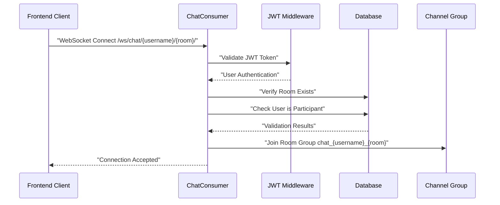
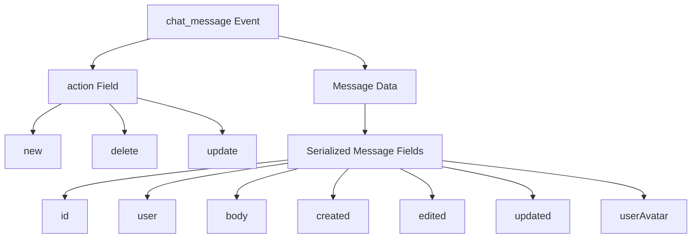
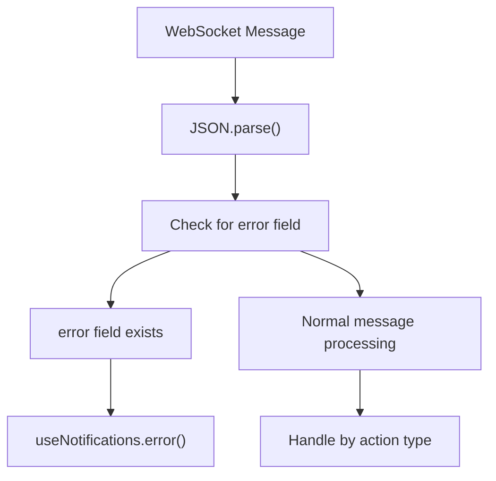
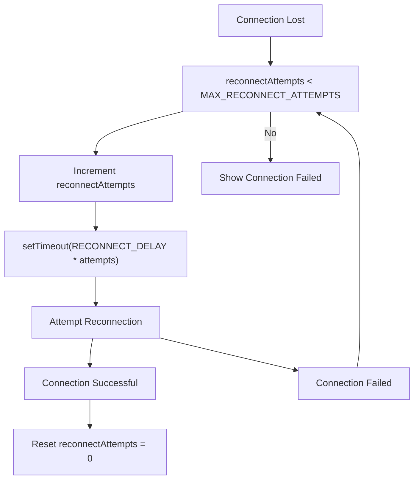

# WebSocket API

> **Relevant source files**
> * [backend/core/chat/consumers.py](../backend/core/chat/consumers.py)
> * [backend/core/models.py](../backend/core/models.py)
> * [frontend/src/api/websocket.ts](../frontend/src/api/websocket.ts)
> * [frontend/src/components/Message.vue](../frontend/src/components/MessageView.vue)
> * [frontend/src/composables/useNotifications.ts](../frontend/src/composables/useNotifications.ts)

This document specifies the WebSocket API for real-time chat communication in EduSphere. It covers the protocol for establishing connections, sending messages, receiving events, and handling errors. For information about the high-level real-time communication architecture, see [Real-time Communication](./Real-time-Communication.md). For details about the messaging features, see [Real-time Messaging](./Real-time-Messaging.md).

## Connection Protocol

WebSocket connections are established using Django Channels through the `ChatConsumer` class. The connection endpoint follows the pattern `/ws/chat/{username}/{room}/` where `username` is the room host's username and `room` is the room slug.



**Connection Authentication**

The connection requires JWT authentication. The `ChatConsumer` validates that:

1. User is authenticated via JWT token
2. The target room exists with the specified host and slug
3. The user is a participant in the room

Sources: [backend/core/chat/consumers.py L23-L62](../backend/core/chat/consumers.py#L23-L62)

 [frontend/src/api/websocket.ts L17-L28](../frontend/src/api/websocket.ts#L17-L28)

## Message Types (Client to Server)

The client sends JSON messages to the WebSocket with a `type` field specifying the operation:

| Message Type | Purpose | Required Fields |
| --- | --- | --- |
| `text` | Send new message | `message` (string) |
| `delete` | Delete existing message | `messageId` (UUID string) |
| `update` | Edit existing message | `messageId` (UUID string), `message` (string) |

### Text Message Format

```json
{
  "type": "text",
  "message": "Hello world!",
  "timestamp": "2024-01-01T12:00:00.000Z"
}
```

### Delete Message Format

```sql
{
  "type": "delete", 
  "messageId": "123e4567-e89b-12d3-a456-426614174000",
  "timestamp": "2024-01-01T12:00:00.000Z"
}
```

### Update Message Format

```sql
{
  "type": "update",
  "messageId": "123e4567-e89b-12d3-a456-426614174000", 
  "message": "Updated message content",
  "timestamp": "2024-01-01T12:00:00.000Z"
}
```

Sources: [backend/core/chat/consumers.py L73-L99](../backend/core/chat/consumers.py#L73-L99)

 [frontend/src/api/websocket.ts L121-L160](../frontend/src/api/websocket.ts#L121-L160)

## Event Types (Server to Client)

The server broadcasts events to all connected clients in the room group. All events have the structure:



### New Message Event

When a user sends a new message:

```json
{
  "type": "chat_message",
  "action": "new",
  "id": "123e4567-e89b-12d3-a456-426614174000",
  "user": "johndoe", 
  "user_id": "456e7890-e89b-12d3-a456-426614174000",
  "body": "Hello world!",
  "created": "2024-01-01T12:00:00.000000Z",
  "edited": false,
  "updated": "2024-01-01T12:00:00.000000Z",
  "userAvatar": "avatars/user.jpg"
}
```

### Delete Message Event

When a message is deleted:

```sql
{
  "type": "chat_message",
  "action": "delete", 
  "id": "123e4567-e89b-12d3-a456-426614174000"
}
```

### Update Message Event

When a message is edited:

```sql
{
  "type": "chat_message",
  "action": "update",
  "id": "123e4567-e89b-12d3-a456-426614174000",
  "body": "Updated message content",
  "edited": true,
  "updated": "2024-01-01T12:01:00.000000Z"
}
```

Sources: [backend/core/chat/consumers.py L100-L216](../backend/core/chat/consumers.py#L100-L216)

 [backend/core/models.py L128-L141](../backend/core/models.py#L128-L141)

 [frontend/src/api/websocket.ts L37-L105](../frontend/src/api/websocket.ts#L37-L105)

## Error Handling

The server sends error messages for validation failures and authorization issues:

```json
{
  "error": "Message exceeds 500 characters."
}
```

### Common Error Messages

| Error | Cause | Solution |
| --- | --- | --- |
| `"Message exceeds {max} characters."` | Message body too long | Reduce message length |
| `"Message not found."` | Invalid message ID | Verify message exists |
| `"You can only delete your own messages."` | Unauthorized delete | Only message author can delete |
| `"You can only edit your own messages."` | Unauthorized edit | Only message author can edit |

### Client-Side Error Handling

The frontend handles errors through the notification system:



Sources: [backend/core/chat/consumers.py L16-L21](../backend/core/chat/consumers.py#L16-L21)

 [frontend/src/api/websocket.ts L40-L43](../frontend/src/api/websocket.ts#L40-L43)

 [frontend/src/composables/useNotifications.ts L55-L62](../frontend/src/composables/useNotifications.ts#L55-L62)

## Connection Management

### Connection States

The frontend tracks connection status with these states:

| State | Description |
| --- | --- |
| `disconnected` | Not connected to WebSocket |
| `connected` | Active WebSocket connection |
| `error` | Connection error occurred |

### Reconnection Logic

The client implements automatic reconnection with exponential backoff:



### Configuration Constants

* `MAX_RECONNECT_ATTEMPTS`: 5
* `RECONNECT_DELAY`: 3000ms base delay
* Actual delay: `RECONNECT_DELAY * reconnectAttempts`

Sources: [frontend/src/api/websocket.ts L13-L118](../frontend/src/api/websocket.ts#L13-L118)

 [backend/core/chat/consumers.py L64-L71](../backend/core/chat/consumers.py#L64-L71)

## WebSocket URL Construction

The frontend dynamically constructs WebSocket URLs based on the current protocol:

```javascript
const wsUrl = `${window.location.protocol === 'https' ? 'wss' : 'ws'}://localhost/ws/chat/${userSlug}/${roomSlug}`;
```

This ensures proper protocol matching (WSS for HTTPS, WS for HTTP) for secure connections.

Sources: [frontend/src/api/websocket.ts L27](../frontend/src/api/websocket.ts#L27-L27)